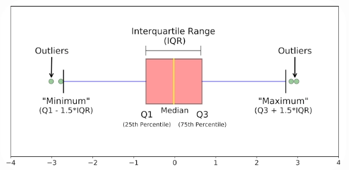
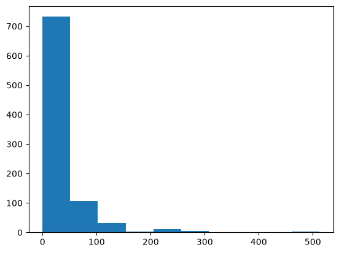
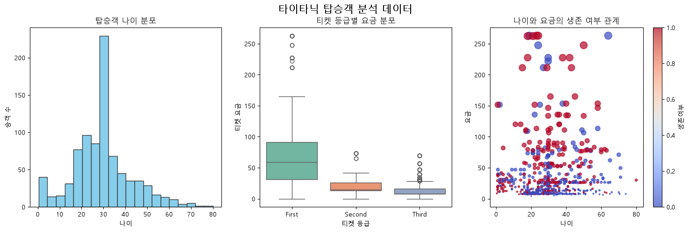

# 20260825 TIL
# 오늘의 TIL

> 날짜 : 2026-08-25  
> 주제 : Pandas 정밀 조회 및 결측치 제어, Matplotlib 기초, 데이터 분석 기초, 머신러닝의 이해

---

## 어제의 복습

1. `random.randint`
2. 언패킹
3. 메서드 오버라이딩

---

## 오늘 공부한 내용

### 4장 머신러닝

#### [특강] Numpy, Pandas, Matplotlib

##### 3. Pandas 정밀 조회 및 결측치 제어

###### 3.1. loc와 iloc를 활용한 행·열 선택

- `loc[]`: 행의 이름으로 검색(선택)
  - `loc[행 라벨]`
  - `loc[행 라벨, 컬럼 이름]`
  - `loc[시작행:종료행, [컬럼1, 컬럼2, ...]]`
  - `loc[..., 시작:종료컬럼]`
  - 종료 라벨 포함
- `iloc[]`: 숫자 인덱스로 검색(선택)
  - `loc`와 사용 방법은 동일하지만 행 라벨이 아니라 인덱스 번호를 사용
  - 범위를 설정할 경우 종료 번호는 미만

~~~python
import pandas as pd

df = pd.DataFrame({
    '나이': [25, 30, 35, 40],
    '점수': [80, 95, 70, 85],
    '등급': ['B', 'A', 'C', 'B']
}, index=['user1', 'user2', 'user3', 'user4'])

df
~~~

~~~text
       나이  점수 등급
user1  25  80  B
user2  30  95  A
user3  35  70  C
user4  40  85  B
~~~

~~~python
df.loc['user1'], type(df.loc['user1'])
~~~

~~~text
(나이    25
 점수    80
 등급     B
 Name: user1, dtype: object,
 pandas.Series)
~~~

~~~python
df.loc['user1', '점수']
~~~

~~~text
np.int64(80)
~~~

~~~python
df.loc['user1':'user3', ['등급', '점수']]
~~~

~~~text
       등급  점수
user1   B  80
user2   A  95
user3   C  70
~~~

~~~python
df.loc['user1':'user2', '점수':'등급']
~~~

~~~text
       점수 등급
user1  80  B
user2  95  A
~~~

~~~python
df.iloc[0:2, 1:3]
~~~

~~~text
       점수 등급
user1  80  B
user2  95  A
~~~

###### 3.2. 불리언 인덱싱과 query() 조건 검색

- **불리언 인덱싱**
  - 컬럼별 값이 True인 조건만 찾아서 조회
  - `&`: and 연산 / 모두 참일 때 참
  - `|`: or 연산 / 조건 중 하나만 참이어도 참

~~~python
(df['나이'] >= 30)
~~~

~~~text
user1    False
user2     True
user3     True
user4     True
Name: 나이, dtype: bool
~~~

~~~python
(df['나이'] >= 30) & (df['점수'] >= 80)
~~~

~~~text
user1    False
user2     True
user3    False
user4     True
dtype: bool
~~~

~~~python
df[(df['나이'] >= 30) & (df['점수'] >= 80)]
~~~

~~~text
       나이  점수 등급
user2  30  95  A
user4  40  85  B
~~~

- **.query() 필터링**
  - 문자열 조건식 및 `@` 외부 변수 참조를 활용

~~~python
df.query('나이 >= 30 and 점수 >= 80')
~~~

~~~text
       나이  점수 등급
user2  30  95  A
user4  40  85  B
~~~

###### 3.3. 결측치(Missing Data) 7대 처리 기법

**3.1 결측치 탐지 및 현황 요약 (Detection)**
- `info()`
- `isna()`, `isnull()` (`isna` = `isnull`)

~~~python
import numpy as np

# 결측치 - np.nan (Not a Number), pd.NA, NONE
raw_df = pd.DataFrame({
    'A': [1, np.nan, 3],
    'B': [pd.NA, 5, 6],
    'C': [7, 8, 9]
})

raw_df.info()
~~~

~~~text
<class 'pandas.DataFrame'>
RangeIndex: 3 entries, 0 to 2
Data columns (total 3 columns):
 #   Column  Non-Null Count  Dtype
---  ------  --------------  -----
 0   A       2 non-null      float64
 1   B       2 non-null      object
 2   C       3 non-null      int64
dtypes: float64(1), int64(1), object(1)
memory usage: 204.0+ bytes
~~~

~~~python
raw_df.isna()
~~~

~~~text
       A      B      C
0  False   True  False
1   True  False  False
2  False  False  False
~~~

~~~python
raw_df.isna().sum()
~~~

~~~text
A    1
B    1
C    0
dtype: int64
~~~

**3.2 결측치 삭제 (Drop)**
- `axis=0`: 행 기준 - 특정 행에 결측치가 있으면 제거 (기본값)
- `axis=1`: 열 기준 - 특정 열에 결측치가 있으면 제거

~~~python
raw_df
~~~

~~~text
     A     B  C
0  1.0  <NA>  7
1  NaN     5  8
2  3.0     6  9
~~~

~~~python
# 행 기준에서 결측치 삭제, 행 기준이 기본값
raw_df.dropna()
~~~

~~~text
     A  B  C
2  3.0  6  9
~~~

~~~python
# 열 기준에서 결측치 삭제
raw_df.dropna(axis=1)
~~~

~~~text
   C
0  7
1  8
2  9
~~~

**3.3 통계적 대푯값 대치 (Imputation)**
- 평균(`mean()`)
- 중앙값(`median()`): 극단치/이상치 영향을 덜 받는다.
- `fillna()`

~~~python
df_age = pd.DataFrame({'나이': [20, 25, None, 30, 95]})

median_val = df_age['나이'].median()
print("중앙값:", median_val)
df_age['나이'] = df_age['나이'].fillna(median_val)

df_age
~~~

~~~text
중앙값: 27.5

    나이
0  20.0
1  25.0
2  27.5
3  30.0
4  95.0
~~~

**3.4 시계열 직전/직후 값 대치 (Forward / Backward Fill)**
- `ffill()`: 앞쪽에 있는 값으로 대체
- `bfill()`: 뒤쪽에 있는 값으로 대체

~~~python
ts_df = pd.DataFrame({'온도': [18.2, None, None, 21.0]})

# ffill()
ts_df.ffill()
~~~

~~~text
    온도
0  18.2
1  18.2
2  18.2
3  21.0
~~~

~~~python
# bfill()
ts_df.bfill()
~~~

~~~text
    온도
0  18.2
1  21.0
2  21.0
3  21.0
~~~

**3.5 선형 보간법 (Linear Interpolation)**
- `method=`: 'linear', 'time', 'index', 'polynominal', 'spline'

~~~python
speed_df = pd.DataFrame({'속도': [10.0, None, None, 40.0]})

speed_df['속도'] = speed_df['속도'].interpolate(method='linear')

speed_df
~~~

~~~text
    속도
0  10.0
1  20.0
2  30.0
3  40.0
~~~

**3.6 이상 기호 치환 및 수치형 변환 (Replace & Type Casting)**
- `replace()`: 이상한 데이터를 교체
- `pandas.to_numeric(...)`: 숫자 자료형으로 변환

~~~python
survey_df = pd.DataFrame({'점수': [85, -999, '?', 95]})
survey_df.info()
~~~

~~~text
<class 'pandas.DataFrame'>
RangeIndex: 4 entries, 0 to 3
Data columns (total 1 columns):
 #   Column  Non-Null Count  Dtype
---  ------  --------------  -----
 0   점수      4 non-null      object
dtypes: object(1)
memory usage: 164.0+ bytes
~~~

~~~python
survey_df.describe()
~~~

~~~text
       점수
count   4
unique  4
top    85
freq    1
~~~

~~~python
survey_df['점수'] = survey_df['점수'].replace([-999, '?'], pd.NA)
survey_df
~~~

~~~text
      점수
0     85
1   <NA>
2   <NA>
3     95
~~~

~~~python
survey_df['점수'] = pd.to_numeric(survey_df['점수'], errors='coerce')
survey_df.info()
~~~

~~~text
<class 'pandas.DataFrame'>
RangeIndex: 4 entries, 0 to 3
Data columns (total 1 columns):
 #   Column  Non-Null Count  Dtype
---  ------  --------------  -----
 0   점수      2 non-null      float64
dtypes: float64(1)
memory usage: 164.0 bytes
~~~

~~~python
survey_df.describe()
~~~

~~~text
       점수
count   2.000000
mean   90.000000
std     7.071068
min    85.000000
25%    87.500000
50%    90.000000
75%    92.500000
max    95.000000
~~~

**3.7 결측 여부 지표 변수 생성 (Missing Indicator)**

~~~python
user_df = pd.DataFrame({'소득': [300, None, 450, None]})

# 결측 여부 불리언 컬럼 생성
user_df['소득_미응답 여부'] = user_df['소득'].isna()

user_df
~~~

~~~text
      소득  소득_미응답 여부
0  300.0       False
1    NaN        True
2  450.0       False
3    NaN        True
~~~

###### 3.4. 그룹화 집계(groupby)와 .to_numpy() 상호 변환

- `groupby`: 범주별 통계 요약
- `.to_numpy()`: 머신러닝 라이브러리에 전달

~~~python
sales_df = pd.DataFrame({
    '지점': ['서울', '서울', '부산', '부산'],
    '매출': [100, 150, 80, 120]
})

sales_df
~~~

~~~text
    지점  매출
0   서울  100
1   서울  150
2   부산   80
3   부산  120
~~~

~~~python
grouped_df = sales_df.groupby('지점').mean(numeric_only=True)
grouped_df
~~~

~~~text
       매출
지점
부산  100.0
서울  125.0
~~~

~~~python
sales_df['매출'].to_numpy(dtype=np.float64)
~~~

~~~text
array([100., 150.,  80., 120.])
~~~

##### 4. Matplotlib 기초

###### 4.1. 캔버스(Figure)와 축(Axes) 기본 구조 (fig, ax)

- 캔버스 `fig` / 개별 차트 영역 `ax`
- 캔버스 생성
  - `plt.figure(figsize=(...))` - 1개 그릴 때
  - `plt.subplots(row, col, figsize=(...))`
- `figsize`: 캔버스의 크기 (가로인치, 세로인치)

~~~python
import matplotlib.pyplot as plt

# Figure와 Axe 캔버스 기본 구조 생성
fig, ax = plt.subplots(figsize=(6, 3.5))
ax.set_title("Basic Figure & Axe Canvas")
ax.set_xlabel("X Axis")
ax.set_ylabel("Y Axis")

plt.show()
~~~

###### 4.2. 산점도(Scatter) 및 막대(Bar) 그래프

~~~python
import matplotlib.pyplot as plt

# 산점도 데이터 (키 vs 몸무게 상관관계)
height = [160, 165, 170, 175, 180, 185]
weight = [55, 62, 65, 74, 78, 85]

# 막대 데이터 (그룹별 인원수)
groups = ['Group A', 'Group B', 'Group C']
counts = [24, 38, 19]

fig, (ax1, ax2) = plt.subplots(1, 2, figsize=(10, 4))

# 좌측: 산점도
ax1.scatter(height, weight, color='teal', s=60, alpha=0.8)
ax1.set_title('Height vs Weight (Scatter)')
ax1.set_xlabel('Height (cm)')
ax1.set_ylabel('Weight (kg)')

# 우측: 막대 그래프
ax2.bar(groups, counts, color='coral', alpha=0.85)
ax2.set_title('Category comparison (Bar)')

plt.tight_layout()
plt.show()
~~~

###### 4.3. 데이터 분포 및 이상치 시각화 (히스토그램 & 박스플롯)

~~~python
import matplotlib.pyplot as plt

# 배달 앱 주문별 배달 소요 시간(분) [120분 극단 지연 건 포함]
delivery_times = [25, 28, 30, 30, 32, 33, 35, 35, 36, 38, 40, 42, 45, 120]

fig, (ax1, ax2) = plt.subplots(1, 2, figsize=(10, 4))

# 좌측: 히스토그램 (대부분 25~45분 구간에 집중됨을 확인)
ax1.hist(delivery_times, bins=10, color='skyblue', edgecolor='black')
ax1.set_title('Delivery Time Distribution (Histogram)')
ax1.set_xlabel('Delivery Time (min)')
ax1.set_ylabel('Order Count')

# 우측: 박스플롯 (120분 이상치 건물 상단 독립 점으로 검출)
ax2.boxplot(delivery_times, tick_labels=['Delivery App'])
ax2.set_title('Outlier Check (Boxplot)')
ax2.set_ylabel('Delivery Time (min)')

plt.tight_layout()
plt.show()
~~~

**❓ 박스플롯(Box Plot, 상자 수염 그림)**
박스플롯은 데이터의 분포, 중심 위치, 산포도, 그리고 이상치(Outlier)를 5가지 요약 수치(Five-number summary)를 바탕으로 시각화한 그래프입니다.

| 구성 요소 | 통계적 명칭 | 의미 |
|---|---|---|
| **상자 하단** | 제1사분위수 (Q1) | 전체 데이터의 하위 25% 지점 |
| **상자 내부 선** | 제2사분위수 / 중앙값 (Median, Q2) | 데이터를 크기순으로 나열했을 때 정가운데(50%) 값 |
| **상자 상단** | 제3사분위수 (Q3) | 전체 데이터의 하위 75%(상위 25%) 지점 |
| **상자 높이/길이** | 사분위수 범위 (IQR) | $IQR = Q3 - Q1$, 데이터의 가운데 50%가 모여 있는 범위 |
| **수염 (Whiskers)** | 정상 범위 경계 | 아래쪽 수염 끝: $Q1 - 1.5 \times IQR$ 이상인 최소 데이터 위쪽 수염 끝: $Q3 + 1.5 \times IQR$ 이하인 최대 데이터 |
| **점 (Dots)** | 이상치 (Outliers) | 수염 범위를 벗어난 특이값 ($< Q1 - 1.5 \times IQR$ 또는 $> Q3 + 1.5 \times IQR$) |

- **중심 경향성:** 중앙값 선의 위치로 데이터의 중심 수준을 파악합니다. 평균과 달리 극단적인 값에 영향을 받지 않습니다.
- **산포도 및 퍼짐 정도:** 상자의 크기(IQR)가 길수록 중간 데이터가 넓게 퍼져 있음을, 짧을수록 밀집되어 있음을 나타냅니다.
- **왜도 (비대칭성):** 중앙값이 상자 중앙보다 아래(왼쪽)에 치우쳐 있고 위쪽 수염이 길면 오른쪽 꼬리가 긴 분포(Right-skewed, 양의 왜도)입니다. 반대로 중앙값이 상단에 치우쳐 있으면 왼쪽 꼬리가 긴 분포(Left-skewed, 음의 왜도)입니다.
- **그룹 간 비교:** 여러 집단의 박스플롯을 나란히 배치하면 집단 간 중앙값 차이, 흩어짐 정도, 이상치 존재 여부를 한눈에 직관적으로 비교할 수 있습니다.

###### 4.4. 다중 서브플롯(Subplots) 분할 배치

~~~python
import matplotlib.pyplot as plt
import numpy as np

fig, axes = plt.subplots(2, 2, figsize=(10, 7))

# 2x2 영역 각각에 서로 다른 차트 배치

# -------------------------------------------------------------
# [0, 0] 파란색 꺾은선 그래프 (Line Plot with Markers)
# -------------------------------------------------------------
x_line = [1, 2, 3]
y_line = [10, 20, 15]

axes[0, 0].plot(
    x_line,
    y_line,
    color='blue',       # 'b'
    linestyle='-',      # '-' (실선)
    marker='o'          # 'o' (원형 마커)
)
axes[0, 0].set_title('Line')
axes[0, 0].grid(True)

# -------------------------------------------------------------
# [0, 1] 빨간색 사인 곡선 (Smooth Curve)
# -------------------------------------------------------------
# 0부터 3까지 균등하게 50개 구간으로 나눈 x값 생성 (중복 연산 방지)
x_curve = np.linspace(0, 3, 50)
y_curve = np.sin(x_curve)

axes[0, 1].plot(
    x_curve,
    y_curve,
    color='red',        # 'r'
    linestyle='-'       # '-' (실선)
)
axes[0, 1].set_title('Curve')
axes[0, 1].grid(True)

# -------------------------------------------------------------
# [1, 0] 초록색 산점도 (Scatter Plot)
# -------------------------------------------------------------
x_scatter = [1, 2, 3]
y_scatter = [5, 15, 10]

axes[1, 0].scatter(
    x_scatter,
    y_scatter,
    color='green'       # 'g'
)
axes[1, 0].set_title('Scatter')
axes[1, 0].grid(True)

# -------------------------------------------------------------
# [1, 1] 주황색 막대 그래프 (Bar Chart)
# -------------------------------------------------------------
categories = ['X', 'Y', 'Z']
values = [12, 18, 9]

axes[1, 1].bar(
    categories,
    values,
    color='orange'
)
axes[1, 1].set_title('Bar')

# 레이아웃 겹침 방지 및 출력
plt.tight_layout()
plt.show()
~~~

---

### 1.2 데이터 분석 기초

#### 1. 실습 환경 준비

- 필수 패키지 설치하기

~~~bash
uv add numpy pandas matplotlib seaborn ipykernel
~~~

#### 2. 탐색적 데이터 분석(EDA, Exploratory Data Analysis)과 결측치/이상치

##### 2.1 문자열로 착각한 숫자와 데이터 유형별 결측치 채우기

- **문자열로 인식된 숫자 변환:** 요금 데이터 등에 기호(`$`, `,` 등)가 섞여 문자로 취급될 경우, `.str.replace()`로 기호를 지우고 `pd.to_numeric()`을 사용해 계산 가능한 숫자로 변환해야 합니다.
- **데이터 유형별 결측치(NaN) 채우기**
  - **숫자형 데이터 (예: 나이):** 전체 데이터의 평균(Mean)이나 중앙값(Median)으로 채우는 것이 일반적입니다.
  - **문자/범주형 데이터 (예: 항구 이름):** 평균 계산이 불가능하므로, 가장 자주 등장한 최빈값(Mode)으로 채웁니다.
- **이상치(Outlier) 처리:** 유독 크거나 작은 극단적인 값은 박스플롯(Boxplot)으로 시각화하여 확인한 뒤 걸러내는 것이 좋습니다.

##### 2.2 기초 통계량 (수학적 원리)

- **평균 (Mean)**

  $$\mu = \frac{1}{n} \sum_{i=1}^{n} x_i$$

  - 전체 데이터($x_i$) 총합 / 데이터의 총 개수($n$)
  - 데이터의 중심 위치를 나타냅니다.

- **분산 (Variance)**

  $$\sigma^2 = \frac{1}{n} \sum_{i=1}^{n} (x_i - \mu)^2$$

  - 각 데이터($x_i$, 표본값)가 평균($\mu$)으로부터 얼마나 떨어져 있는지(편차)를 구한 뒤, 이를 제곱하여 평균 낸 값.
  - 데이터가 흩어진 정도(산포도)를 보여줍니다.
  - 표본분산을 구할 때 $n-1$으로 나누는 이유: 전체 데이터가 아닌 일부 표본만으로 분산을 구할 때, 계산 값이 실제 모분산보다 작게 나오는 현상(편향)을 수학적으로 보정하기 위함.

- **표준편차 (Standard Deviation)**

  $$\sigma = \sqrt{\frac{1}{n} \sum_{i=1}^{n} (x_i - \mu)^2}$$

  - 분산에 루트($\sqrt{}$)를 씌운 값.
  - 표준편차에 루트를 씌우는 이유: 분산을 구하는 과정에서 함께 제곱되어 버린 데이터의 단위(예: cm²)를 원래 단위(cm)로 되돌려서, 데이터의 퍼짐 정도를 직관적으로 이해하기 위함.

#### 3. Pandas와 안전한 데이터 다루기

- **Copy-on-Write (CoW) 도입:** Pandas 2.2부터 도입된 메모리 관리 기술입니다. 데이터를 '조회'할 때는 원본을 공유하여 메모리를 아끼고, '수정(Write)'할 때만 독립적인 복사본(Copy)을 만들어 원본 훼손을 방지합니다.
- **기존의 문제점 (뷰 vs 복사):** 과거에는 추출한 데이터가 원본을 보여주는 '창문(뷰)'인지, 새로 만든 '복사본'인지 모호했습니다. 이 때문에 데이터를 수정할 때 원본까지 망가질 위험이 있어 잦은 경고(`SettingWithCopyWarning`)가 발생했습니다.
- **안전한 데이터 수정을 위한 2가지 해결책:**
  - **CoW 활용:** 데이터를 수정하는 순간 알아서 복사본을 만들어 원본을 보호하게 합니다.
  - **`.loc[]` / `.iloc[]` 사용:** 대괄호를 연속으로 쓰는 방식(`df['A']['B']`)은 두 단계를 거치면서 임시 복사본이 생길 수 있어 수정이 보장되지 않습니다. 반면, `.loc[]`를 사용하면 한 번에 정확한 메모리 위치로 직행하므로 100% 안전하게 데이터를 수정할 수 있습니다.

- **한 줄 정리:** 데이터를 수정할 때는 대괄호 연속 사용(`[][]`)을 피하고 `.loc[]`를 쓰며, 최신 Pandas의 CoW 기능을 활용하여 메모리 절약과 원본 보호.

#### 4. 타이타닉(Titanic) 탑승객 데이터 분석

##### 4.1 데이터 로드 및 결측치, 이상치 처리

1. 타이타닉(Titanic) 탑승객 데이터 로드 하기

~~~python
import pandas as pd
import numpy as np
import matplotlib.pyplot as plt
import seaborn as sns

df = sns.load_dataset("titanic")

# df.iloc[:5]  iloc 기능. 행과 열 동시에 자를 때
# df[:5]      리스트 슬라이싱 숏컷. 짧고 간편
df.head()    # 데이터 미리보기 전용 함수 (기본값 5줄). 코드 가독성 좋음 > 실무적
~~~

~~~text
   survived  pclass     sex   age  sibsp  parch     fare embarked  class    who  adult_male deck  embark_town alive  alone
0         0       3    male  22.0      1      0   7.2500        S  Third    man        True  NaN  Southampton    no  False
1         1       1  female  38.0      1      0  71.2833        C  First  woman       False    C    Cherbourg   yes  False
2         1       3  female  26.0      0      0   7.9250        S  Third  woman       False  NaN  Southampton   yes   True
3         1       1  female  35.0      1      0  53.1000        S  First  woman       False    C  Southampton   yes  False
4         0       3    male  35.0      0      0   8.0500        S  Third    man        True  NaN  Southampton    no   True
~~~

~~~python
# 컬럼 목록 확인
df.columns
~~~

~~~text
Index(['survived', 'pclass', 'sex', 'age', 'sibsp', 'parch', 'fare',
       'embarked', 'class', 'who', 'adult_male', 'deck', 'embark_town',
       'alive', 'alone'],
      dtype='str')
~~~

2. 데이터 요약 및 통계 확인 하기

~~~python
df.info()
print("-" * 100)
df.describe()
~~~

~~~text
<class 'pandas.DataFrame'>
RangeIndex: 891 entries, 0 to 890
Data columns (total 15 columns):
 #   Column       Non-Null Count  Dtype
---  ------       --------------  -----
 0   survived     891 non-null    int64
 1   pclass       891 non-null    int64
 2   sex          891 non-null    str
 3   age          714 non-null    float64
 4   sibsp        891 non-null    int64
 5   parch        891 non-null    int64
 6   fare         891 non-null    float64
 7   embarked     889 non-null    str
 8   class        891 non-null    category
 9   who          891 non-null    str
 10  adult_male   891 non-null    bool
 11  deck         203 non-null    category
 12  embark_town  889 non-null    str
 13  alive        891 non-null    str
 14  alone        891 non-null    bool
dtypes: bool(2), category(2), float64(2), int64(4), str(5)
memory usage: 80.7 KB
----------------------------------------------------------------------------------------------------
~~~

| | survived | pclass | age | sibsp | parch | fare |
|---|---|---|---|---|---|---|
| count | 891.000000 | 891.000000 | 714.000000 | 891.000000 | 891.000000 | 891.000000 |
| mean | 0.383838 | 2.308642 | 29.699118 | 0.523008 | 0.381594 | 32.204208 |
| std | 0.486592 | 0.836071 | 14.526497 | 1.102743 | 0.806057 | 49.693429 |
| min | 0.000000 | 1.000000 | 0.420000 | 0.000000 | 0.000000 | 0.000000 |
| 25% | 0.000000 | 2.000000 | 20.125000 | 0.000000 | 0.000000 | 7.910400 |
| 50% | 0.000000 | 3.000000 | 28.000000 | 0.000000 | 0.000000 | 14.454200 |
| 75% | 1.000000 | 3.000000 | 38.000000 | 1.000000 | 0.000000 | 31.000000 |
| max | 1.000000 | 3.000000 | 80.000000 | 8.000000 | 6.000000 | 512.329200 |

3. 결측치 파악하기

~~~python
df.isna().sum()
~~~

~~~text
survived        0
pclass          0
sex             0
age           177
sibsp           0
parch           0
fare            0
embarked        2
class           0
who             0
adult_male      0
deck          688
embark_town     2
alive           0
alone           0
dtype: int64
~~~

4. 숫자형 데이터(나이): 전체 탑승객의 '평균(mean)'으로 빈칸 채우기

~~~python
mean_age = df['age'].mean()
print("평균 나이:", mean_age)

df['age'] = df['age'].fillna(mean_age)
df.isna().sum()
~~~

~~~text
평균 나이: 29.69911764705882

survived        0
pclass          0
sex             0
age             0
sibsp           0
parch           0
fare            0
embarked        2
class           0
who             0
adult_male      0
deck          688
embark_town     2
alive           0
alone           0
dtype: int64
~~~

5. 문자/범주형 데이터(탑승 항구): 가장 많이 탑승한 곳인 '최빈값(mode)'으로 빈칸 채우기

~~~python
mode_embarked = df['embark_town'].mode()[0]
mode_embarked
~~~

~~~text
'Southampton'
~~~

~~~python
df['embark_town'] = df['embark_town'].fillna(mode_embarked)

# embarked 컬럼은 embark_town의 첫 글자(대문자)이므로 변환 처리로 통일, 이상치 교정
df['embarked'] = df['embark_town'].map(lambda x: x[0].upper())

df.isna().sum()
~~~

~~~text
survived        0
pclass          0
sex             0
age             0
sibsp           0
parch           0
fare            0
embarked        0
class           0
who             0
adult_male      0
deck          688
embark_town     0
alive           0
alone           0
dtype: int64
~~~

6. 특정 컬럼(deck)을 '기준'으로 좌우(열 방향) 데이터를 채우기

~~~python
df.head()
df['deck'] = df['deck'].ffill()
df['deck'] = df['deck'].bfill()

# 결측치/이상치 보완 결과 확인
df.isna().sum()
~~~

~~~text
survived        0
pclass          0
sex             0
age             0
sibsp           0
parch           0
fare            0
embarked        0
class           0
who             0
adult_male      0
deck            0
embark_town     0
alive           0
alone           0
dtype: int64
~~~

7. 너무 비싼 요금(이상치) 걸러내기

~~~python
print("요금 평균:", df['fare'].mean())
print("중앙값:", df['fare'].median())

plt.Figure(figsize=(8, 8))
plt.hist(df['fare'], bins=10)
plt.show()
~~~

~~~text
요금 평균: 32.204207968574636
중앙값: 14.4542
~~~

~~~python
# 요금 300 초과 이상치 제거
df = df[df['fare'] <= 300]
~~~

8. 결측치/이상치 보완 결과 확인

~~~python
df.isna().sum()
~~~

~~~text
survived        0
pclass          0
sex             0
age             0
sibsp           0
parch           0
fare            0
embarked        0
class           0
who             0
adult_male      0
deck            0
embark_town     0
alive           0
alone           0
dtype: int64
~~~

~~~python
df[df['fare'] > 300].count()
~~~

~~~text
survived        0
pclass          0
sex             0
age             0
sibsp           0
parch           0
fare            0
embarked        0
class           0
who             0
adult_male      0
deck            0
embark_town     0
alive           0
alone           0
dtype: int64
~~~

##### 4.2 중복 데이터 처리하기

1. 중복 데이터 확인하기

~~~python
df.duplicated()
~~~

~~~text
0      False
1      False
2      False
3      False
4      False
       ...
886    False
887    False
888    False
889    False
890    False
Length: 888, dtype: bool
~~~

~~~python
print("중복 데이터 수:", df.duplicated().sum())
~~~

~~~text
중복 데이터 수: 39
~~~

2. 중복 데이터 제거하기

~~~python
# drop_duplicates() : 중복 행 삭제
# df.duplicates()[:100]
df = df.drop_duplicates().reset_index(drop=True)

print("중복 데이터 수:", df.duplicated().sum())
~~~

~~~text
중복 데이터 수: 0
~~~

##### 4.3 그래프로 시각화하기

1. 내 컴퓨터에 맞는 한글 폰트 설정하기

~~~python
import platform
from matplotlib import rc

os_name = platform.system()

if os_name == "Windows":
    rc("font", family="Malgun Gothic")
else:
    rc("font", family="AppleGothic")
~~~

2. 도화지(Figure)와 3개의 액자(Axes) 준비
3. 그래프로 분석하기

~~~python
fig, axes = plt.subplots(1, 3, figsize=(18, 5))
fig.suptitle('타이타닉 탑승객 분석 데이터', fontsize=16)

# [히스토그램] 탑승객 나이 분포
# 헥스 색상 코드 사용 가능
# axes[0].hist(df['age'], bins=20, color='skyblue', edgecolor='black')
axes[0].hist(df['age'], bins=20, color='#87CEEB', edgecolor='#333333')
axes[0].set_title('탑승객 나이 분포')
axes[0].set_xlabel('나이')
axes[0].set_ylabel('승객 수')

# [박스 플롯] 티켓 등급에 따른 요금 이상치 확인
sns.boxplot(
    x='class',
    y='fare',
    data=df,
    ax=axes[1],
    hue='class',
    palette='Set2',
    legend=False,
    dodge=False
)
axes[1].set_title('티켓 등급별 요금 분포')
axes[1].set_xlabel('티켓 등급')
axes[1].set_ylabel('티켓 요금')

# [산점도] 나이와 클리닝된 요금의 관계
scatter = axes[2].scatter(
    df['age'],
    df['fare'],
    c=df['survived'],  # 색상: 생존 여부 (파랑/빨강)
    cmap='coolwarm',   # 1 - 빨강, 0 - 파랑
    s=df['fare'] / 2,  # 점 크기 : 요금에 비례
    alpha=0.7          # 점이 겹쳐서 안 보일 때 투명도 조절
)
axes[2].set_title('나이와 요금의 생존 여부 관계')
axes[2].set_xlabel('나이')
axes[2].set_ylabel('요금')

fig.colorbar(scatter, ax=axes[2], label="생존여부")
plt.show()
~~~

---

### 1.1 머신러닝의 이해

#### 1. 머신러닝이란?

- **머신러닝**
  - 데이터 + 답 → 규칙(모델)
  - 데이터 사이언스의 한 분야
  - 데이터 기반 규칙(알고리즘<예측, 분류>)을 발견하는 분야
- **톰 미첼의 정의**
  - "컴퓨터가 어떤 작업(T)을 할 때, 경험(E)이 쌓일수록 그 성능(P)이 좋아진다면, 그것은 학습하고 있는 것이다."
  - **작업(T):** 스팸 메일 걸러내기, 또는 체스 게임하기
  - **경험(E):** 수만 통의 이메일 데이터, 또는 수만 번의 체스 대국 기록
  - **성능(P):** 스팸을 정확히 걸러낸 비율, 또는 체스 승률

#### 2. 머신러닝의 3가지 공부

- 학습 → 규칙
  - **지도학습 (Supervised Learning):** 문제(or 특성 feature) - 독립변수 + 답 (Label) - 종속변수
    - 분류 (Classification): 종류
    - 회귀 (Regression): 숫자 - 수치 예측
  - **비지도학습 (Unsupervised Learning):** 문제, 특성 → 규칙
    - 예) k-means → 군집화(Clustering)
  - **준지도학습:** 지도 + 비지도
  - **강화학습:** 보상 알고리즘
- 규칙을 통해서 해결하고자 하는 문제영역
  - 회귀
  - 분류
- **AI**
  - Strong AI X
  - Weak AI - 특정 분야에 한정된 AI
- **알고리즘**
  1. Regression - 선형 회귀
  2. ANN (Artificial Neural Network) 인공신경망 (퍼셉트론)
     - **Deep Learning [DNN (Deep Neural Network)]**
       - CNN
       - RNN, LSTM, GRU
       - GAN
  3. KNN
  4. SVM
  5. Decision Tree
  6. Ensemble

---

## 찾아본 내용

### 1. `.gitignore` 작성 문법

- `.gitignore` 작성 요약 가이드
  - 이름만 지정 (프로젝트 전체 하위 폴더에서 싹 다 무시)
    - `secret.txt`
  - 경로까지 지정 (해당 폴더에 있는 파일만 콕 집어서 무시)
    - `2026/08/secret.txt`
  - 맨 앞에 슬래시 (최상위 폴더, 즉 현재 위치의 파일만 무시)
    - `/secret.txt`
  - 맨 뒤에 슬래시 (해당 이름의 '폴더' 안의 모든 것을 무시)
    - `images/`
  - 별표 활용 (특정 확장자로 끝나는 파일 싹 다 무시)
    - `*.csv`
    - `*.log`

### 2. 이미지 링크 첨부 방법

- ``
- 작성 예시:
  - ``

### 3. K-Means 클러스터링 정리

#### 1. K-Means 클러스터링이란?
- **비지도 학습 (Unsupervised Learning):** 정답(Label)이 없는 데이터 $x^{(1)}, x^{(2)}, \dots$ 들을 비슷한 특징을 가진 것들끼리 묶어주는 대표적인 알고리즘입니다.
- **의미:** 데이터를 $K$개의 군집(Cluster)으로 묶고, 각 군집의 중심(Centroid)을 묶인 데이터들의 평균(Means) 위치로 맞춘다는 뜻입니다.

#### 2. K-Means의 핵심 작동 원리 (4단계)
아래의 과정을 결과가 더 이상 바뀌지 않거나(수렴), 지정한 횟수를 채울 때까지 반복합니다.
1. **초기화:** 사용자가 지정한 $K$개만큼의 군집 중심점($\mu_k$)을 데이터 공간에 랜덤하게 찍습니다.
2. **데이터 할당 (Cluster assignment):** 모든 데이터가 $K$개의 중심점 중 가장 가까운 중심점($\mu_k$)이 있는 곳으로 소속을 정합니다. (결과를 $c(i)$로 표기)
3. **중심점 이동 (Move centroid):** 각 군집에 소속된 데이터들의 평균 위치를 계산하여, 중심점($\mu_k$)을 그 평균 위치로 새롭게 갱신합니다.
4. **반복:** 다시 2번으로 돌아가 갱신된 중심점을 기준으로 데이터를 재할당하고 업데이트합니다.

#### 3. 최적의 $K$값 찾기 (엘보우 기법, Elbow Method)
- 몇 개의 그룹으로 나눌지($K$)는 사람이 직접 정해야 합니다.
- **Inertia(관성):** 군집의 중심점과 데이터 간의 거리 제곱 합입니다. (작을수록 데이터가 잘 모여 있음)
- $K$값을 늘려가며 Inertia를 그래프로 그렸을 때, 팔꿈치처럼 꺾이며 경사가 완만해지는 지점을 최적의 $K$값으로 선정합니다.

#### 4. K-Means의 특징 및 한계점
- **직관성과 속도:** 원리가 단순하여 대용량 데이터에서도 계산이 빠릅니다. 육안으로 분류가 어려운 데이터(예: 애매한 티셔츠 사이즈 S, M, L 구분)도 훌륭하게 군집화합니다.
- **초기값 의존성:** 처음 $\mu_k$를 어디에 찍느냐에 따라 결과가 크게 달라집니다. 이를 보완하기 위해 처음부터 중심점을 영리하게 멀리 떨어뜨려 놓는 K-Means++ 기법을 주로 사용합니다.
- **모양과 밀도의 한계:** 동그란 구형(Spherical) 군집에는 잘 작동하지만, 도넛 모양이거나 각 군집의 밀도가 다를 때는 잘 분류하지 못합니다.
- **이상치(Outlier) 취약성:** '평균'을 계산하여 중심을 이동하므로, 극단적으로 튀는 값에 중심점이 크게 끌려갈 수 있습니다.

### 4. `df['age']` & `df.loc[:, 'age']` 요약 비교

| 비교 항목 | `df['age'] = ...` (직접 대입) | `df.loc[:, 'age'] = ...` (.loc 대입) |
| --- | --- | --- |
| **코드 직관성** | 매우 높음 (작성하기 편함) | 보통 (명시적임) |
| **작동 원리** | 'age'라는 이름의 Series를 통째로 교체 | 기존 DataFrame의 'age' 열 위치의 값을 변경 |
| **경고 발생 가능성** | **높음** (`SettingWithCopyWarning` 주의) | **거의 없음 (안전함)** |
| **권장 여부** | 간단한 전체 원본 데이터 전처리 시 | **데이터프레임을 슬라이싱한 후 전처리할 때 필수 권장** |
---

## 핵심 개념

- `loc[]`, `iloc[]`
- 불리언 인덱싱, `query()`
- 결측치 탐지(`isna()`, `isnull()`), 삭제(`dropna()`), 통계적 대푯값 대치(`fillna()`), 직전/직후 값 대치(`ffill()`, `bfill()`), 선형 보간법(`interpolate()`)
- 이상 기호 치환 및 수치형 변환 (`replace()`, `pd.to_numeric()`)
- `groupby()`, `.to_numpy()`
- `plt.subplots()`, `scatter`, `bar`, `hist`, `boxplot`
- 탐색적 데이터 분석(EDA), 기초 통계량 (평균, 분산, 표준편차)
- Copy-on-Write (CoW)
- 머신러닝의 3가지 공부법: 지도학습, 비지도학습, 강화학습
- K-Means 클러스터링

---

## 교재 보충

※ 아래 내용은 사용자의 필기를 보완하기 위해 교재에서 가져온 내용이다.

- **결측 행 열 기준 삭제:** `df_drop.dropna(subset=['A'])`를 사용하면 'A' 열에 결측 행이 있는 경우만 특정하여 삭제할 수 있습니다.
- **pd.to_numeric()의 errors 옵션:**
  - `errors='coerce'`: 숫자로 바꿀 수 없는 값이 있으면 에러를 내지 않고 `NaN(np.nan)`으로 대체합니다.
  - `errors='raise'` (기본값): 변환할 수 없는 값이 하나라도 있으면 즉시 ValueError 예외를 발생시키고 작업을 중단합니다.
  - `errors='ignore'`: 변환에 실패하면 에러 없이 원래 데이터를 그대로 유지합니다.
- **피어슨 상관계수 (Pearson Correlation):** 두 변수가 같이 움직이는 정도를 나타냅니다.
  $$ r_{XY} = \frac{\text{Cov}(X, Y)}{\sigma_X \sigma_Y} $$

---

## 필기 ↔ 교재 비교

| 항목 | 필기 | 교재 | 결과 |
|---|---|---|---|
| `pd.to_numeric` 옵션 | `errors='coerce'`만 명시 | `coerce`, `raise`, `ignore` 모두 설명 | 교재 보충 |

---

## 필기 누락 가능성

다음 내용은 교재에는 있으나 오늘 수업에서 다루었는지는 확실하지 않습니다.
- keep=False를 사용한 중복 행 전체 표시
- 머신러닝 문제 유형을 실제 사례로 분류하는 연습
- 피어슨 상관계수(Pearson Correlation)의 상세 설명
- 강화학습의 미래 가치 계산
※ 수업에서 다루었다면 필기를 놓쳤을 가능성이 있습니다.

---

## 편집 로그

### 수정한 내용
- 맞춤법 수정 ("오버드라이빙" -> "오버라이딩")
- Markdown 구조 개선 (코드 블록을 python과 text로 명확히 분리)
- 원문의 제목 계층을 유지하면서 가독성을 위해 리스트 구조로 정리
- 교재 보충 3건 추가
- 필기 ↔ 교재 비교 4건 표 작성
- 확인 필요 3건 작성

### 수정하지 않은 내용
- 작성자의 필기 서술 방식 (예: 3.1. loc와 iloc 번호 매기기 등)
- 코드 내용 및 출력 결과
- 잘못 입력된 가능성이 있는 코드 원형 (예: `plt.feature(figsize=(...))`)
- `찾아본 내용`의 분리된 학습 출처

### 추가 정보 출처
- 필기
- 교재
----
# 오늘의 TIL

## 어제의 복습
1. random.randint
2. 언패킹
3. 메서드 오버드라이빙

## 오늘의 학습
## 4장 머신러닝
### [특강] Numpy, Pandas, Matplotlib
#### 3. Pandas 정밀 조회 및 결측치 제어
##### 3.1. loc와 iloc를 활용한 행·열 선택
- `loc()`: 행의 이름으로 검색(선택)
    - loc[행 라벨]
    - loc[행 라벨, 컬럼 이름]
    - loc[시작행:종료행,[컬럼1,컬럼2,...]]
    - loc[..., 시작:종료컬럼]
    - 종료 포함
- `iloc()`: 숫자 인덱스로 검색(선택)
    - loc와 사용 방법은 동일하지만 행 라벨이 아니라 인덱스 번호
    - 범위를 설정할 경우 종료 번호는 미만

~~~python
import pandas as pd
df = pd.DataFrame({
    '나이' : [25,30,35,40],
    '점수' : [80,95,70,85],
    '등급' : ['B','A','C','B']
},index=['user1','user2','user3','user4'])
df

>
나이	점수	등급
user1	25	80	B
user2	30	95	A
user3	35	70	C
user4	40	85	B

df.loc['user1'],type(df.loc['user1'])
>
(나이    25
 점수    80
 등급     B
 Name: user1, dtype: object,
 pandas.Series)

 df.loc['user1','점수']
 >
 np.int64(80)

df.loc['user1':'user3',['등급','점수']]
>
	등급	점수
user1	B	80
user2	A	95
user3	C	70

df.loc['user1':'user2','점수':'등급']
>
	점수	등급
user1	80	B
user2	95	A

df.iloc[0:2,1:3]
>
	점수	등급
user1	80	B
user2	95	A
~~~

##### 3.2. 불리언 인덱싱과 query() 조건 검색
 - **불리언 인덱싱**
   - 컬럼별 값이 True인 조건만 찾아서 조회
   - & : and 연산 / 모두 참일때 참
   - | : or 연산 / 조건 중 하나만 참이어도 참

~~~python
(df['나이'] >= 30)
>
user1    False
user2     True
user3     True
user4     True
Name: 나이, dtype: bool

(df['나이'] >= 30)&(df['점수']>=80)
>
user1    False
user2     True
user3    False
user4     True
dtype: bool

df[(df['나이']>=30)&(df['점수']>=80)]
>
	나이	점수	등급
user2	30	95	A
user4	40	85	B
~~~

- **.query() 필터링**
  - 문자열 조건식 및 @ 외부 변수 참조를 활용

~~~python
df.query('나이>=30 and 점수>=80')
>
	나이	점수	등급
user2	30	95	A
user4	40	85	B
~~~

##### 3.3. 결측치(Missing Data) 7대 처리 기법
 3.1 결측치 탐지 및 현황 요약 (Detection) 
   - `info()`
   - `isna()`,`isnull()` **isna = isnull**

    ~~~python
    import numpy as np
    # 결측치 - np.nan (Not a Number), pd.NA, NONE
    raw_df = pd.DataFrame({'A': [1, np.nan, 3], 'B': [pd.NA, 5, 6], 'C': [7, 8, 9]})
    raw_df.info()
    >
    <class 'pandas.DataFrame'>
    RangeIndex: 3 entries, 0 to 2
    Data columns (total 3 columns):
    #   Column  Non-Null Count  Dtype  
    ---  ------  --------------  -----  
    0   A       2 non-null      float64
    1   B       2 non-null      object 
    2   C       3 non-null      int64  
    dtypes: float64(1), int64(1), object(1)
    memory usage: 204.0+ bytes

    raw_df.isna()
    >
        A	B	C
    0	False	True	False
    1	True	False	False
    2	False	False	False

    raw_df.isna().sum()
    >
    A    1
    B    1
    C    0
    dtype: int64
    ~~~

 3.2 결측치 삭제 (Drop)
   - `axis=0` : 행 기준 - 특정 행에 결측치가 있으면 제거
   - `axis=1` : 열 기준 - 특정 열에 결측치가 있으면 제거

    ~~~python
    raw_df
    >
        A	B	C
    0	1.0	<NA>	7
    1	NaN	5	8
    2	3.0	6	9

    # 행 기준에서 결측치 삭제 , 행 기준이 기본값
    raw_df.dropna() 
    >
        A	B	C
    2	3.0	6	9

    # 열 기준에서 결측치 삭제
    raw_df.dropna(axis=1)
    >
        C
    0	7
    1	8
    2	9

    ~~~

 3.3 통계적 대푯값 대치 (Imputation)
   - 평균(`mean()`)
   - 중앙값(`median()`) : 극단치/이상치 영향을 덜 받는다
   - `fillna(..)`
    ~~~python
    df_age = pd.DataFrame({'나이': [20, 25, None, 30, 95]})

    median_val=df_age['나이'].median()
    print("중앙값:" ,median_val)
    df_age['나이'] = df_age['나이'].fillna(median_val)

    df_age
    >
    중앙값: 27.5
        나이
    0	20.0
    1	25.0
    2	27.5
    3	30.0
    4	95.0
    ~~~
 3.4 시계열 직전/직후 값 대치 (Forward / Backward Fill)
   - `ffill()` : 앞쪽에 있는 값으로 대체
   - `bfill()` : 뒤쪽에 있는 값으로 대체

    ~~~python
    ts_df = pd.DataFrame({'온도': [18.2, None, None, 21.0]})

    # ffill()
    ts_df.ffill()
    >
        온도
    0	18.2
    1	18.2
    2	18.2
    3	21.0

    # bfill()
    ts_df.bfill()
    >

    온도
    0	18.2
    1	21.0
    2	21.0
    3	21.0
    ~~~
 3.5 선형 보간법 (Linear Interpolation)
   - `method=` 'linear,time,index,polynominal,spline'
  
    ~~~python
    speed_df = pd.DataFrame({'속도': [10.0, None, None, 40.0]})

    speed_df['속도'] = speed_df['속도'].interpolate(method='linear')

    speed_df
    >

    속도
    0	10.0
    1	20.0
    2	30.0
    3	40.0
    ~~~

 3.6 이상 기호 치환 및 수치형 변환 (Replace & Type Casting)    
   - `replace()`: 이상한 데이터를 교체
   - `pandas.to_numeric(...)` : 숫자 자료형으로 변환

    ~~~python
    survey_df = pd.DataFrame({'점수': [85, -999, '?', 95]})

    survey_df.info()
    >
    <class 'pandas.DataFrame'>
    RangeIndex: 4 entries, 0 to 3
    Data columns (total 1 columns):
    #   Column  Non-Null Count  Dtype 
    ---  ------  --------------  ----- 
    0   점수      4 non-null      object
    dtypes: object(1)
    memory usage: 164.0+ bytes

    survey_df.describe()
    >
        점수
    count	4
    unique	4
    top	85
    freq	1

    survey_df['점수'] = survey_df['점수'].replace([-999,'?'],pd.NA)
    survey_df
    >
        점수
    0	85
    1	<NA>
    2	<NA>
    3	95

    survey_df.info()
    >
    <class 'pandas.DataFrame'>
    RangeIndex: 4 entries, 0 to 3
    Data columns (total 1 columns):
    #   Column  Non-Null Count  Dtype 
    ---  ------  --------------  ----- 
    0   점수      2 non-null      object
    dtypes: object(1)
    memory usage: 164.0+ bytes~~~

    survey_df['점수'] = pd.to_numeric(survey_df['점수'], errors='coerce')
    survey_df.info()
    >
    <class 'pandas.DataFrame'>
    RangeIndex: 4 entries, 0 to 3
    Data columns (total 1 columns):
    #   Column  Non-Null Count  Dtype  
    ---  ------  --------------  -----  
    0   점수      2 non-null      float64
    dtypes: float64(1)
    memory usage: 164.0 bytes

    survey_df.describe()
    >
        점수
    count	2.000000
    mean	90.000000
    std	7.071068
    min	85.000000
    25%	87.500000
    50%	90.000000
    75%	92.500000
    max	95.000000
    ~~~

 3.7 결측 여부 지표 변수 생성 (Missing Indicator)

    ~~~python
    user_df = pd.DataFrame({'소득': [300, None, 450, None]})

    # 결측 여부 불리언 컬럼 생성
    user_df['소득_미응답 여부'] = user_df['소득'].isna()

    user_df
    >
        소득	소득_미응답 여부
    0	300.0	False
    1	NaN	True
    2	450.0	False
    3	NaN	True

    ~~~
##### 3.4. 그룹화 집계(groupby)와 .to_numpy() 상호 변환
- `groupby` : 범주별 통계 요약
- `.to_numpy()` : 머신러닝 라이브러리에 전달
~~~python
sales_df = pd.DataFrame({'지점': ['서울', '서울', '부산', '부산'], '매출': [100, 150, 80, 120]})

sales_df
>
	지점	매출
0	서울	100
1	서울	150
2	부산	80
3	부산	120

grouped_df = sales_df.groupby('지점').mean(numeric_only=True)
grouped_df
>
	매출
지점	
부산	100.0
서울	125.0

sales_df['매출'].to_numpy(dtype=np.float64)
>
array([100., 150.,  80., 120.])
~~~

#### 4. Matplotlib 기초
##### 4.1 캔버스(Figure)와 축(Axes) 기본 구조 (fig, ax)
캔버스 `fig` / 개별 차트 영역 `ax`
- 캔버스 생성 - `plt.feature(figsize=(...))` - 1개 그릴 때
            - `plt.subplots(row,col,figsize=(...))`
- `figsize` : 캔버스의 크기 (가로인치, 세로인치)

~~~python
import matplotlib.pyplot as plt

# Figure와 Axe 캔버스 기본 구조 생성
fig, ax = plt.subplots(figsize=(6, 3.5))
ax.set_title("Basic Figure & Axe Canvas")
ax.set_xlabel("X Axis")
ax.set_ylabel("Y Axis")

plt.show()
~~~
##### 4.2 산점도(Scatter) 및 막대(Bar) 그래프
~~~python
import matplotlib.pyplot as plt

# 산점도 데이터 (키 vs 몸무게 상관관계)
height = [160, 165, 170, 175, 180, 185]
weight = [55, 62, 65, 74, 78, 85]

# 막대 데이터 (그룹별 인원수)
groups = ['Group A', 'Group B', 'Group C']
counts = [24, 38, 19]

fig, (ax1, ax2) = plt.subplots(1, 2, figsize=(10, 4))

# 좌측: 산점도
ax1.scatter(height, weight, color='teal', s=60, alpha=0.8)
ax1.set_title('Height vs Weight (Scatter)')
ax1.set_xlabel('Height (cm)') 
ax1.set_ylabel('Weight (kg)')

# 우측: 막대 그래프
ax2.bar(groups, counts, color='coral', alpha=0.85)
ax2.set_title('Category comparison (Bar)')

plt.tight_layout()
plt.show()
~~~
##### 4.3 데이터 분포 및 이상치 시각화 (히스토그램 & 박스플롯)
~~~python
import matplotlib.pyplot as plt

# 배달 앱 주문별 배달 소요 시간(분) [120분 극단 지연 건 포함]
delivery_times = [25, 28, 30, 30, 32, 33, 35, 35, 36, 38, 40, 42, 45, 120]

fig, (ax1, ax2) = plt.subplots(1, 2, figsize=(10,4))

# 좌측: 히스토그램 (대부분 25~45분 구간에 집중됨을 확인)
ax1.hist(delivery_times, bins=10, color='skyblue', edgecolor='black')
ax1.set_title('Delivery Time Distribution (Histogram)')
ax1.set_xlabel('Delivery Time (min)');
ax1.set_ylabel('Order Count')

# 우측: 박스플롯 (120분 이상치 건물 상단 독립 점으로 검출)
ax2.boxplot(delivery_times, tick_labels=['Delivery App'])
ax2.set_title('Outlier Check (Boxplot)')
ax2.set_ylabel('Delivery Time (min)')

plt.tight_layout()
plt.show()
~~~

❓ **박스플롯(Box Plot, 상자 수염 그림)**

박스플롯(Box Plot, 상자 수염 그림)은 데이터의 분포, 중심 위치, 산포도, 그리고 이상치(Outlier)를 5가지 요약 수치(Five-number summary)를 바탕으로 시각화한 그래프입니다.

### 박스플롯을 구성하는 핵심 요소

| 구성 요소 | 통계적 명칭 | 의미 |
| :--- | :--- | :--- |
| **상자 하단** | 제1사분위수 (Q1) | 전체 데이터의 하위 25% 지점 |
| **상자 내부 선** | 제2사분위수 / 중앙값 (Median, Q2) | 데이터를 크기순으로 나열했을 때 정가운데(50%) 값 |
| **상자 상단** | 제3사분위수 (Q3) | 전체 데이터의 하위 75%(상위 25%) 지점 |
| **상자 높이/길이** | 사분위수 범위 (IQR) | $\text{IQR} = \text{Q3} - \text{Q1}$, 데이터의 가운데 50%가 모여 있는 범위 |
| **수염 (Whiskers)** | 정상 범위 경계 | • 아래쪽 수염 끝: $\text{Q1} - 1.5 \times \text{IQR}$ 이상인 최소 데이터 • 위쪽 수염 끝: $\text{Q3} + 1.5 \times \text{IQR}$ 이하인 최대 데이터 |
| **점 (Dots)** | 이상치 (Outliers) | 수염 범위를 벗어난 특이값 ($< \text{Q1} - 1.5 \times \text{IQR}$ 또는 $> \text{Q3} + 1.5 \times \text{IQR}$) |

### 박스플롯으로 파악할 수 있는 정보

* **중심 경향성:** 중앙값 선의 위치로 데이터의 중심 수준을 파악합니다. (평균과 달리 극단적인 값에 영향을 받지 않음)
* **산포도 및 퍼짐 정도:** 상자의 크기(IQR)가 길수록 중간 데이터가 넓게 퍼져 있음을, 짧을수록 밀집되어 있음을 나타냅니다.
* **왜도 (비대칭성):** 중앙값이 상자 중앙보다 아래(왼쪽)에 치우쳐 있고 위쪽 수염이 길면 오른쪽 꼬리가 긴 분포(Right-skewed, 양의 왜도)입니다. 반대로 중앙값이 상단에 치우쳐 있으면 왼쪽 꼬리가 긴 분포(Left-skewed, 음의 왜도)입니다.
* **그룹 간 비교:** 여러 집단의 박스플롯을 나란히 배치하면 집단 간 중앙값 차이, 흩어짐 정도, 이상치 존재 여부를 한눈에 직관적으로 비교할 수 있습니다.

##### 4.4 다중 서브플롯(Subplots) 분할 배치

~~~python
import matplotlib.pyplot as plt
import numpy as np

fig, axes = plt.subplots(2, 2, figsize=(10, 7))

# 2x2 영역 각각에 서로 다른 차트 배치

# -------------------------------------------------------------
# [0, 0] 파란색 꺾은선 그래프 (Line Plot with Markers)
# -------------------------------------------------------------
x_line = [1, 2, 3]
y_line = [10, 20, 15]

axes[0, 0].plot(
    x_line, 
    y_line, 
    color='blue',       # 'b'
    linestyle='-',      # '-' (실선)
    marker='o'          # 'o' (원형 마커)
)
axes[0, 0].set_title('Line')
axes[0, 0].grid(True)

# -------------------------------------------------------------
# [0, 1] 빨간색 사인 곡선 (Smooth Curve)
# -------------------------------------------------------------
# 0부터 3까지 균등하게 50개 구간으로 나눈 x값 생성 (중복 연산 방지)
x_curve = np.linspace(0, 3, 50)
y_curve = np.sin(x_curve)

axes[0, 1].plot(
    x_curve, 
    y_curve, 
    color='red',        # 'r'
    linestyle='-'       # '-' (실선)
)
axes[0, 1].set_title('Curve')
axes[0, 1].grid(True)

# -------------------------------------------------------------
# [1, 0] 초록색 산점도 (Scatter Plot)
# -------------------------------------------------------------
x_scatter = [1, 2, 3]
y_scatter = [5, 15, 10]

axes[1, 0].scatter(
    x_scatter, 
    y_scatter, 
    color='green'       # 'g'
)
axes[1, 0].set_title('Scatter')
axes[1, 0].grid(True)

# -------------------------------------------------------------
# [1, 1] 주황색 막대 그래프 (Bar Chart)
# -------------------------------------------------------------
categories = ['X', 'Y', 'Z']
values = [12, 18, 9]

axes[1, 1].bar(
    categories, 
    values, 
    color='orange'
)
axes[1, 1].set_title('Bar')

# 레이아웃 겹침 방지 및 출력
plt.tight_layout()
plt.show()
~~~

### 1.2 데이터 분석 기초
#### 1. 실습 환경 준비
필수 패키지 설치하기
uv add numpy pandas matplotlib seaborn ipykernel
#### 2. 탐색적 데이터 분석(EDA, Exploratory Data Analysis)과 결측치/이상치
##### 2.1 문자열로 착각한 숫자와 데이터 유형별 결측치 채우기

* **문자열로 인식된 숫자 변환:** 요금 데이터 등에 기호($, , 등)가 섞여 문자로 취급될 경우, `.str.replace()`로 기호를 지우고 `pd.to_numeric()`을 사용해 계산 가능한 숫자로 변환해야 합니다.
* **데이터 유형별 결측치(NaN) 채우기:**
* **숫자형 데이터 (예: 나이):** 전체 데이터의 평균(Mean)이나 중앙값(Median)으로 채우는 것이 일반적입니다.
* **문자/범주형 데이터 (예: 항구 이름):** 평균 계산이 불가능하므로, 가장 자주 등장한 최빈값(Mode)으로 채웁니다.

* **이상치(Outlier) 처리:** 유독 크거나 작은 극단적인 값은 박스플롯(Boxplot)으로 시각화하여 확인한 뒤 걸러내는 것이 좋습니다.

##### 2.2 기초 통계량 (수학적 원리)
1. **평균 (Mean)**
$$\mu = \frac{1}{n} \sum_{i=1}^{n} x_i$$
- 전체 데이터($x_i$) 총합 / 데이터의 총 개수($n$). 
- 데이터의 중심 위치를 나타냅니다.
2. **분산 (Variance)**
$$\sigma^2 = \frac{1}{n} \sum_{i=1}^{n} (x_i - \mu)^2$$
- 각 데이터($x_i$, '표본값')가 평균($\mu$, '평균')으로부터 얼마나 떨어져 있는지(편차)를 구한 뒤, 이를 제곱하여 평균 낸 값. 데이터가 흩어진 정도(산포도)를 보여줍니다.

- 표본분산에서 $n-1$을 나누는 이유: 전체 데이터가 아닌 일부 표본만으로 분산을 구할 때, 계산 값이 실제 모분산보다 작게 나오는 현상(편향)을 수학적으로 보정하기 위함

3. **표준편차 (Standard Deviation)**
$$\sigma = \sqrt{\frac{1}{n} \sum_{i=1}^{n} (x_i - \mu)^2}$$
- 분산에 루트($\sqrt{}$)를 씌운 값.
- 표준편차에 루트를 씌우는 이유: 분산을 구하는 과정에서 함께 제곱되어 버린 데이터의 단위(예: cm²)를 원래 단위(cm)로 되돌려서, 데이터의 퍼짐 정도를 직관적으로 이해하기 위함

#### 3. Pandas와 안전한 데이터 다루기 요약
* **Copy-on-Write (CoW) 도입:** Pandas 2.2부터 도입된 똑똑한 메모리 관리 기술입니다. 데이터를 '조회'할 때는 원본을 공유하여 메모리를 아끼고, '수정(Write)'할 때만 독립적인 복사본(Copy)을 만들어 원본 훼손을 방지합니다.
* **기존의 문제점 (뷰 vs 복사):** 과거에는 추출한 데이터가 원본을 보여주는 '창문(뷰)'인지, 새로 만든 '복사본'인지 모호했습니다. 이 때문에 데이터를 수정할 때 원본까지 망가질 위험이 있어 잦은 경고(`SettingWithCopyWarning`)가 발생했습니다.
* **안전한 데이터 수정을 위한 2가지 해결책:**
1. **CoW 활용:** 데이터를 수정하는 순간 알아서 복사본을 만들어 원본을 보호하게 합니다.
2. **`.loc[]` / `.iloc[]` 사용:** 대괄호를 연속으로 쓰는 방식(`df['A']['B']`)은 두 단계를 거치면서 임시 복사본이 생길 수 있어 수정이 보장되지 않습니다. 반면, `.loc[]`를 사용하면 한 번에 정확한 메모리 위치로 직행하므로 100% 안전하게 데이터를 수정할 수 있습니다.

**한 줄 정리:**
데이터를 수정할 때는 대괄호 연속 사용(`[][]`)을 피하고 `.loc[]`를 쓰며, 최신 Pandas의 **CoW 기능**을 활용하여 메모리 절약과 원본 보호

#### 4. 타이타닉(Titanic) 탑승객 데이터 분석
##### 4.1 데이터 로드 및 결측치, 이상치 처리
1. 타이타닉(Titanic) 탑승객 데이터 로드 하기
~~~python
import pandas as pd
import numpy as np
import matplotlib.pyplot as plt
import seaborn as sns

df = sns.load_dataset("titanic")

# df.iloc[:5]  iloc 기능 . 행과 열 동시에 자를 때
# df[:5]       리스트 슬라이싱 숏컷. 짧고 간편
df.head()    # 데이터 미리보기 전용 함수 (기본값 5줄). 코드 가독성 좋음 > 실무적
~~~
* 실행 결과

| survived | pclass | sex | age | sibsp | parch | fare | embarked | class | who | adult_male | deck | embark_town | alive | alone |
| :--- | :--- | :--- | :--- | :--- | :--- | :--- | :--- | :--- | :--- | :--- | :--- | :--- | :--- | :--- |
| 0 | 3 | male | 22.0 | 1 | 0 | 7.2500 | S | Third | man | True | NaN | Southampton | no | False |
| 1 | 1 | female | 38.0 | 1 | 0 | 71.2833 | C | First | woman | False | C | Cherbourg | yes | False |
| 1 | 3 | female | 26.0 | 0 | 0 | 7.9250 | S | Third | woman | False | NaN | Southampton | yes | True |
| 1 | 1 | female | 35.0 | 1 | 0 | 53.1000 | S | First | woman | False | C | Southampton | yes | False |
| 0 | 3 | male | 35.0 | 0 | 0 | 8.0500 | S | Third | man | True | NaN | Southampton | no | True |

~~~python
# 컬럼 목록 확인
df.columns

> 실행 결과
Index(['survived', 'pclass', 'sex', 'age', 'sibsp', 'parch', 'fare',
       'embarked', 'class', 'who', 'adult_male', 'deck', 'embark_town',
       'alive', 'alone'],
      dtype='str')
~~~

2. 데이터 요약 및 통계 확인 하기

~~~python
df.info()
print("-" * 100)
df.describe()

> 실행 결과
<class 'pandas.DataFrame'>
RangeIndex: 891 entries, 0 to 890
Data columns (total 15 columns):
 #   Column       Non-Null Count  Dtype   
---  ------       --------------  -----   
 0   survived     891 non-null    int64   
 1   pclass       891 non-null    int64   
 2   sex          891 non-null    str     
 3   age          714 non-null    float64 
 4   sibsp        891 non-null    int64   
 5   parch        891 non-null    int64   
 6   fare         891 non-null    float64 
 7   embarked     889 non-null    str     
 8   class        891 non-null    category
 9   who          891 non-null    str     
 10  adult_male   891 non-null    bool    
 11  deck         203 non-null    category
 12  embark_town  889 non-null    str     
 13  alive        891 non-null    str     
 14  alone        891 non-null    bool    
dtypes: bool(2), category(2), float64(2), int64(4), str(5)
memory usage: 80.7 KB
----------------------------------------------------------------------------------------------------
~~~
| | survived | pclass | age | sibsp | parch | fare |
| :--- | :--- | :--- | :--- | :--- | :--- | :--- |
| **count** | 891.000000 | 891.000000 | 714.000000 | 891.000000 | 891.000000 | 891.000000 |
| **mean** | 0.383838 | 2.308642 | 29.699118 | 0.523008 | 0.381594 | 32.204208 |
| **std** | 0.486592 | 0.836071 | 14.526497 | 1.102743 | 0.806057 | 49.693429 |
| **min** | 0.000000 | 1.000000 | 0.420000 | 0.000000 | 0.000000 | 0.000000 |
| **25%** | 0.000000 | 2.000000 | 20.125000 | 0.000000 | 0.000000 | 7.910400 |
| **50%** | 0.000000 | 3.000000 | 28.000000 | 0.000000 | 0.000000 | 14.454200 |
| **75%** | 1.000000 | 3.000000 | 38.000000 | 1.000000 | 0.000000 | 31.000000 |
| **max** | 1.000000 | 3.000000 | 80.000000 | 8.000000 | 6.000000 | 512.329200 |

3. 결측치 파악하기
~~~python
df.isna().sum()
> 실행 결과
survived         0
pclass           0
sex              0
age            177
sibsp            0
parch            0
fare             0
embarked         2
class            0
who              0
adult_male       0
deck           688
embark_town      2
alive            0
alone            0
dtype: int64
~~~

4. 숫자형 데이터(나이): 전체 탑승객의 '평균(mean)'으로 빈칸 채우기
~~~python
mean_age=df['age'].mean()
print("평균 나이:",mean_age)

df['age']= df['age'].fillna(mean_age)
df.isna().sum()

> 실행 결과
평균 나이: 29.69911764705882
survived         0
pclass           0
sex              0
age              0
sibsp            0
parch            0
fare             0
embarked         2
class            0
who              0
adult_male       0
deck           688
embark_town      2
alive            0
alone            0
dtype: int64
~~~

5. 문자/범주형 데이터(탑승 항구): 가장 많이 탑승한 곳인 '최빈값(mode)'으로 빈칸 채우기
~~~python
mode_embarked = df['embark_town'].mode()[0]
mode_embarked

> 'Southampton'
~~~
~~~python
df['embark_town']= df['embark_town'].fillna(mode_embarked)
# embarked 컬럼은 embark_town의 첫 글자(대문자)이므로 변환 처리로 통일, 이상치 교정
df['embarked'] = df['embark_town'].map(lambda x:x[0].upper())
df.isna().sum()

> 실행 결과
survived         0
pclass           0
sex              0
age              0
sibsp            0
parch            0
fare             0
embarked         0
class            0
who              0
adult_male       0
deck           688
embark_town      0
alive            0
alone            0
dtype: int64
~~~

6. 특정 컬럼(deck) 을 '기준'으로 좌우(열 방향) 데이터를 채우기
~~~python
df.head()
~~~
> 실행 결과

| survived | pclass | sex | age | sibsp | parch | fare | embarked | class | who | adult_male | deck | embark_town | alive | alone |
| :--- | :--- | :--- | :--- | :--- | :--- | :--- | :--- | :--- | :--- | :--- | :--- | :--- | :--- | :--- |
| 0 | 3 | male | 22.0 | 1 | 0 | 7.2500 | S | Third | man | True | NaN | Southampton | no | False |
| 1 | 1 | female | 38.0 | 1 | 0 | 71.2833 | C | First | woman | False | C | Cherbourg | yes | False |
| 1 | 3 | female | 26.0 | 0 | 0 | 7.9250 | S | Third | woman | False | NaN | Southampton | yes | True |
| 1 | 1 | female | 35.0 | 1 | 0 | 53.1000 | S | First | woman | False | C | Southampton | yes | False |
| 0 | 3 | male | 35.0 | 0 | 0 | 8.0500 | S | Third | man | True | NaN | Southampton | no | True |

~~~python
df['deck']=df['deck'].ffill()
df['deck']=df['deck'].bfill()
# 결측치/이상치 보완 결과 확인
df.isna().sum()

> 실행 결과
survived       0
pclass         0
sex            0
age            0
sibsp          0
parch          0
fare           0
embarked       0
class          0
who            0
adult_male     0
deck           0
embark_town    0
alive          0
alone          0
dtype: int64
~~~

7. 너무 비싼 요금(이상치) 걸러내기
~~~python
print("요금 평균:",df['fare'].mean())
print("중앙값:",df['fare'].median())

plt.Figure(figsize=(8,8))
plt.hist(df['fare'],bins=10)
plt.show()

> 실행 결과
요금 평균: 32.204207968574636
중앙값: 14.4542
~~~

~~~python
# 요금 300 초과 이상치 제거
df = df[df['fare']<=300]
~~~

8. 결측치/이상치 보완 결과 확인
~~~python
df.isna().sum()

> 실행 결과
survived       0
pclass         0
sex            0
age            0
sibsp          0
parch          0
fare           0
embarked       0
class          0
who            0
adult_male     0
deck           0
embark_town    0
alive          0
alone          0
dtype: int64
~~~

~~~python
df[df['fare']>300].count()

> 실행 결과
survived       0
pclass         0
sex            0
age            0
sibsp          0
parch          0
fare           0
embarked       0
class          0
who            0
adult_male     0
deck           0
embark_town    0
alive          0
alone          0
dtype: int64
~~~

##### 4.2 중복 데이터 처리하기
1. 중복 데이터 확인하기
~~~python
df.duplicated()

> 실행 결과
0      False
1      False
2      False
3      False
4      False
       ...  
886    False
887    False
888    False
889    False
890    False
Length: 888, dtype: bool
~~~
~~~python
print("중복 데이터 수:", df.duplicated().sum())
> 
중복 데이터 수: 39
~~~

2. 중복 데이터 제거하기
~~~python
# drop_duplicates() :  중복 행 삭제
#df.duplicates()[:100]
df = df.drop_duplicates().reset_index(drop=True)

print("중복 데이터 수:", df.duplicated().sum())
>
중복 데이터 수: 0
~~~
##### 4.3 그래프로 시각화하기
1. 내 컴퓨터에 맞는 한글 폰트 설정하기
~~~python
import platform
from matplotlib import rc

os_name = platform.system()
if os_name == "Windows":
    rc("font",family="Malgun Gothic")
else:
    rc("font",family="AppleGothic")
~~~

2. 도화지(Figure)와 3개의 액자(Axes) 준비
3. 그래프로 분석하기

~~~python
fig, axes = plt.subplots(1,3,figsize=(18,5))
fig.suptitle('타이타닉 탑승객 분석 데이터',fontsize=16)

# [히스토그램] 탑승객 나이 분포
# 헥스 색상 코드 사용 가능
# axes[0].hist(df['age'],bins=20,color='skyblue',edgecolor='black')
axes[0].hist(df['age'],bins=20,color='#87CEEB',edgecolor='#333333')
axes[0].set_title('탑승객 나이 분포')
axes[0].set_xlabel('나이')
axes[0].set_ylabel('승객 수')

# [박스 플롯] 티켓 등급에 따른 요금 이상치 확인
sns.boxplot(x='class', y='fare', data=df, ax=axes[1], hue='class', palette='Set2', legend=False, dodge=False)
axes[1].set_title('티켓 등급별 요금 분포')
axes[1].set_xlabel('티켓 등급')
axes[1].set_ylabel('티켓 요금')

# [산점도] 나이와 클리닝된 요금의 관계
scatter = axes[2].scatter(
    df['age'],
    df['fare'],
    c=df['survived'], # 색상: 생존 여부 (파랑/빨강)
    cmap='coolwarm', # 1 - 빨강, 0 - 파랑
    s=df['fare']/2,  # 점 크기 : 요금에 비례
    alpha=0.7   # 점이 겹쳐서 안 보일 때 투명도 조절
)
axes[2].set_title('나이와 요금의 생존 여부 관계')
axes[2].set_xlabel('나이')
axes[2].set_ylabel('요금')

fig.colorbar(scatter, ax=axes[2],label="생존여부") # 색상(파랑=사망, 빨강=생존)을 설명해 주는 범례(컬러바) 추가

plt.show()
~~~

### 1.1 머신러닝의 이해
#### 1. 머신러닝이란?
1. 머신러닝
    - 데이터+ 답 > 규칙(모델)
    - 데이터 사이언스의 한 분야
    - 데이터 기반 규칙(알고리즘<예측,분류>)을 발견하는 분야
2. 톰 미첼의 정의
    - "컴퓨터가 어떤 작업(T)을 할 때, 경험(E)이 쌓일수록 그 성능(P)이 좋아진다면, 그것은 학습하고 있는 것이다."
    - **작업(T)**: 스팸 메일 걸러내기, 또는 체스 게임하기
    - **경험(E)**: 수만 통의 이메일 데이터, 또는 수만 번의 체스 대국 기록
    - **성능(P)**: 스팸을 정확히 걸러낸 비율, 또는 체스 승률

#### 2. 머신러닝의 3가지 공부
 - 학습 > 규칙
   1) 지도학습 (Supervised Learning) :
         - 문제(or 특성 feature) - 독립변수 + 답 (Label) - 종속변수
            - 분류 (Classification) : 종류
            - 회귀 (Regression) : 숫자 - 수치 예측
   2) 비지도학습 (Unsupervised Learning)
         - 문제,특성 > 규칙
           - 예) k-means > 군집화(Clustering)
   3) 준지도학습(지도+비지도)
   4) 강화학습 - 보상 알고리즘
         
 - 규칙을 통해서 해결하고자 하는 문제영역
    1. 회귀
    2. 분류

- AI - Strong AI X
       - Weak AI - 특정 분야에 한정된 AI
      
- 알고리즘
    1. Regression - 선형 회귀
    2. ANN (Artificial Neural Network) 인공신경망 (퍼셉트론) -> 
        * **Deep Learning [DNN (Deep Neural Network)]**  
                     ┌──▶ CNN  
                     ├──▶ RNN, LSTM, GRU  
                     └──▶ GAN  
    3. KNN
    4. SVM
    5. Decision Tree
    6. Ensemble

## 찾아본 내용
- .gitignore 작성 문법  
     **💡 .gitignore 작성 요약 가이드**
    
      1. 이름만 지정 (프로젝트 전체 하위 폴더에서 싹 다 무시)  
      secret.txt  
      2. 경로까지 지정 (해당 폴더에 있는 파일만 콕 집어서 무시)  
      2026/08/secret.txt  
      3. 맨 앞에 슬래시 (최상위 폴더, 즉 현재 위치의 파일만 무시)  
      /secret.txt  
      4. 맨 뒤에 슬래시 (해당 이름의 '폴더' 안의 모든 것을 무시)  
      images/
      5. 별표 활용 (특정 확장자로 끝나는 파일 싹 다 무시)  
      *.csv  
      *.log  
- 이미지 링크 첨부 방법
  -   
       * 작성 예시 (상대 경로 사용)  
        ``

- k-means?
#### 1. K-Means 클러스터링이란?

* **비지도 학습 (Unsupervised Learning):** 정답(Label)이 없는 데이터 $x^{(1)}, x^{(2)}, \dots$ 들을 비슷한 특징을 가진 것들끼리 묶어주는 대표적인 알고리즘입니다.
* **의미:** 데이터를 $K$개의 군집(Cluster)으로 묶고, 각 군집의 중심(Centroid)을 묶인 데이터들의 **평균(Means)** 위치로 맞춘다는 뜻입니다.

#### 2. K-Means의 핵심 작동 원리 (4단계)

아래의 과정을 결과가 더 이상 바뀌지 않거나(수렴), 지정한 횟수를 채울 때까지 반복합니다.

1. **초기화:** 사용자가 지정한 $K$개만큼의 군집 중심점($\mu_k$)을 데이터 공간에 랜덤하게 찍습니다.
2. **데이터 할당 (Cluster assignment):** 모든 데이터가 $K$개의 중심점 중 가장 가까운 중심점($\mu_k$)이 있는 곳으로 소속을 정합니다. (결과를 $c(i)$로 표기)
3. **중심점 이동 (Move centroid):** 각 군집에 소속된 데이터들의 평균 위치를 계산하여, 중심점($\mu_k$)을 그 평균 위치로 새롭게 갱신합니다.
4. **반복:** 다시 2번으로 돌아가 갱신된 중심점을 기준으로 데이터를 재할당하고 업데이트합니다.

#### 3. 최적의 $K$값 찾기 (엘보우 기법, Elbow Method)

* 몇 개의 그룹으로 나눌지($K$)는 사람이 직접 정해야 합니다.
* **Inertia(관성):** 군집의 중심점과 데이터 간의 거리 제곱 합입니다. (작을수록 데이터가 잘 모여 있음)
* $K$값을 늘려가며 Inertia를 그래프로 그렸을 때, 팔꿈치처럼 꺾이며 **경사가 완만해지는 지점**을 최적의 $K$값으로 선정합니다.

#### 4. K-Means의 특징 및 한계점

* **직관성과 속도:** 원리가 단순하여 대용량 데이터에서도 계산이 빠릅니다. 육안으로 분류가 어려운 데이터(예: 애매한 티셔츠 사이즈 S, M, L 구분)도 훌륭하게 군집화합니다.
* **초기값 의존성:** 처음 $\mu_k$를 어디에 찍느냐에 따라 결과가 크게 달라집니다. (💡 이를 보완하기 위해 처음부터 중심점을 영리하게 멀리 떨어뜨려 놓는 **K-Means++** 기법을 주로 사용합니다.)
* **모양과 밀도의 한계:** 동그란 구형(Spherical) 군집에는 잘 작동하지만, 도넛 모양이거나 각 군집의 밀도가 다를 때는 잘 분류하지 못합니다.
* **이상치(Outlier) 취약성:** '평균'을 계산하여 중심을 이동하므로, 극단적으로 튀는 값에 중심점이 크게 끌려갈 수 있습니다.

