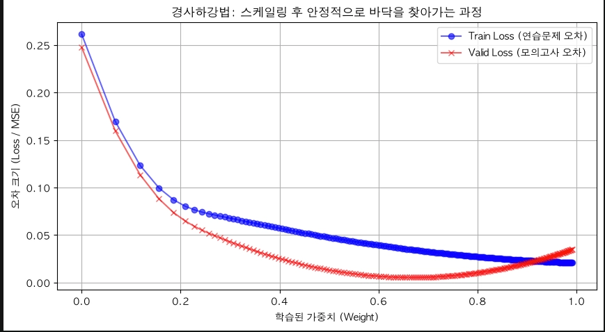
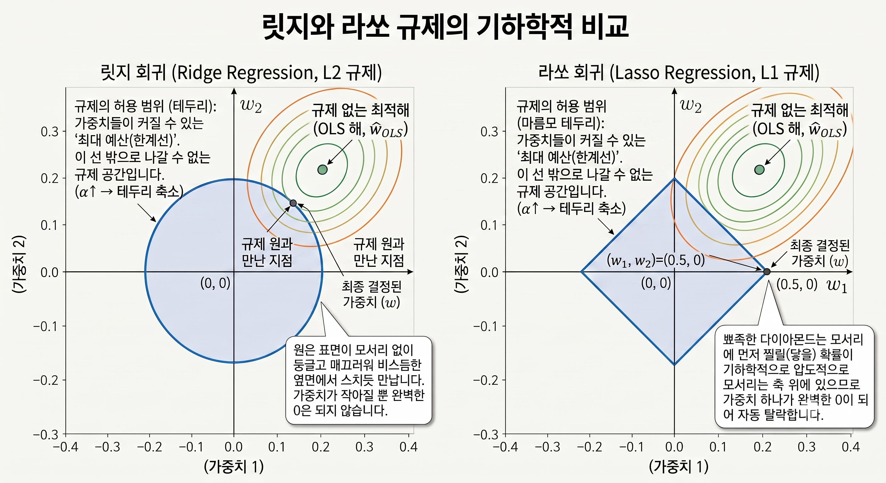
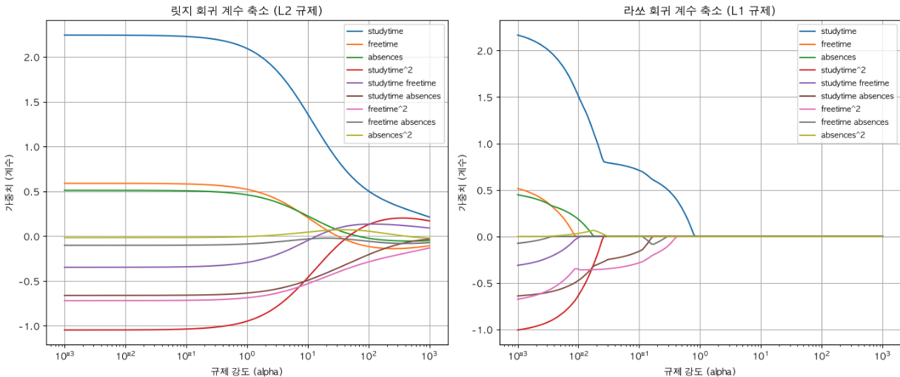

# 20260827 TIL

# 오늘의 TIL

> 날짜 : 2026-08-27
> 주제 : 데이터 스케일링, 데이터 분할, 경사하강법 구현, 다중 회귀와 규제 모델(Ridge / Lasso)

## 어제의 복습

1. 선형 회귀 모델 학습의 궁극적 목표
2. MSE
3. 경사하강법 가중치 업데이트 공식의 기울기 앞 마이너스가 붙는 이유
4. 학습률이 너무 클 때 발생할 문제
5. 인공지능이 훈련 전 사람이 정해주는 값, 학습률이나 학습 횟수(Epochs) : 하이퍼파라미터

## 오늘 공부한 내용

### 4장 머신러닝

### 2.2 경사하강법, 옵티마이저 및 데이터 분할

### 4. 데이터 분할 및 경사하강법 시각화

**스케일링이 필요한 이유**

- 데이터의 숫자 ↑ , 인공지능 학습 시 값의 변동 폭 ↑ → 최적점을 빗나가는 **오버슈팅(Overshooting)** 발생 → 기준을 통일 (데이터 스케일링)

- **최소값 최대값 스케일링 (MinMaxScaler)**: 0~1 사이로 압축

$$X_{new} = \frac{X - min}{max - min}$$

최소값 최대값: 데이터의 가장 작은 값을 0, 가장 큰 값을 1로 기준을 잡아 그 사이의 비율로 크기를 맞춤을 의미함

  - 장점
    - 값의 범위가 0~1로 고정되어 해석이 직관적임
    - 이미지 픽셀(0~255)처럼 원래 범위가 정해진 데이터에 적합함
  - 단점
    - 이상치(outlier)에 매우 취약함 — 최대/최소값 자체가 기준이라, 극단값 하나가 나머지 데이터를 전부 좁은 구간으로 몰아넣음
    - 새로운 데이터가 기존 min/max 범위를 벗어나면 0~1 범위 밖의 값이 나올 수 있음

- **표준점수 (StandardScaler / Z-score)**: 평균 0, 표준편차 1로 변환

$$Z = \frac{X - \mu}{\sigma} = \frac{X - \text{평균}}{\text{표준편차}}$$

해당 데이터가 평균($\mu$)으로부터 '표준편차($\sigma$)의 몇 배'만큼 떨어져 있는지를 의미함

  - 장점
    - 이상치의 영향을 MinMaxScaler보다 상대적으로 덜 받음 (평균·표준편차 기준이라 극단값 하나에 전체 스케일이 휘둘리지 않음)
    - 정규분포를 가정하는 모델(로지스틱 회귀, SVM, 선형 회귀 등)과 궁합이 좋음
  - 단점
    - 값의 범위가 고정되어 있지 않음 (음수 포함, 상한/하한 없음) → 범위가 정해진 입력을 요구하는 경우엔 부적합
    - 데이터가 정규분포에서 크게 벗어나면 효과가 떨어질 수 있음

**[분산, 표준편차, 표준점수]**

- **분산 ($\sigma^2$)**: 데이터가 흩어진 정도. (단점: 값을 제곱해서 단위가 뻥튀기되므로 직관성이 떨어짐)
- **표준편차 ($\sigma$)**: 분산에 루트($\sqrt{}$)를 씌워 단위를 원상 복구한 값. "데이터들이 평균에서 평균적으로 얼마나 떨어져 있는가"를 나타내는 체감 가능한 실제 거리.
- **표준점수 ($Z$)**: 내 데이터가 평균으로부터 '표준편차의 몇 배'만큼 떨어져 있는지 나타내는 **"상대적 위치"**. (단순 수치가 아닌, 전체 집단에서의 진짜 내 위치를 비교할 때 사용)

**3단계 연결 흐름**

1. 흩어진 정도를 구하고 **(분산)**
2. 보기 편한 단위로 되돌린 뒤 **(표준편차)**
3. 그것을 기준으로 내 위치를 파악한다 **(표준점수)**

$$
\text{분산}(\sigma^2) \xrightarrow{\sqrt{}} \text{표준편차}(\sigma) \xrightarrow{\quad\text{분모로 활용}\quad} \text{표준점수}(Z)
$$

### 3. 모의고사가 필요한 이유: 데이터 분할 (Data Split)

**데이터 분할(Data Split)이 필요한 이유**

- **문제점** : 모델에게 모든 데이터를 한 번에 주면, 데이터의 '법칙'을 학습하지 못하고 **과적합(Overfitting)** 현상이 발생
- 과적합 : 문제와 정답을 통째로 외워버리는 현상
- **해결책** : 전체 데이터를 **훈련용(연습문제)**, **검증용(모의고사)**, **테스트용(본수능)** 3가지로 엄격하게 나누어 학습
- `Scikit-learn` 라이브러리의 `sklearn.model_selection`의 `train_test_split` 기능을 활용

**[데이터 분할의 종류와 역할]**

| 데이터 종류 | 비율(예시) | 역할 및 수능 시험 비유 |
| --- | --- | --- |
| <b>훈련 세트 (Train Set)</b> | 60% | <b>수학 익힘책 (평소 연습용):</b> 모델이 직접 데이터를 보며 패턴을 학습하고, 오답 노트를 쓰며 <b>가중치(Weight)를 업데이트(역전파)</b>하는 주력 데이터 |
| <b>검증 세트 (Validation Set)</b> | 20% | <b>9월 모의고사 (중간 점검용):</b> 학습 주기(Epoch)마다 모델을 평가(Loss 확인)하여, 과적합이 발생하지 않는지 감시하고 학습 방향(하이퍼파라미터)을 조율하는 데이터 |
| <b>테스트 세트 (Test Set)</b> | 20% | <b>실제 수능 시험 (최종 평가용):</b> 모든 학습이 끝난 후, 모델이 한 번도 본 적 없는 데이터를 주입해 모델의 <b>진짜 실력(일반화 성능)을 최종 평가(예측 후 채점)</b>하는 데이터 |

**데이터 분할 시 주의사항**

- **데이터 섞기(Shuffle):** 데이터의 순서나 패턴이 한쪽으로 치우치지 않도록 비율에 맞게 골고루 섞기
- **테스트 셋 봉인:** 테스트 세트는 최종 평가 순간까지 절대 모델의 학습 과정에 노출되거나 관여해서는 안 된다

**[핵심 요약] 학습 곡선(Loss Curve) 분석과 과적합 방지**

**1. 두 곡선의 기본 움직임**

- **파란색 선 (Train Loss / 연습문제 오차):**
  - 학습이 진행될수록 끝없이 바닥을 향해 내려갑니다. (연습문제를 완벽하게 외우며 점수를 올리고 있다는 뜻)
- **빨간색 선 (Valid Loss / 모의고사 오차):**
  - 처음에는 파란선과 함께 사이좋게 오차가 줄어들지만, 특정 시점(최저점)을 지나면 바닥을 찍고 다시 튕겨 올라갑니다.

**2. 학습 상태 진단 구간**

- **과소적합 (Underfitting) 구간 (예: 0.0 ~ 약 0.3)**
  - 학습을 막 시작하여 연습문제와 모의고사 모두 오차가 매우 큰 상태임 모델이 아직 데이터의 패턴을 파악하지 못했으므로 **더 많은 학습이 필요**합니다.
- **과대적합 (Overfitting) 구간 (예: 약 0.65 ~ 1.0)**
  - 모델이 연습문제의 지엽적인 노이즈까지 통째로 외워버려, 처음 보는 실전(모의고사)에서는 융통성을 발휘하지 못해 오차가 커지는 상태임

**3. 그래프에서 나타나는 주요 경고 신호**

- **갭(Gap) 확장과 축소**: 초반에 두 선이 모두 순조롭게 하락하며 두 선 사이의 격차가 벌어지는 것은 학습이 아주 잘 되고 있다는 뜻입. 하지만 특정 시점(0.65) 이후 빨간선이 반등하여 치솟으면서 벌어졌던 갭이 다시 줄어들기 시작하는데, 이것이 바로 모델이 과대적합으로 빠져들고 있다는 명백한 증거
- **교차(Crossing) 현상:** 솟구치던 빨간선이 결국 파란선을 뚫고 위로 올라가 역전해 버립니다. 이는 모델의 일반화 능력(처음 보는 데이터를 맞추는 실력)이 완전히 붕괴되어, "연습문제를 푼 실력조차 실전에서는 전혀 먹히지 않는 상태"임을 알리는 강력한 경고 신호임

**4. 최종 해결책: 스위트 스팟과 조기 종료**

- **스위트 스팟(Sweet Spot):** 파란선의 끝없는 하락 유혹을 무시하고, **빨간선(Valid Loss)이 가장 낮은 최저점**을 선택해야 합니다. 이곳이 훈련과 실전 모두에서 최고의 성능을 내는 최적의 지점임
- **조기 종료 (Early Stopping):** 적절한 학습 횟수를 찾기 위해, 검증 세트(Valid Loss)의 오차가 바닥을 찍고 **더 이상 떨어지지 않거나 상승하려는 조짐이 보이면 즉시 학습을 강제로 종료**하여 모델의 '진짜 실력'을 보존하는 핵심 테크닉임

## 머신러닝 회귀 모델과 경사하강법 구현

### 1. 다중 선형 회귀 및 스케일링 기본

데이터를 불러오고 `scikit-learn`을 활용해 선형 회귀 모델을 학습시킵니다. 또한 데이터의 단위를 맞추기 위해 스케일링을 진행합니다.

~~~python
import sklearn
import pandas as pd
from sklearn.linear_model import LinearRegression
from sklearn.preprocessing import MinMaxScaler, StandardScaler

# 텍스트 형태로 출력 설정
sklearn.set_config(display='text')

# 데이터 불러오기
df = pd.read_csv('usa_housing.csv')
df.head()

# 특성(Feature)과 정답(Label) 분리
X = df[['SquareFeet', 'CrimeRate', 'SchoolRating']]
y = df['Price']

print("X shape, y shape:", X.shape, y.shape)

# 1. 기본 선형 회귀 모델 학습
model = LinearRegression()
model.fit(X, y)

# 모델이 학습한 가중치와 절편 확인
print("원본 가중치:", model.coef_)
print("원본 절편:", model.intercept_)

# 2. 데이터 스케일링 (MinMaxScaler)
min_max_scaler = MinMaxScaler()
min_max_scaler.fit(X.values) # 기준 준비
X_scaled1 = min_max_scaler.transform(X.values) # 0~1 사이로 변환

# 3. 데이터 스케일링 (StandardScaler)
ss = StandardScaler()
ss.fit(X.values) # 변환 준비
X_scaled2 = ss.transform(X.values)

# 스케일링된 데이터로 다시 학습
model_scaled = LinearRegression()
model_scaled.fit(X_scaled2, y.values)

print("스케일링 후 가중치:", model_scaled.coef_)
print("스케일링 후 절편:", model_scaled.intercept_)
~~~

### 2. 머신러닝 데이터 가공 및 세트 분할

학습에 필요한 핵심 도구들을 불러오고, 데이터를 Train, Validation, Test 세트로 쪼개어 실전 검증을 준비합니다.

~~~python
import pandas as pd
from sklearn.preprocessing import StandardScaler
from sklearn.model_selection import train_test_split
import matplotlib.pyplot as plt

# 데이터 전처리: 2015년 이후 지어지고 범죄율이 40 미만인 데이터로 필터링
df = pd.read_csv('usa_housing.csv')
df = df[(df['YearBuilt'] > 2015) & (df['CrimeRate'] < 40)]

# 예측할 문제(Feature)와 정답(Label) 추출
X_sqrt = df[['SquareFeet']].values
y_price = df['Price'].values

# 데이터 스케일링 (2차원 배열을 1차원으로 평탄화)
ss = StandardScaler()
X_scaled = ss.fit_transform(X_sqrt).flatten()

# 데이터 쪼개기 (Train 60%, Valid 20%, Test 20%)
# 1차 분할 - 임시 훈련 세트(80%)와 테스트 세트(20%)
X_train_tmp, X_test, y_price_tmp, y_test = train_test_split(
    X_scaled, y_price, test_size=0.2, random_state=42
)

# 2차 분할 - 최종 훈련 세트(60%)와 검증 세트(20%)
X_train, X_valid, y_train, y_valid = train_test_split(
    X_train_tmp, y_price_tmp, test_size=0.25, random_state=42 # 0.8 * 0.25 = 0.2
)

print("전체:", X_scaled.shape)
print("Train Set:", X_train.shape)
print("Validation Set:", X_valid.shape)
print("Test:", X_test.shape)
~~~

### 3. 경사하강법 직접 구현 및 시각화 (AI 모델 최적화)

`scikit-learn`을 사용하지 않고 직접 수학 공식을 통해 경사하강법(Gradient Descent)을 구현하여 오차를 줄여나가는 과정을 학습합니다.

~~~python
import numpy as np

# 하이퍼파라미터 초기 세팅
weight = 0.0 # 가중치(w): 집 크기에 따른 가격 영향력 (초기값 0)
bias = 0.0 # 편향(b): 기본적으로 깔고 가는 베이스 집값 (초기값 0)
learning_rate = 0.1 # 보폭(학습률): 스케일링을 했으므로 조금 넓게 잡아도 안전함
epochs = 300 # 훈련 횟수: 산을 내려가는 걸음을 총 300번 반복

# 오차 기록용 리스트
train_losses = []
valid_losses = []
history_w = []

N_train = len(X_train)
N_valid = len(X_valid)

# 경사하강법 루프 시작
for epoch in range(epochs):
    # [훈련 세트] 현재 가중치로 집값 예측 (y_pred = w * x + b)
    y_pred_train = weight * X_train + bias
    train_loss = np.mean((y_pred_train - y_train) ** 2)
    train_losses.append(train_loss)

    # [검증 세트] 모의고사 데이터를 넣어 실력 중간 점검
    y_pred_valid = weight * X_valid + bias
    valid_loss = np.mean((y_pred_valid - y_valid) ** 2)
    valid_losses.append(valid_loss)

    history_w.append(weight)

    # 기울기(Gradient) 구하기: 반드시 훈련(Train) 데이터를 기준으로 계산!
    dw = (2 / N_train) * np.sum((y_pred_train - y_train) * X_train)
    db = (2 / N_train) * np.sum(y_pred_train - y_train)

    # 한 걸음 이동! (현재 위치 - 보폭 * 기울기)
    weight -= learning_rate * dw
    bias -= learning_rate * db

# 인공지능이 길을 찾아간 과정 시각화
plt.figure(figsize=(10, 5))

# 가중치 변화에 따른 오차율 시각화
plt.plot(history_w, train_losses, color='blue', label='Train Loss')
plt.plot(history_w, valid_losses, color='red', label='Valid Loss')

plt.xlabel('Weight (w)')
plt.ylabel('Loss (MSE)')
plt.title('경사하강법: 가중치에 따른 오차 감소 흐름')
plt.legend()
plt.grid(True, linestyle='--')
plt.show()
~~~

### 3.1 다중 회귀와 규제 모델

### 1. 다중 선형 회귀와 다중공선성

**1. 다중 회귀의 구조와 원리**

$$y = w_1 x_1 + w_2 x_2 + w_3 x_3 + \dots + w_p x_p + b$$

- $y$ : 예측해 낼 최종 기말고사 시험 성적 (0점부터 20점 범위)
- $x_1$ : 주당 자습 시간 (1: 2시간 미만, 2: 2 ~ 5시간, 3: 5 ~ 10시간, 4: 10시간 초과)
- $x_2$ : 방과 후 자유 시간 (1: 매우 적음 ~ 5: 매우 많음)
- $x_3$ : 학기 중 학교 결석 일수
- $w_1, w_2, w_3$ : 각 정보가 최종 성적에 미치는 영향력/중요도 (가중치)
- $b$ : 기본적으로 깔고 가는 점수 (편향)

### 다중공선성과 규제 모델 (Ridge / Lasso) 핵심 요약

**1. 다중공선성 (Multicollinearity)**

원인 변수들끼리 서로 지나치게 밀접한 상관관계를 가져서, 각 변수의 독립적인 기여도를 파악하기 어려워지는 **중복 간섭 현상**.

**비유**: 조별 발표에서 두 발표자가 똑같이 '학습 효율성' 파트를 준비해 와서, 서로 자기 기여도가 더 크다고 우기는 상황과 같습니다.

**유해성**

- 데이터가 아주 조금만 바뀌어도 가중치(계수) 추정치가 크게 요동쳐 **모델 신뢰도 저하**
- 모형의 **과적합 위험 증가** → 새로운 데이터에 대한 예측력 상실

**진단 지표**

- **VIF (분산팽창계수, Variance Inflation Factor)**: 다중공선성 존재 여부를 판단하는 가장 직관적인 척도

**2. 특성 공학과 규제 모델**

**특성 공학(Feature Engineering)**은 기존 변수를 가공해 더 유용한 단서(파생 변수)를 새로 만드는 전처리 과정임. 다만 이 과정에서 변수 개수가 급증하면 과적합이라는 부작용이 생길 수 있어, **변수에 패널티를 부여해 과도한 영향력을 억누르는 '규제(Regularization)'**가 필요합니다.

**2.1 특성 공학 (Feature Engineering)**

**정의**: 예를 들어 기존의 자습 시간 × 자유 시간 데이터를 곱해 '학습 대비 휴식 균형'과 같은 고차원 파생 변수를 새로 만드는 과정.

**비유**: 떡볶이를 만들 때 고춧가루·설탕·간장을 따로 맛보며 간을 맞추기는 어렵지만, 이를 황금 비율로 미리 섞은 '마법의 특제 양념장'을 만들면 요리가 훨씬 쉬워지는 것과 같습니다.

**과적합(Overfitting)의 공격**

- 유용하다고 다항 변수를 9개, 10개씩 남발하면, 모델이 훈련 데이터의 자잘한 소음(noise)까지 암기해버리는 함정에 빠집니다.
- **비유**: 몸에 좋다고 인삼·대추·치즈·카레가루 등 10가지 재료를 다 때려 넣으면, 결국 만든 사람 입맛(훈련 데이터)에만 맞고 남들은 못 먹는 정체불명 요리가 됩니다.

**2.2 릿지 회귀 (Ridge Regression) — L2 규제**

예측 오차(MSE)를 최소화하면서, **가중치들의 제곱합**을 추가 벌금(패널티)으로 부과해 특정 변수로 쏠리는 현상을 방지합니다.

**손실 함수 공식**

$$
\text{Loss}_{\text{Ridge}} = \text{MSE} + \alpha \sum_{j=1}^{p} w_j^2
$$

| 기호 | 의미 |
| --- | --- |
| $\text{Loss}_{\text{Ridge}}$ | 최종 손실 함수. 예측 오차와 가중치 복잡도(크기)를 동시에 고려한 종합 벌점으로, 이 값을 최소화하는 것이 학습 목표임 |
| $\text{MSE}$ | 평균 제곱 오차(Mean Squared Error). 실제값 $y$와 예측값 $\hat{y}$ 차이를 제곱해 평균낸 값으로, 모델의 데이터 적합도(Fit)를 담당합니다. |
| $\alpha$ | 규제 강도(Hyperparameter). 적합도와 단순함 사이의 무게중심을 조절하는 계수로, 사용자가 직접 지정합니다. $\alpha$가 커질수록 오차를 더 허용하더라도 가중치를 강하게 압박해 모델을 단순하게 만듭니다. |
| $\sum_{j=1}^{p} w_j^2$ | L2 규제항(패널티항). 편향(상수항)을 제외한 모든 독립 변수 가중치의 제곱합. |
| $p$ | 모델에 사용된 **독립 변수(특성, feature)의 총 개수** — 즉 규제 대상이 되는 가중치 $w_1, w_2, \dots, w_p$의 개수임 |
| $j$ | 각 독립 변수를 가리키는 인덱스(일련번호). 편향(상수항)을 규제에서 제외하기 위해 $0$이 아닌 $1$번 변수부터 시작합니다. |

**역할**: 특정 변수의 가중치가 비정상적으로 커지는 것을 막아 과적합을 방지하는 브레이크.

**왜 편향(상수항)은 규제 대상에서 빠질까?**

선형 모델 방정식은 다음과 같습니다.

$$
y = w_1x_1 + w_2x_2 + \dots + w_px_p + b
$$

여기서 편향 $b$는 모델의 기본 베이스라인(y절편)을 잡아주는 상수항임. 만약 $j=0$부터 시작해 $b$까지 규제하면, 그래프가 강제로 원점 $(0,0)$에 붙어버려 데이터의 전체적인 높낮이를 맞추지 못합니다. 따라서 Ridge는 변수의 영향력(기울기 $w$)만 통제하고, 상수항 $b$는 규제 범위($j=1$부터 $p$까지)에서 제외해 모델의 최소한의 유연성을 보장합니다.

**특징**

- 독립 변수의 척도(scale)에 민감하므로 **데이터 표준화 전처리가 필수**
- 가중치가 $0$에 아주 가까워질 뿐, **완전한 $0$은 되지 않아 변수를 모두 보전**

**2.3 라쏘 회귀 (Lasso Regression) — L1 규제**

Ridge와 마찬가지로 과적합을 막는 브레이크 역할을 하지만, "쓸모없는 힌트는 아예 보지 않겠다"며 가중치를 칼같이 **0으로 만들어버리는** 단호함을 가진 알고리즘임

**손실 함수 공식**

$$
\text{Loss}_{\text{Lasso}} = \text{MSE} + \alpha \sum_{j=1}^{p} |w_j|
$$

| 기호 | 의미 |
| --- | --- |
| $\text{Loss}_{\text{Lasso}}$ | 모델이 최종적으로 최소화해야 하는 종합 벌점. 낮을수록 좋은 모델임 |
| $\sum_{j=1}^{p} \lvert w_j \rvert$ | L1 규제항. 편향을 제외한 모든 독립 변수 가중치의 **절대값 합**. |
| $p$ | 모델이 학습하는 독립 변수(컬럼)의 **총 개수** — Ridge와 동일하게, 규제 대상 가중치 개수를 의미합니다. |
| $j$ | 각 변수의 인덱스. y절편 역할을 하는 편향(상수항)은 전체 기본 바닥선을 잡아주어야 하므로 Ridge와 마찬가지로 규제 대상에서 제외($j=1$부터 시작)합니다. |

**왜 절대값을 쓰면 가중치가 정확히 0이 될까?**

- **Ridge(제곱)는 둥근 원**, **Lasso(절대값)는 뾰족한 다이아몬드(마름모)** 모양의 규제 경계선을 만듭니다.
- 오차가 가장 적은 최적점을 찾아가다가 이 경계선과 처음 마주치는 지점이 해(解)가 되는데,
- 둥근 원(Ridge)은 완만한 곡선 위에서 만나기 때문에 가중치가 0.1, 0.05처럼 작아질 뿐 완전한 0이 되기는 어렵습니다.
- 뾰족한 다이아몬드(Lasso)는 높은 확률로 **축 위의 모서리**에서 만나며, 축 위에서 만난다는 것은 좌표 중 하나가 정확히 $0$이 된다는 뜻임

**특징**

- 예측에 도움이 안 되는 컬럼의 가중치를 스스로 판단해 **0으로 제거** → 자동 변수 선택(feature selection) 효과
- **비유**: 집값을 맞추는 데 '역까지 거리'는 중요하지만 '집주인 성씨'나 '문손잡이 색깔'은 쓸모가 없습니다. Lasso는 이런 무의미한 컬럼을 자동으로 탈락(0으로 사멸)시켜 데이터 다이어트를 해줍니다.

**요약 비교**

| 구분 | Ridge (L2) | Lasso (L1) |
| --- | --- | --- |
| 패널티 | $\sum w_j^2$ (제곱합) | $\sum \lvert w_j \rvert$ (절대값 합) |
| 가중치가 0이 되는가 | 아니오 (0에 근접만) | 예 (정확히 0 가능) |
| 효과 | 변수 전체 보존, 영향력만 축소 | 불필요한 변수 자동 제거 |
| 전제조건 | 데이터 표준화 필수 | 데이터 표준화 필수 |

### 3.1 데이터 준비 및 가공하기

머신러닝 데이터 가공과 시각화에 필요한 필수 도구들을 불러옵니다.

~~~python
import pandas as pd
import numpy as np
import matplotlib.pyplot as plt
import sklearn
from sklearn.preprocessing import StandardScaler, PolynomialFeatures

# 텍스트 형태로 출력 설정
sklearn.set_config(display='text')

# 난수를 고정하여 매번 돌릴 때마다 동일한 분석 결과가 나오도록 처리
np.random.seed(42)

# 학생 성적(student-por.csv) 불러오기
df = pd.read_csv('student-por.csv')
df.head()
~~~

분석을 위한 변수 3가지를 독립변수(특성, Feature)로 지정합니다.

- **studytime:** 주당 자습 시간 (1~4 범위)
- **freetime:** 방과 후 자유 시간 (1~5 범위)
- **absences:** 학기 중 최종 결석 횟수 (0~93 범위)

~~~python
X = df[['studytime', 'freetime', 'absences']]
y = df['G3']
X.head()
~~~

특성 공학(Polynomial Features)을 적용하여 3개의 기본 축을 제곱항과 상호작용항이 포함된 9개 컬럼으로 확장합니다.

~~~python
poly = PolynomialFeatures(degree=2, include_bias=False)
# poly.fit(X) # 준비
# X_poly = poly.transform(X) # 변경
X_poly = poly.fit_transform(X)

print("확장된 특성 형태:", X_poly.shape)

feature_names = poly.get_feature_names_out(X.columns)
print("특성 이름:", feature_names)
~~~

자습 시간(1~4단계)과 결석 일수(0~93일)의 척도가 크게 다르므로, 이를 동일한 스케일(표준점수)로 맞춰줍니다.

~~~python
ss = StandardScaler()
X_scaled = ss.fit_transform(X_poly) # 표준점수로 변환
X_scaled[:10]
~~~

### 3.3 모델 학습 및 시각화

모델 학습 및 규제를 위한 도구를 불러옵니다. 규제 강도(`alpha`)를 로그 스케일로 0.001부터 1000까지 넓은 범위에 걸쳐 200단계로 나누어 설정합니다.

~~~python
from sklearn.linear_model import Ridge, Lasso

alphas = np.logspace(-3, 3, 200)

ridge_coefs = []
lasso_coefs = []

# 모델 학습하기
for alpha in alphas:
    # Ridge 모델 가중치 저장
    ridge = Ridge(alpha=alpha)
    ridge.fit(X_scaled, y)
    ridge_coefs.append(ridge.coef_)

    # Lasso 모델 가중치 저장
    lasso = Lasso(alpha=alpha)
    lasso.fit(X_scaled, y)
    lasso_coefs.append(lasso.coef_)
~~~

학습된 데이터를 바탕으로 두 가지 규제 모델의 특성을 비교하는 시각화를 진행합니다.

~~~python
# 데이터 분석 및 시각화를 위해 계수 리스트를 NumPy 배열로 변환합니다.
ridge_coefs = np.array(ridge_coefs)
lasso_coefs = np.array(lasso_coefs)

# 두 가지 규제 모델의 가중치 축소 궤적을 비교 시각화하기 위해 1행 2열의 plot 영역을 생성합니다.
fig, axes = plt.subplots(1, 2, figsize=(14, 6))

# 왼쪽 그래프: 규제가 강해질수록 가중치가 완만하게 0에 가까워지는 릿지(Ridge) 차트
for i in range(X_scaled.shape[1]):
    axes[0].plot(alphas, ridge_coefs[:, i], label=feature_names[i])
axes[0].set_xscale('log') # alpha 값의 광범위한 탐색을 위해 x축을 로그 스케일로 설정
axes[0].set_title('릿지 회귀 계수 축소 (L2 규제)')
axes[0].set_xlabel('규제 강도 (alpha)')
axes[0].set_ylabel('가중치 (계수)')
axes[0].grid(True)
axes[0].legend(fontsize='small', loc='upper right')

# 오른쪽 그래프: 규제가 강해지면서 불필요한 가중치가 완전히 0이 되어 사라지는 라쏘(Lasso) 차트
for i in range(X_scaled.shape[1]):
    axes[1].plot(alphas, lasso_coefs[:, i], label=feature_names[i])
axes[1].set_xscale('log')
axes[1].set_title('라쏘 회귀 계수 축소 (L1 규제)')
axes[1].set_xlabel('규제 강도 (alpha)')
axes[1].set_ylabel('가중치 (계수)')
axes[1].grid(True)
axes[1].legend(fontsize='small', loc='upper right')

plt.tight_layout() # 서브플롯 간의 간격을 자동으로 최적화하여 겹침을 방지
plt.show() # 최종 학습 궤적 시각화 그래프를 화면에 출력합니다.
~~~

**결과 그래프 설명**

*좌측 릿지 그래프*

규제 강도($\alpha$)가 $100$을 넘어서면서 각 변수의 가중치(계수)들이 완만하게 $0$을 향해 수축합니다. 하지만 릿지 모델의 특성상 가중치가 완전히 소멸(0)하지는 않으며, 자습 시간(studytime)과 결석 일수(absences)의 상호작용 항을 비롯한 주요 변수들의 영향력을 미세하게 유지합니다.

*우측 라쏘 그래프*

규제 강도($\alpha$)가 $0.1$에서 $1$ 사이를 지날 무렵, 종속 변수와 관련성이 낮은 상호작용(융합) 변수들의 가중치가 급격히 감소하여 완전히 $0$으로 수렴하는 것을 볼 수 있습니다. 이는 중요도가 떨어지는 특성의 가중치를 정확히 $0$으로 만들어 모델에서 제외하는 라쏘(Lasso)의 특성 선택 기능이 명확히 드러나는 부분임

## 찾아본 내용

### 1. 어느 수치가 커지면 영향력이? 무슨 기준으로 통일?

**[핵심 요약: 가중치 비교와 스케일링의 필요성]**

- **가중치의 함정**
  - 모델이 학습한 가중치 숫자가 크다고 해서 무조건 더 중요한 요인인 것은 아님
- **단위(기준)의 차이**
  - 데이터마다 기본 크기(예: 100 단위의 면적 vs 소수점 단위의 범죄율)가 다름
  - 값이 너무 작은 데이터는 밸런스를 맞추기 위해 모델이 가중치를 인위적으로 크게 곱해버리는 착시가 발생
- **해결책 (데이터 스케일링)**
  - 변수들의 진짜 중요도를 비교하려면, 학습 전에 `StandardScaler`나 `MinMaxScaler`를 사용하여 모든 데이터의 단위(스케일)를 통일

### 2. `X_sqrt = df[['SquareFeet']]` 와 `X_sqrt = df[['SquareFeet']].values` 차이

- Same : 데이터를 추출한다
- Diff : 결과물의 '형태(데이터 타입)'

**[핵심 차이 요약]**

| 코드 | 반환 형태 | 특징 | 활용 |
| --- | --- | --- | --- |
| `df[['SquareFeet']]` | **Pandas DataFrame** | 컬럼 이름(SquareFeet)과 행 번호(인덱스)를 그대로 유지함 | 데이터를 눈으로 확인하거나, Pandas 고유의 기능을 계속 쓸 때 |
| `df[['SquareFeet']].values` | **NumPy Array** | 껍데기(컬럼명, 인덱스)를 모두 벗기고 **순수 숫자 데이터(배열)**만 남김 | Scikit-learn 모델에 입력값($X$)으로 집어넣을 때 |

### 3. fc.exe의 비교 기능 상세 설명

- `fc.exe /n "상대 경로\파일1" "상대 경로\파일2"`
- VS Code의 Select for Compare 기능이 더 직관적이고 좋음

### 4. `ValueError: operands could not be broadcast together with shapes (2,) (6,)` 에러 해석

**'배열 크기 불일치'** 에러

- **`ValueError` (값 에러):** 연산을 수행하기에 데이터의 값이 적절하지 않다는 뜻임
- **`operands` (피연산자):** 연산 기호(`+`, `-`, `*`, `/` 등)의 양옆에 놓인 데이터를 말합니다. (예: `A + B`에서 A와 B)
- **`shapes (2,) (6,)` (형태/크기):** 연산하려는 두 데이터의 크기임. 하나는 데이터가 2개 들어있는 1차원 배열(`(2,)`)이고, 다른 하나는 6개 들어있는 1차원 배열(`(6,)`)이라는 의미임
- **`broadcast` (브로드캐스팅):** 모양이 서로 다른 배열끼리 연산할 때, 시스템이 알아서 작은 배열을 쫙 늘려(복사해) 크기를 맞춰주는 아주 편리한 자동 확장 기능임

**왜 에러가 났을까? (결론)**

데이터가 2개인 배열과 6개인 배열은 배수 관계가 아니며 짝을 맞출 수 없기 때문에, 시스템이 "이 둘은 어떻게 늘려도(브로드캐스팅해도) 크기를 똑같이 맞출 수 없어서 계산을 포기하겠다!"라며 에러를 뱉은 것임

### 5. Ridge와 Lasso가 가중치를 다루는 기하학적 원리

**1. 3가지 핵심 비유 매칭**

수식의 원리를 2차원 좌표평면 위의 시각적 요소로 치환하면 다음과 같습니다.

- **테두리 (울타리)**: 모델의 **규제 허용 범위**임 오차를 줄이고 싶어도 가중치들이 절대 넘어갈 수 없는 '최대 한계선'을 뜻합니다.
  - Ridge는 **둥근 원(구)**, Lasso는 **뾰족한 다이아몬드(마름모)** 모양임
  - 테두리의 **크기는 규제 강도 $\alpha$에 따라 달라집니다.**
  - $\alpha$가 커질수록 → 테두리가 원점 쪽으로 작아짐 → 접점도 원점에 가까워짐(가중치가 더 강하게 압박됨)
  - $\alpha \to 0$이면 테두리가 무한히 커져 규제가 없는 원래 해와 접점이 일치
  - $\alpha \to \infty$이면 테두리가 원점으로 수축해 모든 가중치가 $0$에 수렴
- **부풀어 오르는 풍선 (타원형 등고선)**: **규제가 없을 때 오차(MSE)가 최소가 되는 지점**($\hat{w}_{OLS}$, 즉 일반 최소제곱 회귀의 해)에서부터 퍼져나오는 **오차(MSE)의 등고선**임
  - 이 지점은 "완벽한 정답(오차 0)"이 아닙니다. 실제 데이터에는 노이즈가 있어 MSE가 정확히 0이 되는 경우는 거의 없습니다. 어디까지나 **규제항 없이 오차만 최소화했을 때의 해**임
  - 독립 변수 간 상관관계(다중공선성)가 클수록 이 등고선은 원이 아니라 **길쭉한 타원** 형태를 띱니다.
- **부딪히는 지점 (접점)**: 풍선과 테두리가 가장 처음 맞닿는 곳으로, 규제와 오차가 타협하여 **최종 결정된 가중치($w$)의 좌표**를 의미합니다.

**2. 라쏘(Lasso)만 가중치를 0으로 만드는 이유**

풍선(오차)이 커지다가 테두리(규제)와 맞닿는 순간의 형태가 결정적인 차이를 만듭니다.

**릿지 (Ridge / 둥근 원 테두리)**

- 원은 표면이 모서리 없이 둥글고 매끄럽습니다.
- 풍선이 닿을 때 대부분 비스듬한 곡선 옆면에서 스치듯 접하게 됩니다.
- 접점의 좌표가 $(0.3, 0.7)$처럼 축을 벗어난 애매한 위치에 떨어지므로, **가중치가 작아질 뿐 완전한 $0$이 되지는 않습니다.**

**라쏘 (Lasso / 뾰족한 다이아몬드 테두리)**

- 다이아몬드는 X축, Y축 위를 향해 창끝처럼 튀어나온 4개의 뾰족한 모서리를 가집니다.
- 풍선이 다가오면 평평한 면보다는 **툭 튀어나온 뾰족한 모서리에서 먼저 닿을 확률이 기하학적으로 높습니다.**
- 모서리는 정확히 축 위에 존재하므로 접점의 좌표는 $(0.5, 0)$ 형태가 되며, **높은 확률로 하나의 가중치가 완벽한 $0$이 되어 자동 탈락**합니다.
- (단, 정답 위치와 등고선의 방향에 따라 평평한 면에서 접할 수도 있어 "확률이 높다"는 것이지 항상 그런 것은 아닙니다.)

**3. 릿지도 어쩌다 축(0)에서 만날 수 있지 않을까?**

- **이론적으론 가능 (확률 0%)**: 정답 위치가 축과 소수점 끝자리까지 완벽하게 일직선상에 놓여 있다면 릿지도 $0$이 될 수 있습니다.
- **현실 데이터의 한계**: 현실의 데이터는 노이즈가 있어 정답이 완벽한 축에서 아주 조금이라도 빗겨나 있습니다. 릿지의 원형 테두리는 매끄러워서, 풍선이 닿는 순간 **접점이 축을 벗어나 옆으로 미끄러져 버립니다.**
- **라쏘의 끌어당기는 효과**: 반면 라쏘의 뾰족한 모서리는 정답이 약간 삐딱하게 놓여 있어도 가장 먼저 부딪히게 되는 경우가 많아, 주변의 어중간한 값들을 $0$ 쪽으로 끌어당기는 효과를 냅니다. 이 때문에 실무에서는 라쏘가 Ridge보다 확실하게 변수를 0으로 지워준다(Data Diet)고 평가받습니다.

**요약**

| 구분 | Ridge (원형 제약) | Lasso (다이아몬드 제약) |
| --- | --- | --- |
| 접점이 생기는 위치 | 곡면 어디서나 (축 밖 포함) | 대부분 축 위의 뾰족한 모서리 |
| 가중치가 0이 되는가 | 거의 안 됨 (근접만) | 자주 됨 (정확히 0) |
| $\alpha$의 역할 | 테두리 크기를 줄여 접점을 원점 쪽으로 압박 | 동일 (+ 모서리 접점 유도로 변수 선택 효과 강화) |

## 핵심 개념

- 스케일링: 숫자 스케일이 크면 오버슈팅(Overshooting)이 나기 쉬워 기준을 통일
- MinMaxScaler: 0~1로 압축
- StandardScaler / Z-score: 평균 0, 표준편차 1. 평균으로부터 표준편차의 몇 배인지
- 분산 → 표준편차 → 표준점수
- Data Split: Train(연습문제) / Validation(모의고사) / Test(본수능)
- 과적합(Overfitting): 문제와 정답을 통째로 외우는 현상
- Shuffle, 테스트 셋 봉인
- Train Loss와 Valid Loss, Gap, Crossing
- Sweet Spot, Early Stopping (Valid Loss 기준)
- 다중공선성(Multicollinearity), VIF
- Feature Engineering과 규제(Regularization)
- Ridge (L2, 제곱합): 가중치를 0에 가깝게만 줄이고 변수는 보전
- Lasso (L1, 절대값 합): 가중치를 정확히 0으로 만들어 변수 선택
- 편향(상수항) $b$는 규제 대상에서 제외
- Ridge / Lasso 모두 데이터 표준화가 전제

## 교재 보충

※ 아래 내용은 사용자의 필기를 보완하기 위해 교재에서 가져온 내용이다.

**학습률이 너무 작은 경우 (Undershooting)**

보폭이 너무 작으면 계곡 밑바닥에 도착하기 전에 학습이 끝나 얕은 성능에 머무를 수 있다. 필기의 어제 복습·오늘 본문은 학습률이 클 때(오버슈팅) 위주로 적혀 있다.

**VIF 수치 기준**

| VIF 수치 범위 | 공선성 진단 결과 | 대응 및 전처리 전략 |
| --- | --- | --- |
| VIF = 1 | 다중공선성이 전혀 없음 | 그대로 모델 학습에 사용 |
| 1 < VIF <= 5 | 가벼운 중복 존재 | 악영향이 미비하면 허용 가능한 수준 |
| VIF >= 10 | 심각한 다중공선성 존재 | 변수 제거, 하나의 중합 변수로 합치기, 또는 규제 모델 |

**`train_test_split` 옵션**

- `test_size=0.2`: 전체 중 시험용으로 빼둘 비율
- `random_state=42`: 섞을 때 쓰는 난수표 번호. 번호를 고정해야 같은 분할이 재현됨
- `shuffle=True`: 분할 전 데이터를 무작위로 섞음
- `stratify=y`: 정답 비율이 쪼갠 세트 안에서도 같게 유지되도록 나눔

**로그 스케일 (`np.logspace`, `set_xscale('log')`)**

`alpha`를 0.001부터 1000까지 배수로 넓게 볼 때, 일반 축이면 작은 값이 한쪽에 뭉친다. 로그 축을 쓰면 간격이 일정해져 규제 강도에 따른 계수 변화를 비교하기 쉽다.

**규제 강도 `alpha`**

- `alpha = 0`: 규제가 없는 일반 최소제곱 선형 회귀와 같아짐
- `alpha`가 커지면 가중치를 더 강하게 억제하고 모델이 단순해짐
- `alpha`가 작아지면 훈련 오차를 줄이는 쪽에 더 집중함

**Lasso 수렴 관련 파라미터 (교재 실습 코드 기준)**

필기 코드는 `Lasso(alpha=alpha)`이다. 교재 코드는 아래를 추가로 넣는다.

- `max_iter`: 최대 반복 횟수. 기본 반복 안에 수렴하지 못하면 `ConvergenceWarning`이 날 수 있어 교재는 `max_iter=20000`을 사용
- `tol`: 이전 단계와 현재 단계 손실 차이가 이 값보다 작으면 최적화 루프를 멈춘다. 교재 예시 `1e-4`
- 이 `tol`은 좌표 하강법 최적화의 수렴 기준이다. 필기의 Valid Loss **조기 종료(Early Stopping)**와는 다른 장치다.

## 필기 ↔ 교재 비교

| 항목 | 필기 | 교재 | 결과 |
| --- | --- | --- | --- |
| 장/강 번호 | 4장 머신러닝, 2.2 / 3.1 | 2장 2강, 3장 1강 | 확인 필요 |
| 스케일링 정의 | MinMax 0~1, Standard 평균 0·표준편차 1 | 동일 | 동일 |
| 분산-표준편차-표준점수 흐름 | 필기에 3단계 연결 있음 | 동일 흐름 | 동일 |
| Data Split 비율 | Train 60 / Valid 20 / Test 20 | 동일 예시 | 동일 |
| 주택 데이터 필터 | YearBuilt > 2015, CrimeRate < 40 | 동일 | 동일 |
| GD 실습 스케일러 | StandardScaler, X만 스케일 | MinMaxScaler, X와 y 모두 스케일 | 확인 필요 |
| 변수명 | `X_sqrt` | `X_sqft` | 확인 필요 |
| GD epochs | 300 | 200 | 확인 필요 |
| 2차 분할 test_size | 0.25 (0.8 * 0.25 = 0.2) | 동일 | 동일 |
| 다중회귀 공식·변수 설명 | studytime, freetime, absences, G3 | 동일 | 동일 |
| Ridge / Lasso 손실 함수 | L2 제곱합, L1 절대값 합 | 동일 | 동일 |
| 편향 미규제 이유 | 원점에 붙으면 높낮이를 못 맞춤 | 동일 | 동일 |
| PolynomialFeatures | degree=2, include_bias=False → 9개 컬럼 | 동일 | 동일 |
| Lasso 학습 코드 | `Lasso(alpha=alpha)` | `Lasso(..., max_iter=20000, tol=1e-4)` | 확인 필요 |
| 학습률이 작을 때 | 필기에 없음 (큰 경우·오버슈팅 위주) | Undershooting | 교재 보충 |
| VIF 구간 기준 | 척도라는 언급만 | 1 / 5 / 10 기준표 | 교재 보충 |

## 확인이 필요한 사항

⚠ 주택 데이터 경사하강법 실습에서 필기는 `StandardScaler`로 X만 스케일하고 `epochs = 300`이다. 교재는 `MinMaxScaler`로 X와 y를 스케일하고 `epochs = 200`이다.

⚠ 변수명이 필기 `X_sqrt`, 교재 `X_sqft`로 다르다.

⚠ Lasso 학습 시 필기는 기본 `Lasso(alpha=alpha)`이고, 교재는 `max_iter=20000`, `tol=1e-4`를 넣는다.

## 필기 누락 가능성

다음 내용은 교재에는 있으나 오늘 필기에서 다루었는지는 확실하지 않다.

- 지역 최솟값(Local Minimum), 볼록/비볼록 함수, SGD·모멘텀 언급
- `train_test_split`의 `random_state`, `stratify` 설명
- VIF 수치 구간(1 / 5 / 10)과 대응 전략
- 학습률이 너무 작을 때(Undershooting)
- Lasso `max_iter`, `tol`, `fit_intercept`, `random_state`
- 교재 주택 실습의 `reshape(-1, 1)` 후 `flatten()` 형태

※ 수업에서 다루었다면 필기를 놓쳤을 가능성이 있다.

## 편집 로그

### 수정한 내용

- `Epoches` → `Epochs`
- 코드 블록 안에 있던 비교표를 GFM 표로 변환
- 제목 번호(2.2, 4., 3., 3.1, 3.3, 2.1, 2.2, 2.3) 유지
- 목록 하위 항목 들여쓰기만 맞춤
- 코드는 들여쓰기만 정리. `Lasso(alpha=alpha)`, `X_sqrt`, `epochs = 300`, `poly.fit` 주석 유지
- 교재 보완: 언더슈팅, VIF 기준, split 옵션, 로그 축, alpha, Lasso 수렴 파라미터
- 확인 필요: 장 번호, 스케일러, epochs, 변수명, Lasso 파라미터

### 수정하지 않은 내용

- 수능·모의고사·익힘책 비유
- 떡볶이·양념장·재료 남발 비유
- 풍선·울타리·다이아몬드 기하 설명
- `합니다` / `의미함` 섞인 말투
- `[핵심 요약]` 표제
- 코드, 주석, 파일명, 이미지 경로, 수식
- 찾아본 내용의 질문과 에러 해석

### 추가 정보 출처

- 필기: 본문 대부분
- 교재: 교재 보충, 비교표의 교재 칸
- AI: 없음

# 오늘의 TIL

## 어제의 복습
1. 선형 회귀 모델 학습의 궁극적 목표
2. MSE
3. 경사하강법 가중치 업데이트 공식의 기울기 앞 마이너스가 붙는 이유
4. 학습률이 너무 클 때 발생할 문제
5. 인공지능이 훈련 전 사람이 정해주는 값, 학습률이나 학습 횟수(Epoches) : 하이퍼파라미터

## 오늘의 학습
### 4장 머신러닝
#### 2.2 경사하강법, 옵티마이저 및 데이터 분할
##### 4. 데이터 분할 및 경사하강법 시각화
* 스케일링이 필요한 이유
    - 데이터의 숫자 ↑ , 인공지능 학습 시 값의 변동 폭 ↑ → 최적점을 빗나가는 **`오버슈팅(Overshooting)`** 발생 → 기준을 통일 (데이터 스케일링)

- **최소값 최대값 스케일링 (MinMaxScaler)**: 0~1 사이로 압축

$$X_{new} = \frac{X - min}{max - min}$$

     최소값 최대값: 데이터의 가장 작은 값을 0, 가장 큰 값을 1로 기준을 잡아 그 사이의 비율로 크기를 맞춤을 의미함

- **표준점수 (StandardScaler / Z-score)**: 평균 0, 표준편차 1로 변환

$$Z = \frac{X - \mu}{\sigma} = \frac{X - \text{평균}}{\text{표준편차}}$$

     해당 데이터가 평균($\mu$)으로부터 '표준편차($\sigma$)의 몇 배'만큼 떨어져 있는지를 의미함

---

**[분산, 표준편차, 표준점수]**

* **분산 ($\sigma^2$)**: 데이터가 흩어진 정도. (단점: 값을 제곱해서 단위가 뻥튀기되므로 직관성이 떨어짐)
* **표준편차 ($\sigma$)**: 분산에 루트($\sqrt{}$)를 씌워 단위를 원상 복구한 값. "데이터들이 평균에서 평균적으로 얼마나 떨어져 있는가"를 나타내는 체감 가능한 실제 거리.
* **표준점수 ($Z$)**: 내 데이터가 평균으로부터 '표준편차의 몇 배'만큼 떨어져 있는지 나타내는 **"상대적 위치"**. (단순 수치가 아닌, 전체 집단에서의 진짜 내 위치를 비교할 때 사용)

**3단계 연결 흐름**

1. 흩어진 정도를 구하고 **(분산)**
2. 보기 편한 단위로 되돌린 뒤 **(표준편차)**
3. 그것을 기준으로 내 위치를 파악한다 **(표준점수)**

$$\text{분산}(\sigma^2) \xrightarrow{\sqrt{}} \text{표준편차}(\sigma) \xrightarrow{\text{분모로 활용}} \text{표준점수}(Z)$$

##### 3. 모의고사가 필요한 이유: 데이터 분할 (Data Split)

**데이터 분할(Data Split)이 필요한 이유**

* **문제점** : 모델에게 모든 데이터를 한 번에 주면, 데이터의 '법칙'을 학습하지 못하고 **과적합(Overfitting)** 현상이 발생
  * 과적합 : 문제와 정답을 통째로 외워버리는 현상

* **해결책** : 전체 데이터를 **훈련용(연습문제)**, **검증용(모의고사)**, **테스트용(본수능)** 3가지로 엄격하게 나누어 학습
  * `Scikit-learn` 라이브러리의 `sklearn.model_selection`의 `train_test_split` 기능을 활용

**[데이터 분할의 종류와 역할]**

| 데이터 종류 | 비율(예시) | 역할 및 수능 시험 비유 |
| --- | --- | --- |
| **훈련 세트 (Train Set)** | 60% | **수학 익힘책 (평소 연습용):** 모델이 직접 데이터를 보며 패턴을 학습하고, 오답 노트를 쓰며 **가중치(Weight)를 업데이트(역전파)**하는 주력 데이터 |
| **검증 세트 (Validation Set)** | 20% | **9월 모의고사 (중간 점검용):** 학습 주기(Epoch)마다 모델을 평가(Loss 확인)하여, 과적합이 발생하지 않는지 감시하고 학습 방향(하이퍼파라미터)을 조율하는 데이터 |
| **테스트 세트 (Test Set)** | 20% | **실제 수능 시험 (최종 평가용):** 모든 학습이 끝난 후, 모델이 한 번도 본 적 없는 데이터를 주입해 모델의 **진짜 실력(일반화 성능)을 최종 평가(예측 후 채점)**하는 데이터 |

**데이터 분할 시 주의사항**

* **데이터 섞기(Shuffle):** 데이터의 순서나 패턴이 한쪽으로 치우치지 않도록 비율에 맞게 골고루 섞기
* **테스트 셋 봉인:** 테스트 세트는 최종 평가 순간까지 절대 모델의 학습 과정에 노출되거나 관여해서는 안 된다

**📈 [핵심 요약] 학습 곡선(Loss Curve) 분석과 과적합 방지**

**1. 두 곡선의 기본 움직임**

* **파란색 선 (Train Loss / 연습문제 오차):** 
  * 학습이 진행될수록 끝없이 바닥을 향해 내려갑니다. (연습문제를 완벽하게 외우며 점수를 올리고 있다는 뜻)
* **빨간색 선 (Valid Loss / 모의고사 오차):** 
  * 처음에는 파란선과 함께 사이좋게 오차가 줄어들지만, 특정 시점(최저점)을 지나면 바닥을 찍고 다시 튕겨 올라갑니다.

**2. 학습 상태 진단 구간**

* **과소적합 (Underfitting) 구간 (예: 0.0 ~ 약 0.3)**
  * 학습을 막 시작하여 연습문제와 모의고사 모두 오차가 매우 큰 상태임 모델이 아직 데이터의 패턴을 파악하지 못했으므로 **더 많은 학습이 필요**합니다.

* **과대적합 (Overfitting) 구간 (예: 약 0.65 ~ 1.0)**
  * 모델이 연습문제의 지엽적인 노이즈까지 통째로 외워버려, 처음 보는 실전(모의고사)에서는 융통성을 발휘하지 못해 오차가 커지는 상태임

**3. 그래프에서 나타나는 주요 경고 신호**

* **갭(Gap) 확장과 축소**: 초반에 두 선이 모두 순조롭게 하락하며 두 선 사이의 격차가 벌어지는 것은 학습이 아주 잘 되고 있다는 뜻입. 하지만 특정 시점(0.65) 이후 빨간선이 반등하여 치솟으면서 벌어졌던 갭이 다시 줄어들기 시작하는데, 이것이 바로 모델이 과대적합으로 빠져들고 있다는 명백한 증거
* **교차(Crossing) 현상:** 솟구치던 빨간선이 결국 파란선을 뚫고 위로 올라가 역전해 버립니다. 이는 모델의 일반화 능력(처음 보는 데이터를 맞추는 실력)이 완전히 붕괴되어, "연습문제를 푼 실력조차 실전에서는 전혀 먹히지 않는 상태"임을 알리는 강력한 경고 신호임

**4. 최종 해결책: 스위트 스팟과 조기 종료**

* **스위트 스팟(Sweet Spot):** 파란선의 끝없는 하락 유혹을 무시하고, **빨간선(Valid Loss)이 가장 낮은 최저점**을 선택해야 합니다. 이곳이 훈련과 실전 모두에서 최고의 성능을 내는 최적의 지점임
* **💡 조기 종료 (Early Stopping):** 적절한 학습 횟수를 찾기 위해, 검증 세트(Valid Loss)의 오차가 바닥을 찍고 **더 이상 떨어지지 않거나 상승하려는 조짐이 보이면 즉시 학습을 강제로 종료**하여 모델의 '진짜 실력'을 보존하는 핵심 테크닉임

---

## 머신러닝 회귀 모델과 경사하강법 구현

### 1. 다중 선형 회귀 및 스케일링 기본

데이터를 불러오고 `scikit-learn`을 활용해 선형 회귀 모델을 학습시킵니다. 또한 데이터의 단위를 맞추기 위해 스케일링을 진행합니다.

~~~python
import sklearn
import pandas as pd
from sklearn.linear_model import LinearRegression
from sklearn.preprocessing import MinMaxScaler, StandardScaler

# 텍스트 형태로 출력 설정
sklearn.set_config(display='text')

# 데이터 불러오기
df = pd.read_csv('usa_housing.csv')
df.head()

# 특성(Feature)과 정답(Label) 분리
X = df[['SquareFeet', 'CrimeRate', 'SchoolRating']] 
y = df['Price'] 

print("X shape, y shape:", X.shape, y.shape)

# 1. 기본 선형 회귀 모델 학습
model = LinearRegression()
model.fit(X, y)

# 모델이 학습한 가중치와 절편 확인
print("원본 가중치:", model.coef_)
print("원본 절편:", model.intercept_)

# 2. 데이터 스케일링 (MinMaxScaler)
min_max_scaler = MinMaxScaler()
min_max_scaler.fit(X.values) # 기준 준비
X_scaled1 = min_max_scaler.transform(X.values) # 0~1 사이로 변환

# 3. 데이터 스케일링 (StandardScaler)
ss = StandardScaler()
ss.fit(X.values) # 변환 준비
X_scaled2 = ss.transform(X.values)

# 스케일링된 데이터로 다시 학습
model_scaled = LinearRegression()
model_scaled.fit(X_scaled2, y.values)

print("스케일링 후 가중치:", model_scaled.coef_)
print("스케일링 후 절편:", model_scaled.intercept_)
~~~

---

### 2. 머신러닝 데이터 가공 및 세트 분할

학습에 필요한 핵심 도구들을 불러오고, 데이터를 Train, Validation, Test 세트로 쪼개어 실전 검증을 준비합니다.

~~~python
import pandas as pd
from sklearn.preprocessing import StandardScaler
from sklearn.model_selection import train_test_split 
import matplotlib.pyplot as plt

# 데이터 전처리: 2015년 이후 지어지고 범죄율이 40 미만인 데이터로 필터링
df = pd.read_csv('usa_housing.csv')
df = df[(df['YearBuilt'] > 2015) & (df['CrimeRate'] < 40)]

# 예측할 문제(Feature)와 정답(Label) 추출
X_sqrt = df[['SquareFeet']].values
y_price = df['Price'].values

# 데이터 스케일링 (2차원 배열을 1차원으로 평탄화)
ss = StandardScaler()
X_scaled = ss.fit_transform(X_sqrt).flatten() 

# 데이터 쪼개기 (Train 60%, Valid 20%, Test 20%)
# 1차 분할 - 임시 훈련 세트(80%)와 테스트 세트(20%)
X_train_tmp, X_test, y_price_tmp, y_test = train_test_split(
    X_scaled, y_price, test_size=0.2, random_state=42
)

# 2차 분할 - 최종 훈련 세트(60%)와 검증 세트(20%)
X_train, X_valid, y_train, y_valid = train_test_split(
    X_train_tmp, y_price_tmp, test_size=0.25, random_state=42 # 0.8 * 0.25 = 0.2
)

print("전체:", X_scaled.shape)
print("Train Set:", X_train.shape)
print("Validation Set:", X_valid.shape)
print("Test:", X_test.shape)
~~~

---

### 3. 경사하강법 직접 구현 및 시각화 (AI 모델 최적화)

`scikit-learn`을 사용하지 않고 직접 수학 공식을 통해 경사하강법(Gradient Descent)을 구현하여 오차를 줄여나가는 과정을 학습합니다.

~~~python
import numpy as np

# 하이퍼파라미터 초기 세팅
weight = 0.0          # 가중치(w): 집 크기에 따른 가격 영향력 (초기값 0)
bias = 0.0            # 편향(b): 기본적으로 깔고 가는 베이스 집값 (초기값 0)
learning_rate = 0.1   # 보폭(학습률): 스케일링을 했으므로 조금 넓게 잡아도 안전함
epochs = 300          # 훈련 횟수: 산을 내려가는 걸음을 총 300번 반복

# 오차 기록용 리스트
train_losses = []
valid_losses = []
history_w = []

N_train = len(X_train)
N_valid = len(X_valid)

# 경사하강법 루프 시작
for epoch in range(epochs):
    # [훈련 세트] 현재 가중치로 집값 예측 (y_pred = w * x + b)
    y_pred_train = weight * X_train + bias
    train_loss = np.mean((y_pred_train - y_train) ** 2)
    train_losses.append(train_loss)
    
    # [검증 세트] 모의고사 데이터를 넣어 실력 중간 점검
    y_pred_valid = weight * X_valid + bias
    valid_loss = np.mean((y_pred_valid - y_valid) ** 2)
    valid_losses.append(valid_loss)
    
    history_w.append(weight)
    
    # 기울기(Gradient) 구하기: 반드시 훈련(Train) 데이터를 기준으로 계산!
    dw = (2 / N_train) * np.sum((y_pred_train - y_train) * X_train)
    db = (2 / N_train) * np.sum(y_pred_train - y_train)
    
    # 한 걸음 이동! (현재 위치 - 보폭 * 기울기)
    weight -= learning_rate * dw
    bias -= learning_rate * db

# 인공지능이 길을 찾아간 과정 시각화
plt.figure(figsize=(10, 5))

# 가중치 변화에 따른 오차율 시각화
plt.plot(history_w, train_losses, color='blue', label='Train Loss')
plt.plot(history_w, valid_losses, color='red', label='Valid Loss')

plt.xlabel('Weight (w)')
plt.ylabel('Loss (MSE)')
plt.title('경사하강법: 가중치에 따른 오차 감소 흐름')
plt.legend()
plt.grid(True, linestyle='--')
plt.show()
~~~

---

#### 3.1 다중 회귀와 규제 모델
##### 1. 다중 선형 회귀와 다중공선성
1. 다중 회귀의 구조와 원리
>
> $$y = w_1 x_1 + w_2 x_2 + w_3 x_3 + \dots + w_p x_p + b$$
>
> * $y$ : 예측해 낼 최종 기말고사 시험 성적 (0점부터 20점 범위)
> $x_1$ : 주당 자습 시간 (1: 2시간 미만, 2: 2 ~ 5시간, 3: 5 ~ 10시간, 4: 10시간 초과)
> * $x_2$ : 방과 후 자유 시간 (1: 매우 적음 ~ 5: 매우 많음)
> * $x_3$ : 학기 중 학교 결석 일수
> * $w_1, w_2, w_3$ : 각 정보가 최종 성적에 미치는 영향력/중요도 (가중치)
> * $b$ : 기본적으로 깔고 가는 점수 (편향)

##### 다중공선성과 규제 모델 (Ridge / Lasso) 핵심 요약

###### 1. 다중공선성 (Multicollinearity)

> 원인 변수들끼리 서로 지나치게 밀접한 상관관계를 가져서, 각 변수의 독립적인 기여도를 파악하기 어려워지는 **중복 간섭 현상**.

**비유**: 조별 발표에서 두 발표자가 똑같이 '학습 효율성' 파트를 준비해 와서, 서로 자기 기여도가 더 크다고 우기는 상황과 같습니다.

###### 유해성
- 데이터가 아주 조금만 바뀌어도 가중치(계수) 추정치가 크게 요동쳐 **모델 신뢰도 저하**
- 모형의 **과적합 위험 증가** → 새로운 데이터에 대한 예측력 상실

###### 진단 지표
- **VIF (분산팽창계수, Variance Inflation Factor)**: 다중공선성 존재 여부를 판단하는 가장 직관적인 척도

---

##### 2. 특성 공학과 규제 모델

> **특성 공학(Feature Engineering)**은 기존 변수를 가공해 더 유용한 단서(파생 변수)를 새로 만드는 전처리 과정임 다만 이 과정에서 변수 개수가 급증하면 과적합이라는 부작용이 생길 수 있어, **변수에 패널티를 부여해 과도한 영향력을 억누르는 '규제(Regularization)'**가 필요합니다.

###### 2.1 특성 공학 (Feature Engineering)

**정의**: 예를 들어 기존의 자습 시간 × 자유 시간 데이터를 곱해 '학습 대비 휴식 균형'과 같은 고차원 파생 변수를 새로 만드는 과정.

**비유**: 떡볶이를 만들 때 고춧가루·설탕·간장을 따로 맛보며 간을 맞추기는 어렵지만, 이를 황금 비율로 미리 섞은 '마법의 특제 양념장'을 만들면 요리가 훨씬 쉬워지는 것과 같습니다.

**과적합(Overfitting)의 공격**
- 유용하다고 다항 변수를 9개, 10개씩 남발하면, 모델이 훈련 데이터의 자잘한 소음(noise)까지 암기해버리는 함정에 빠집니다.
- **비유**: 몸에 좋다고 인삼·대추·치즈·카레가루 등 10가지 재료를 다 때려 넣으면, 결국 만든 사람 입맛(훈련 데이터)에만 맞고 남들은 못 먹는 정체불명 요리가 됩니다.

---

###### 2.2 릿지 회귀 (Ridge Regression) — L2 규제

예측 오차(MSE)를 최소화하면서, **가중치들의 제곱합**을 추가 벌금(패널티)으로 부과해 특정 변수로 쏠리는 현상을 방지합니다.

**손실 함수 공식**

$$
\text{Loss}_{\text{Ridge}} = \text{MSE} + \alpha \sum_{j=1}^{p} w_j^2
$$

| 기호 | 의미 |
|---|---|
| $\text{Loss}_{\text{Ridge}}$ | 최종 손실 함수. 예측 오차와 가중치 복잡도(크기)를 동시에 고려한 종합 벌점으로, 이 값을 최소화하는 것이 학습 목표임 |
| $\text{MSE}$ | 평균 제곱 오차(Mean Squared Error). 실제값 $y$와 예측값 $\hat{y}$ 차이를 제곱해 평균낸 값으로, 모델의 데이터 적합도(Fit)를 담당합니다. |
| $\alpha$ | 규제 강도(Hyperparameter). 적합도와 단순함 사이의 무게중심을 조절하는 계수로, 사용자가 직접 지정합니다. $\alpha$가 커질수록 오차를 더 허용하더라도 가중치를 강하게 압박해 모델을 단순하게 만듭니다. |
| $\sum_{j=1}^{p} w_j^2$ | L2 규제항(패널티항). 편향(상수항)을 제외한 모든 독립 변수 가중치의 제곱합. |
| $p$ | 모델에 사용된 **독립 변수(특성, feature)의 총 개수** — 즉 규제 대상이 되는 가중치 $w_1, w_2, \dots, w_p$의 개수임 |
| $j$ | 각 독립 변수를 가리키는 인덱스(일련번호). 편향(상수항)을 규제에서 제외하기 위해 $0$이 아닌 $1$번 변수부터 시작합니다. |

> **역할**: 특정 변수의 가중치가 비정상적으로 커지는 것을 막아 과적합을 방지하는 브레이크.

#### ❓ 왜 편향(상수항)은 규제 대상에서 빠질까?

선형 모델 방정식은 다음과 같습니다.

$$
y = w_1x_1 + w_2x_2 + \dots + w_px_p + b
$$

여기서 편향 $b$는 모델의 기본 베이스라인(y절편)을 잡아주는 상수항임 만약 $j=0$부터 시작해 $b$까지 규제하면, 그래프가 강제로 원점 $(0,0)$에 붙어버려 데이터의 전체적인 높낮이를 맞추지 못합니다. 따라서 Ridge는 변수의 영향력(기울기 $w$)만 통제하고, 상수항 $b$는 규제 범위($j=1$부터 $p$까지)에서 제외해 모델의 최소한의 유연성을 보장합니다.

#### 특징
- 독립 변수의 척도(scale)에 민감하므로 **데이터 표준화 전처리가 필수**
- 가중치가 $0$에 아주 가까워질 뿐, **완전한 $0$은 되지 않아 변수를 모두 보전**

---

###### 2.3 라쏘 회귀 (Lasso Regression) — L1 규제

Ridge와 마찬가지로 과적합을 막는 브레이크 역할을 하지만, "쓸모없는 힌트는 아예 보지 않겠다"며 가중치를 칼같이 **0으로 만들어버리는** 단호함을 가진 알고리즘임

**손실 함수 공식**

$$
\text{Loss}_{\text{Lasso}} = \text{MSE} + \alpha \sum_{j=1}^{p} |w_j|
$$

| 기호 | 의미 |
|---|---|
| $\text{Loss}_{\text{Lasso}}$ | 모델이 최종적으로 최소화해야 하는 종합 벌점. 낮을수록 좋은 모델임 |
| $\sum_{j=1}^{p} \lvert w_j \rvert$ | L1 규제항. 편향을 제외한 모든 독립 변수 가중치의 **절대값 합**. |
| $p$ | 모델이 학습하는 독립 변수(컬럼)의 **총 개수** — Ridge와 동일하게, 규제 대상 가중치 개수를 의미합니다. |
| $j$ | 각 변수의 인덱스. y절편 역할을 하는 편향(상수항)은 전체 기본 바닥선을 잡아주어야 하므로 Ridge와 마찬가지로 규제 대상에서 제외($j=1$부터 시작)합니다. |

#### ❓ 왜 절대값을 쓰면 가중치가 정확히 0이 될까?

- **Ridge(제곱)는 둥근 원**, **Lasso(절대값)는 뾰족한 다이아몬드(마름모)** 모양의 규제 경계선을 만듭니다.
- 오차가 가장 적은 최적점을 찾아가다가 이 경계선과 처음 마주치는 지점이 해(解)가 되는데,
  - 둥근 원(Ridge)은 완만한 곡선 위에서 만나기 때문에 가중치가 0.1, 0.05처럼 작아질 뿐 완전한 0이 되기는 어렵습니다.
  - 뾰족한 다이아몬드(Lasso)는 높은 확률로 **축 위의 모서리**에서 만나며, 축 위에서 만난다는 것은 좌표 중 하나가 정확히 $0$이 된다는 뜻임

#### 특징
- 예측에 도움이 안 되는 컬럼의 가중치를 스스로 판단해 **0으로 제거** → 자동 변수 선택(feature selection) 효과
- **비유**: 집값을 맞추는 데 '역까지 거리'는 중요하지만 '집주인 성씨'나 '문손잡이 색깔'은 쓸모가 없습니다. Lasso는 이런 무의미한 컬럼을 자동으로 탈락(0으로 사멸)시켜 데이터 다이어트를 해줍니다.

---

## 요약 비교

| 구분 | Ridge (L2) | Lasso (L1) |
|---|---|---|
| 패널티 | $\sum w_j^2$ (제곱합) | $\sum \lvert w_j \rvert$ (절대값 합) |
| 가중치가 0이 되는가 | 아니오 (0에 근접만) | 예 (정확히 0 가능) |
| 효과 | 변수 전체 보존, 영향력만 축소 | 불필요한 변수 자동 제거 |
| 전제조건 | 데이터 표준화 필수 | 데이터 표준화 필수 |

---

#### 3.1 데이터 준비 및 가공하기

머신러닝 데이터 가공과 시각화에 필요한 필수 도구들을 불러옵니다.

~~~python
import pandas as pd
import numpy as np
import matplotlib.pyplot as plt
import sklearn
from sklearn.preprocessing import StandardScaler, PolynomialFeatures

# 텍스트 형태로 출력 설정
sklearn.set_config(display='text')

# 난수를 고정하여 매번 돌릴 때마다 동일한 분석 결과가 나오도록 처리
np.random.seed(42)

# 학생 성적(student-por.csv) 불러오기
df = pd.read_csv('student-por.csv')
df.head()
~~~

분석을 위한 변수 3가지를 독립변수(특성, Feature)로 지정합니다.
*   **studytime:** 주당 자습 시간 (1~4 범위)
*   **freetime:** 방과 후 자유 시간 (1~5 범위)
*   **absences:** 학기 중 최종 결석 횟수 (0~93 범위)

~~~python
X = df[['studytime', 'freetime', 'absences']]
y = df['G3']
X.head()
~~~

특성 공학(Polynomial Features)을 적용하여 3개의 기본 축을 제곱항과 상호작용항이 포함된 9개 컬럼으로 확장합니다.

~~~python
poly = PolynomialFeatures(degree=2, include_bias=False)
# poly.fit(X) # 준비
# X_poly = poly.transform(X) # 변경
X_poly = poly.fit_transform(X)

print("확장된 특성 형태:", X_poly.shape)

feature_names = poly.get_feature_names_out(X.columns)
print("특성 이름:", feature_names)
~~~

자습 시간(1~4단계)과 결석 일수(0~93일)의 척도가 크게 다르므로, 이를 동일한 스케일(표준점수)로 맞춰줍니다.

~~~python
ss = StandardScaler() 
X_scaled = ss.fit_transform(X_poly) # 표준점수로 변환
X_scaled[:10]
~~~

---

#### 3.3 모델 학습 및 시각화

모델 학습 및 규제를 위한 도구를 불러옵니다. 규제 강도(`alpha`)를 로그 스케일로 0.001부터 1000까지 넓은 범위에 걸쳐 200단계로 나누어 설정합니다.

~~~python
from sklearn.linear_model import Ridge, Lasso

alphas = np.logspace(-3, 3, 200)

ridge_coefs = []
lasso_coefs = []

# 모델 학습하기
for alpha in alphas:
    # Ridge 모델 가중치 저장
    ridge = Ridge(alpha=alpha)
    ridge.fit(X_scaled, y)
    ridge_coefs.append(ridge.coef_)

    # Lasso 모델 가중치 저장
    lasso = Lasso(alpha=alpha)
    lasso.fit(X_scaled, y)
    lasso_coefs.append(lasso.coef_)
~~~

학습된 데이터를 바탕으로 두 가지 규제 모델의 특성을 비교하는 시각화를 진행합니다.

~~~python
# 데이터 분석 및 시각화를 위해 계수 리스트를 NumPy 배열로 변환합니다.
ridge_coefs = np.array(ridge_coefs)
lasso_coefs = np.array(lasso_coefs)

# 두 가지 규제 모델의 가중치 축소 궤적을 비교 시각화하기 위해 1행 2열의 plot 영역을 생성합니다.
fig, axes = plt.subplots(1, 2, figsize=(14, 6))

# 왼쪽 그래프: 규제가 강해질수록 가중치가 완만하게 0에 가까워지는 릿지(Ridge) 차트
for i in range(X_scaled.shape[1]):
    axes[0].plot(alphas, ridge_coefs[:, i], label=feature_names[i])
axes[0].set_xscale('log') # alpha 값의 광범위한 탐색을 위해 x축을 로그 스케일로 설정
axes[0].set_title('릿지 회귀 계수 축소 (L2 규제)')
axes[0].set_xlabel('규제 강도 (alpha)')
axes[0].set_ylabel('가중치 (계수)')
axes[0].grid(True)
axes[0].legend(fontsize='small', loc='upper right')

# 오른쪽 그래프: 규제가 강해지면서 불필요한 가중치가 완전히 0이 되어 사라지는 라쏘(Lasso) 차트
for i in range(X_scaled.shape[1]):
    axes[1].plot(alphas, lasso_coefs[:, i], label=feature_names[i])
axes[1].set_xscale('log')
axes[1].set_title('라쏘 회귀 계수 축소 (L1 규제)')
axes[1].set_xlabel('규제 강도 (alpha)')
axes[1].set_ylabel('가중치 (계수)')
axes[1].grid(True)
axes[1].legend(fontsize='small', loc='upper right')

plt.tight_layout() # 서브플롯 간의 간격을 자동으로 최적화하여 겹침을 방지
plt.show() # 최종 학습 궤적 시각화 그래프를 화면에 출력합니다.
~~~

**결과 그래프 설명**

*좌측 릿지 그래프*
규제 강도($\alpha$)가 $100$을 넘어서면서 각 변수의 가중치(계수)들이 완만하게 $0$을 향해 수축합니다. 하지만 릿지 모델의 특성상 가중치가 완전히 소멸(0)하지는 않으며, 자습 시간(studytime)과 결석 일수(absences)의 상호작용 항을 비롯한 주요 변수들의 영향력을 미세하게 유지합니다.

*우측 라쏘 그래프*
규제 강도($\alpha$)가 $0.1$에서 $1$ 사이를 지날 무렵, 종속 변수와 관련성이 낮은 상호작용(융합) 변수들의 가중치가 급격히 감소하여 완전히 $0$으로 수렴하는 것을 볼 수 있습니다. 이는 중요도가 떨어지는 특성의 가중치를 정확히 $0$으로 만들어 모델에서 제외하는 라쏘(Lasso)의 특성 선택 기능이 명확히 드러나는 부분임

---

## 찾아본 내용
### 1. 어느 수치가 커지면 영향력이? 무슨 기준으로 통일?

**[핵심 요약: 가중치 비교와 스케일링의 필요성]**

* **가중치의 함정** 
  * 모델이 학습한 가중치 숫자가 크다고 해서 무조건 더 중요한 요인인 것은 아님
* **단위(기준)의 차이** 
  * 데이터마다 기본 크기(예: 100 단위의 면적 vs 소수점 단위의 범죄율)가 다름
  * 값이 너무 작은 데이터는 밸런스를 맞추기 위해 모델이 가중치를 인위적으로 크게 곱해버리는 착시가 발생
* **해결책 (데이터 스케일링)** 
  * 변수들의 진짜 중요도를 비교하려면, 학습 전에 `StandardScaler`나 `MinMaxScaler`를 사용하여 모든 데이터의 단위(스케일)를 통일

### 2. X_sqrt = df[['SquareFeet']] 와 X_sqrt = df[['SquareFeet']].values 차이
    - Same : 데이터를 추출한다
    - Diff : 결과물의 '형태(데이터 타입)'

**[핵심 차이 요약]**

| 코드 | 반환 형태 | 특징 | 활용 |
| --- | --- | --- | --- |
| `df[['SquareFeet']]` | **Pandas DataFrame** | 컬럼 이름(SquareFeet)과 행 번호(인덱스)를 그대로 유지함 | 데이터를 눈으로 확인하거나, Pandas 고유의 기능을 계속 쓸 때 |
| `df[['SquareFeet']].values` | **NumPy Array** | 껍데기(컬럼명, 인덱스)를 모두 벗기고 **순수 숫자 데이터(배열)**만 남김 | Scikit-learn 모델에 입력값($X$)으로 집어넣을 때 |

### 3. fc.exe의 비교 기능 상세 설명
    - fc.exe /n "상대 경로\파일1" "상대 경로\파일2"
    - VS Code의 Select for Compare 기능이 더 직관적이고 좋음

### 4. ValueError: operands could not be broadcast together with shapes (2,) (6,) 에러 해석

**'배열 크기 불일치'** 에러

* **`ValueError` (값 에러):** 연산을 수행하기에 데이터의 값이 적절하지 않다는 뜻임
* **`operands` (피연산자):** 연산 기호(`+`, `-`, `*`, `/` 등)의 양옆에 놓인 데이터를 말합니다. (예: `A + B`에서 A와 B)
* **`shapes (2,) (6,)` (형태/크기):** 연산하려는 두 데이터의 크기임. 하나는 데이터가 2개 들어있는 1차원 배열(`(2,)`)이고, 다른 하나는 6개 들어있는 1차원 배열(`(6,)`)이라는 의미임
* **`broadcast` (브로드캐스팅):** 모양이 서로 다른 배열끼리 연산할 때, 시스템이 알아서 작은 배열을 쫙 늘려(복사해) 크기를 맞춰주는 아주 편리한 자동 확장 기능임

**💡 왜 에러가 났을까? (결론)**
데이터가 2개인 배열과 6개인 배열은 배수 관계가 아니며 짝을 맞출 수 없기 때문에, 시스템이 "이 둘은 어떻게 늘려도(브로드캐스팅해도) 크기를 똑같이 맞출 수 없어서 계산을 포기하겠다!"라며 에러를 뱉은 것임

### 5. Ridge와 Lasso가 가중치를 다루는 기하학적 원리

#### 1. 3가지 핵심 비유 매칭

수식의 원리를 2차원 좌표평면 위의 시각적 요소로 치환하면 다음과 같습니다.

- **테두리 (울타리)**: 모델의 **규제 허용 범위**임 오차를 줄이고 싶어도 가중치들이 절대 넘어갈 수 없는 '최대 한계선'을 뜻합니다.
  - Ridge는 **둥근 원(구)**, Lasso는 **뾰족한 다이아몬드(마름모)** 모양임
  - 테두리의 **크기는 규제 강도 $\alpha$에 따라 달라집니다.**
    - $\alpha$가 커질수록 → 테두리가 원점 쪽으로 작아짐 → 접점도 원점에 가까워짐(가중치가 더 강하게 압박됨)
    - $\alpha \to 0$이면 테두리가 무한히 커져 규제가 없는 원래 해와 접점이 일치
    - $\alpha \to \infty$이면 테두리가 원점으로 수축해 모든 가중치가 $0$에 수렴

- **부풀어 오르는 풍선 (타원형 등고선)**: **규제가 없을 때 오차(MSE)가 최소가 되는 지점**($\hat{w}_{OLS}$, 즉 일반 최소제곱 회귀의 해)에서부터 퍼져나오는 **오차(MSE)의 등고선**임
  - 이 지점은 "완벽한 정답(오차 0)"이 아닙니다. 실제 데이터에는 노이즈가 있어 MSE가 정확히 0이 되는 경우는 거의 없습니다. 어디까지나 **규제항 없이 오차만 최소화했을 때의 해**임
  - 독립 변수 간 상관관계(다중공선성)가 클수록 이 등고선은 원이 아니라 **길쭉한 타원** 형태를 띱니다.

- **부딪히는 지점 (접점)**: 풍선과 테두리가 가장 처음 맞닿는 곳으로, 규제와 오차가 타협하여 **최종 결정된 가중치($w$)의 좌표**를 의미합니다.

---

#### 2. 라쏘(Lasso)만 가중치를 0으로 만드는 이유

풍선(오차)이 커지다가 테두리(규제)와 맞닿는 순간의 형태가 결정적인 차이를 만듭니다.

##### 릿지 (Ridge / 둥근 원 테두리)
- 원은 표면이 모서리 없이 둥글고 매끄럽습니다.
- 풍선이 닿을 때 대부분 비스듬한 곡선 옆면에서 스치듯 접하게 됩니다.
- 접점의 좌표가 $(0.3, 0.7)$처럼 축을 벗어난 애매한 위치에 떨어지므로, **가중치가 작아질 뿐 완전한 $0$이 되지는 않습니다.**

##### 라쏘 (Lasso / 뾰족한 다이아몬드 테두리)
- 다이아몬드는 X축, Y축 위를 향해 창끝처럼 튀어나온 4개의 뾰족한 모서리를 가집니다.
- 풍선이 다가오면 평평한 면보다는 **툭 튀어나온 뾰족한 모서리에서 먼저 닿을 확률이 기하학적으로 높습니다.**
- 모서리는 정확히 축 위에 존재하므로 접점의 좌표는 $(0.5, 0)$ 형태가 되며, **높은 확률로 하나의 가중치가 완벽한 $0$이 되어 자동 탈락**합니다.
- (단, 정답 위치와 등고선의 방향에 따라 평평한 면에서 접할 수도 있어 "확률이 높다"는 것이지 항상 그런 것은 아닙니다.)

---

#### 3. 💡 핵심 Q&A: 릿지도 어쩌다 축(0)에서 만날 수 있지 않을까?

- **이론적으론 가능 (확률 0%)**: 정답 위치가 축과 소수점 끝자리까지 완벽하게 일직선상에 놓여 있다면 릿지도 $0$이 될 수 있습니다.
- **현실 데이터의 한계**: 현실의 데이터는 노이즈가 있어 정답이 완벽한 축에서 아주 조금이라도 빗겨나 있습니다. 릿지의 원형 테두리는 매끄러워서, 풍선이 닿는 순간 **접점이 축을 벗어나 옆으로 미끄러져 버립니다.**
- **라쏘의 끌어당기는 효과**: 반면 라쏘의 뾰족한 모서리는 정답이 약간 삐딱하게 놓여 있어도 가장 먼저 부딪히게 되는 경우가 많아, 주변의 어중간한 값들을 $0$ 쪽으로 끌어당기는 효과를 냅니다. 이 때문에 실무에서는 라쏘가 Ridge보다 확실하게 변수를 0으로 지워준다(Data Diet)고 평가받습니다.

---

#### 요약

| 구분 | Ridge (원형 제약) | Lasso (다이아몬드 제약) |
|---|---|---|
| 접점이 생기는 위치 | 곡면 어디서나 (축 밖 포함) | 대부분 축 위의 뾰족한 모서리 |
| 가중치가 0이 되는가 | 거의 안 됨 (근접만) | 자주 됨 (정확히 0) |
| $\alpha$의 역할 | 테두리 크기를 줄여 접점을 원점 쪽으로 압박 | 동일 (+ 모서리 접점 유도로 변수 선택 효과 강화) |

