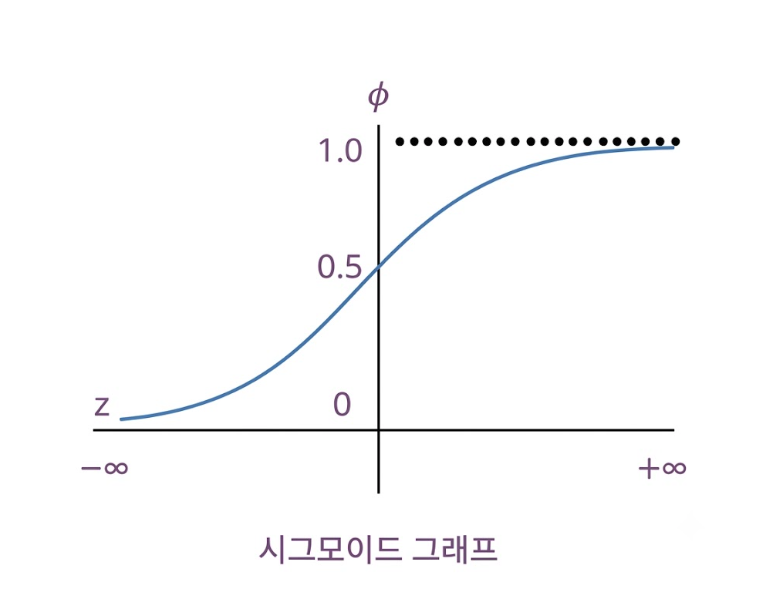
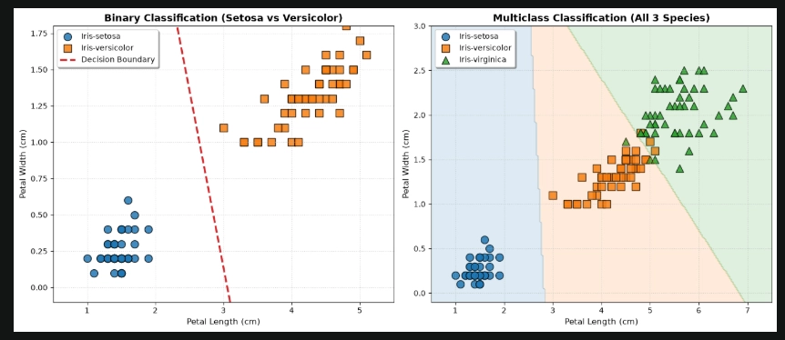
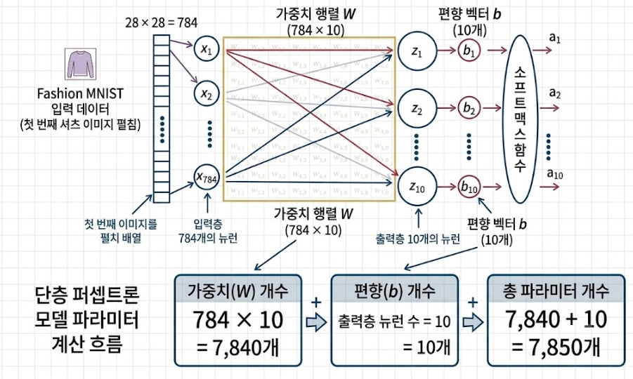
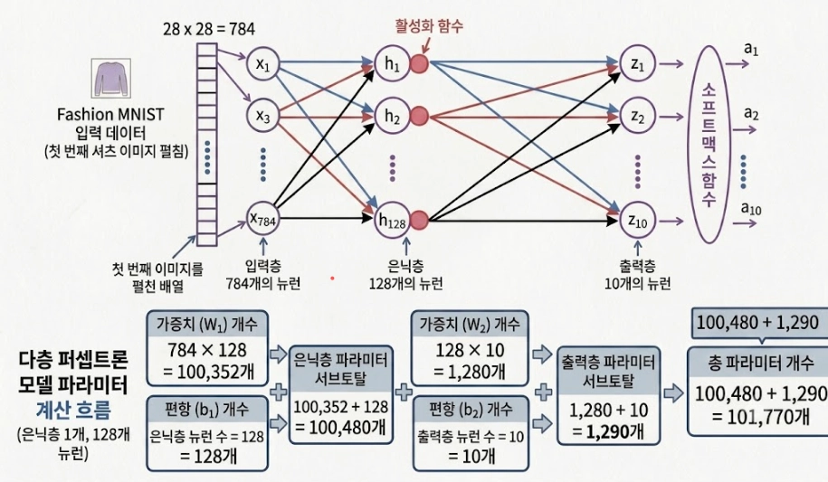
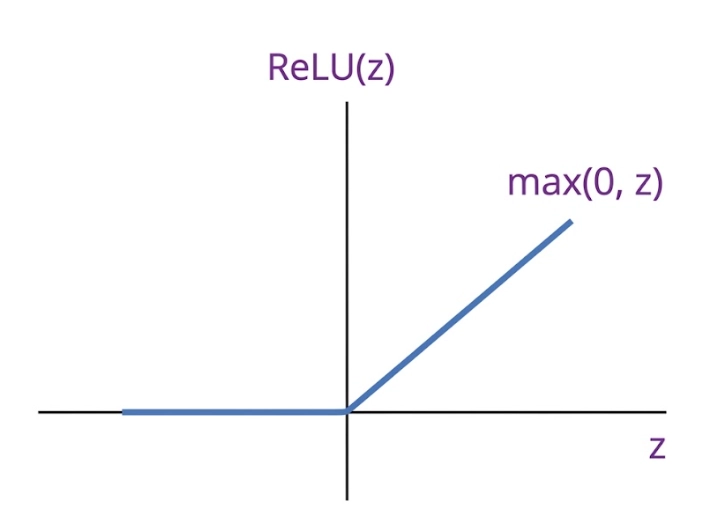

# 20260828 TIL

# 오늘의 TIL

> 날짜 : 2026-08-28
> 주제 : 로지스틱 회귀와 교차 검증, 파이토치 기초 및 심층 신경망

## 어제의 복습

1. Train, Valid, Test 분리 학습 이유
2. 오버슈팅
3. TVT에서 `random_state=42` 값 고정 이유. 난수 시드 값이 동일해야 결과가 동일하게 공유됨
4. 릿지, 라쏘 회귀 차이점
5. 다중공선성

## 오늘 공부한 내용

### 4장 머신러닝

### 3.2 로지스틱 회귀와 교차 검증

### 1. 로지스틱 회귀: 선형 회귀로 분류를 해결

- 회귀 방식을 이용한 분류 알고리즘 모델
- 선형 회귀의 한계
  - 선형 회귀의 출력 범위(-∞ ~ +∞)와 분류 문제가 요구하는 확률의 범위(0~1)가 근본적으로 불일치
  - 회귀 도구를 분류 문제에 억지로 적용할 때 발생하는 문제
- 회귀와 분류 사이의 필터: **활성화 함수(Activation Function)**
  - 로짓(Logit, $z=wx+b$)을 확률로 압축(변환)해주는 함수
  - **Logit:** 시그모이드에 들어가기 직전의 값, $z = wx+b$ 그 자체
  - (수학적 정의) 확률의 로그 오즈(log-odds)
    - **오즈(Odds):** 실패 확률 대비 성공 확률의 비율, $\text{Odds} = \dfrac{p}{1-p}$
  - 예측 파이프라인의 가장 마지막 최종 변환 단계에서 활약

### 2. 모델의 수학적 채점 기준: MSE vs 크로스 엔트로피

- 오차 채점의 전환: **손실 함수(Loss Function)** 단계
  - 모델의 예측 확률과 정답이 얼마나 다른지 벌점을 주며 다듬는 과정
  - 일반 회귀와 로지스틱 분류 회귀는 완전히 다른 채점 기준을 사용
- **MSE (평균 제곱 오차):** 회귀용
  - 실제값과 예측값의 '거리(차이의 제곱)'를 측정하여 벌점 부여
  - 분류 문제 적용 시 한계: 오차가 커도 벌점 증가가 완만하여 최적의 학습(가중치 업데이트)을 하기 어려움
  - 의문
    - 벌점 증가가 완만? 제곱이라 2차함수면 곡선으로 기하급수적으로 증가하지 않음?
    - 분류 문제에서 다루는 '확률'의 특성과 시그모이드(활성화 함수)의 비선형성 때문에
    - 입력값($x$)이 아니라 '확률($\hat{y}$)'과 '정답($y$)'의 관점 (0과 1 사이의 제한)
    - 시그모이드 함수 구간에서의 '기울기 소실(완만함)'
- **크로스 엔트로피 (Cross Entropy):** 분류용
  - 핵심 원리: 거짓말 탐지기와 '확률 괘씸죄 벌금' (모델의 확신 수준에 따라 누진세처럼 부과)
  - 정답을 강하게 확신 (예: 실제 정답을 99% 확률로 예측): 벌점 0에 수렴
  - 오답을 강하게 확신 (예: 실제 정답임에도 1% 확률로 엉뚱하게 확신): 괘씸죄가 적용되어 무한대($\infty$)에 가까운 벌점 폭탄 부과

### 분류 문제의 유형과 활성화 함수

### 1. 이진 분류(Binary Classification)

- 활성화 함수: **시그모이드(Sigmoid)** $\sigma(z)$
- 0~1 사이 확률값(단일 값)으로 압축

$$
\underbrace{z = wx+b}_{\text{선형 회귀 (로짓)}} \;\xrightarrow{\text{활성화 함수 (시그모이드)}}\; \underbrace{\sigma(z) = \frac{1}{1+e^{-z}}}_{\text{확률 (0} \sim \text{1)}}
$$

- **$z$ (원시 예측 점수):** 선형 회귀 연산으로 구해진 값 ($z = w \cdot x + b$), 범위 $-\infty \sim +\infty$
- **$e$ (자연상수, 약 2.718):** 임시 계산 점수가 커질수록 분모를 급격히 작아지게 만드는 마법의 숫자. $|z|$가 커질수록 확률을 0 또는 1 쪽으로 빠르게 밀어붙임
- 양성 클래스(Positive, 1): 찾고자 하는 대상(예: 스팸, 암, 세토사)
- 음성 클래스(Negative, 0): 대상이 아님(예: 정상 메일, 정상, 세토사 아님)

$$
\hat{y} = \begin{cases} 1 \text{ (양성)} & \sigma(z) \ge 0.5 \\ 0 \text{ (음성)} & \sigma(z) < 0.5 \end{cases}
$$

- **S-Curve (눈으로 보는 형태)**

- 가로축 = 입력값 $z$, 세로축 = 확률
- $z$가 큰 음수 → 확률 ≈ 0
- $z$가 큰 양수 → 확률 ≈ 1
- $z = 0$ → 정확히 확률 0.5(50%)를 지나며 좌우 대칭을 이룸
- 손실 함수(Loss Function)
  - **BCE (Binary Cross Entropy):** 이진 크로스 엔트로피

$$
L = -[y \log(\hat{y}) + (1 - y) \log(1 - \hat{y})]
$$

  - $y$: 실제값 (0 ~ 1)
  - $\hat{y}$: 예측값 (0 ~ 1)
  - $y=1/0$, $\hat{y}=0/1$ → 완전히 틀림: $-(1\cdot\log(0))$ → $+\infty$
  - $y=1$, $\hat{y}=1$ → 완전히 맞음: $-(1\cdot\log(1))$ → $0$
  - **$y \log(\hat{y})$ (정답이 1일 때 활성화):** 예측값($\hat{y}$)이 1에 가까우면 손실이 0이 되지만, 반대로 0에 가깝게 빗나가면 손실이 무한대로
  - **$(1 - y) \log(1 - \hat{y})$ (정답이 0일 때 활성화):** 예측값($\hat{y}$)이 0에 가까우면 손실이 0이 되어 안정화

### 붓꽃 데이터(Iris) 이진 및 다중 분류 실습

- 데이터 불러오기 및 학습 준비

~~~python
# 실습에 필요한 도구(라이브러리) 불러오기
import numpy as np
import pandas as pd
from sklearn.model_selection import train_test_split  # 데이터를 학습용과 시험용으로 쪼개주는 도구
from sklearn.linear_model import LogisticRegression   # 분류 모델 (이름만 회귀일 뿐 분류에 쓰임)
from sklearn.metrics import accuracy_score            # 몇 점인지 채점(정확도 계산)해주는 도구

# 붓꽃 데이터셋(Iris.csv) 불러오기
df = pd.read_csv("Iris.csv")
df.head() # 데이터가 잘 불러와졌는지 위에서 5줄만 미리보기

# 데이터에 어떤 붓꽃 품종들이 있는지 종류 확인 (중복 제거)
df['Species'].unique()

# --- 실습 1. 이진 분류용 데이터 구성 ---

# 3가지 품종 중 '세토사'와 '버시칼라' 2가지만 남겨서 복사본(copy) 만들기
df_binary = df[df['Species'].isin(['Iris-setosa','Iris-versicolor'])].copy()

# 문제지(X): 모델이 학습할 단서 (꽃잎의 길이와 너비 데이터만 추출)
X_binary = df_binary[['PetalLengthCm','PetalWidthCm']]

# 정답지(y): 문자로 된 품종 이름을 컴퓨터가 계산할 수 있도록 0과 1로 변환
y_binary = df_binary['Species'].map({'Iris-setosa':0, 'Iris-versicolor':1})

# 전체 데이터를 학습용(Train)과 시험용(Test)으로 8:2 비율로 쪼개기
X_bin_train, X_bin_test, y_bin_train, y_bin_test = train_test_split(
    X_binary, y_binary,
    test_size=0.2,       # 테스트 데이터를 전체의 20%로 설정
    random_state=42,     # 데이터를 섞는 패턴을 고정하여 매번 똑같이 쪼개지도록 설정
    stratify=y_binary    # 0과 1의 정답 비율이 한쪽으로 쏠리지 않게 공평하게 분배
)

# 쪼개기 전 전체 데이터가 어떻게 생겼는지 확인
X_binary.head(), y_binary[:5]

# --- 실습 2. 이진 분류 모델 학습 및 평가 ---

# 빈 모델(로지스틱 회귀) 생성
binary_model = LogisticRegression()

# 전체 데이터가 아닌 '학습용 데이터(Train)'만 주고 공부시키기
binary_model.fit(X_bin_train, y_bin_train)

# 학습을 마친 모델에게 시험용 문제지(X_bin_test)만 주고 정답을 예측하게 함
bin_test_preds = binary_model.predict(X_bin_test)

# 모델이 제출한 답안과 실제 정답 비교 출력
print("모델의 예측값:", bin_test_preds)
print("실제 정답지  :", y_bin_test.values)

# 몇 점인지 정확도 계산 (실제 정답과 예측한 정답 비교)
bin_accuracy = accuracy_score(y_bin_test, bin_test_preds)
print(f"이진 분류 테스트 정확도: {bin_accuracy:.4f}")
~~~

### 2. 다중 분류(Multiclass Classification)

- 활성화 함수: **소프트맥스(Softmax)** $P(y = i | x)$
- 여러 클래스에 대한 확률 분포(합이 1)로 압축

$$
P(y = i \mid x) = \text{Softmax}(z_i) = \frac{e^{z_i}}{\sum_{j=1}^{C} e^{z_j}}
$$

- **$P(y = i | x)$** (최종 예측 확률): 입력 데이터 $x$가 주어졌을 때, 최종 정답($y$)이 $i$번째 클래스일 조건부 확률
- **$\sum_{j=1}^{C} e^{z_j}$:** 모든 클래스의 지수 총합 (정규화). 하나의 '기준치', 전체 확률의 합을 1로 만들기 위한 분모(전체 백분율의 기준) 역할
- **$C$ (클래스 갯수):** 분류하고자 하는 전체 범주의 수, 예측해야 하는 전체 클래스의 개수
- **$\sum_{j=1}^{C}$ (시그마):** 1번째 클래스부터 마지막 $C$번째 클래스까지의 모든 $e^{z}$ 값을 전부 더함
- **$z_j$ (로짓값):** 모델(선형 회귀)이 각 클래스에 대해 계산해 낸 무한한 범위의 원본 출력값
- **분모 ($\sum$):** 모든 클래스의 로짓값을 지수 함수($e$)에 통과시킨 뒤 전부 더한 '전체 합'
- **분자 ($e^{z_i}$):** 확률을 구하고자 하는 특정 타겟 클래스의 지수값
- **전체 1에서 부분 확률:** 소프트맥스 함수를 통과한 각 클래스의 결과값을 모두 더하면 항상 1(100%)이 됨. 제각각이던 로짓값들을 '전체 파이 안에서 각 범주가 차지하는 비율(확률)'로 변환해 주는 다중 분류의 핵심 필터
- **지수 함수의 역할**
  - 음수 로짓도 양수로 변환 (확률은 음수가 될 수 없음)
  - 큰 점수는 더 크게, 작은 점수는 더 작게 (돋보기 효과)

$$
\text{소프트맥스 결과} = \frac{\text{내가 관심 있는 클래스의 지수화된 점수}}{\text{모든 클래스의 지수화된 점수 총합}} \implies P(y = i \mid x) = \frac{e^{z_i}}{\sum_{j=1}^{C} e^{z_j}}
$$

### One-Hot Encoding

- 레이블 인코딩(1,2,3,..)하면 **수치적 편향성** 문제 발생 (숫자가 높을수록 의미 있구나!)
- **범주별 독립된 열(차원) 부여**로 서열 왜곡 방지
- 0과 1로 스위치를 켜듯 **매핑**해 **편향된 가중치 학습 방지**
- 단점
  - **카테고리 개수 ↑ → 차원이 폭발적 증가**
  - **다중공선성 (Dummy Variable Trap)**
    - 예: 평일/주말처럼 범주가 2개일 때 두 열을 모두 쓰면, 한쪽이 1이면 다른 쪽은 무조건 0 → 열이 서로를 완벽히 예측
    - 입력 변수끼리 독립이어야 하는데 정보가 묶여 가중치 계산이 불안정
    - 실무: `drop='first'`로 열 하나를 제거해 함정 차단
- 대안
  - SCCE
  - Embedding Layer

~~~python
# 원핫 인코딩 실습
# 실습에 필요한 도구 불러오기
from sklearn.preprocessing import OneHotEncoder

# 간단한 가상의 과일 범주 데이터를 준비합니다
data = pd.DataFrame({'과일':['사과','바나나','딸기','바나나']})
data

# 원핫 인코딩 변환
encoder = OneHotEncoder(sparse_output=False)
encoded_data = encoder.fit_transform(data[['과일']])

encoded_data

# 변환 결과를 보기 좋게 판다스 데이터프레임으로 만들어 출력합니다
encoded_df = pd.DataFrame(encoded_data, columns=encoder.get_feature_names_out(['과일']))
encoded_df
~~~

- **Embedding Layer (입력)**
  - 정수 인덱스 → 실수 밀집 벡터(dense vector)로 변환
  - One-Hot의 "차원 폭발 + 의미 없음" 문제를 동시에 해결
  - (예: 10,000차원 원-핫 → 128차원 실수 벡터)
  - 학습을 통해 벡터값이 채워지며, 유사한 의미의 항목끼리 벡터 공간에서 가까워짐
- 손실 함수(Loss Function)
  - **CCE (Categorical Cross Entropy):** 범주형 크로스 엔트로피

$$
L = - \sum_{c=1}^{C} y_c \log(\hat{y}_c)
$$

  - **CCE 공식 1줄 요약: 어차피 정답 빼고 다 0으로 소멸한다**
  - **$C, c$:** 전체 선택지 개수와 순서표
  - **$y_c, \hat{y}_c$:** 실제 정답(원-핫 인코딩, 정답만 1)과 모델의 예측 확률
  - **$\sum$ (전체 합산):** 모든 선택지를 다 더하라는 뜻이지만, 오답 자리는 $y_c=0$이므로 곱하는 순간 전부 날아감
  - 용도: 선택지가 3개 이상인 다중 분류 + 정답이 원-핫 인코딩 형태일 때
  - 분류 개수 ↑ → 메모리 부족, 연산량 ↑
  - **SCCE (Sparse Categorical Cross Entropy):** 희소 범주형 크로스 엔트로피

$$
L = - \log(\hat{y}_{target})
$$

  - **SCCE 공식 1줄 요약: 불필요한 0 곱하기 연산 없이, 정답 위치의 확률만 쏙 뽑아 계산한다**
  - **$target$:** 실제 정답을 가리키는 인덱스 정수 (예: 정답이 3번 클래스라면 3)
  - **$\hat{y}_{target}$:** 모델이 출력한 여러 확률 배열 중에서, 정답 인덱스($target$)에 해당하는 위치의 확률값 딱 하나
  - **최적화 원리:** CCE에서 어차피 0이 되어 사라질 오답 항목들을 수학적으로 미리 제거한 압축 버전임. 불필요한 합산($\sum$) 연산 없이 곧바로 마이너스 로그를 취하므로 메모리 효율이 좋음
  - **용도:** 선택지가 3개 이상인 다중 분류 + 정답이 정수형 레이블 형태일 때

### BCE & CCE & SCCE

| | 클래스 개수 | 정답(레이블) 형태 | 마지막 활성화 함수 |
|---|---|---|---|
| **BCE** (Binary Cross Entropy) | 2개 (예/아니오) | 0 또는 1 (스칼라) | 시그모이드 |
| **CCE** (Categorical Cross Entropy) | 3개 이상 | 원-핫 벡터 [0,0,1,0] | 소프트맥스 |
| **SCCE** (Sparse CCE) | 3개 이상 | 정수 인덱스 (예: 2) | 소프트맥스 |

| 비교 | CCE | SCCE |
|---|---|---|
| 내부 동작 | 원핫 배열과 확률 배열을 원소마다 매칭 | 정답 인덱스의 확률만 추출 |
| 메모리 | 클래스 ↑ → 원핫 낭비 심함 | 원핫을 안 만들어 효율적 |

**왜(Why) 쓰는가 — 공통 이유**

세 개 다 "모델이 낸 확률이 정답과 얼마나 멀리 떨어져 있나"를 측정하는 도구.
정답 확률에 가까울수록 손실이 0에 가까워지고, 틀릴수록 손실이 폭발적으로 커지도록 설계되어 있어서 (log 함수 특성), 모델이 "애매하게 틀리는 것"보다 "확실하게 맞히는 것"을 강하게 선호하게 만듦.

**언제/어디에(When/Where) 쓰는가 — 실전 판단 기준**

1. **스팸 메일 필터** (스팸 / 정상 → 2개) → **BCE**
2. **손글씨 숫자 인식** (0~9 → 10개, 정답을 [0,0,0,1,0,0,0,0,0,0] 원-핫으로 갖고 있음) → **CCE**
3. **손글씨 숫자 인식인데, 정답 라벨을 그냥 `3`처럼 정수로 저장해둔 경우** → **SCCE** (결과는 CCE와 완전히 동일, 그냥 원-핫으로 변환하는 수고를 덜어줄 뿐)

즉 **CCE vs SCCE는 "성능 차이"가 아니라 "데이터 전처리 편의성 차이"**.
원-핫 벡터를 미리 만들어뒀으면 CCE, 안 만들었으면 (또는 클래스가 너무 많아서 원-핫이 부담스러우면, 예: 단어 5만 개) SCCE.

**어떻게(How) 쓰는가 — 실무 코드 감**

~~~python
# 이진 분류
model.compile(loss='binary_crossentropy', ...)  # BCE

# 다중 분류 + 정답이 원-핫
model.compile(loss='categorical_crossentropy', ...)  # CCE

# 다중 분류 + 정답이 정수 (0, 1, 2, 3...)
model.compile(loss='sparse_categorical_crossentropy', ...)  # SCCE
~~~

한 줄: **"몇 지선다냐(BCE=2지선다, CCE/SCCE=다지선다) + 정답을 어떻게 저장해뒀냐(원-핫이냐 정수냐)"** 이 두 질문에 답하면 셋 중 뭘 써야 할지 바로 정해짐.

~~~python
# --- 실습 2. 다중 분류용 데이터 구성 ---

# 붓꽃 품종이 총 몇 개인지(어떤 것들이 있는지) 종류 확인
df['Species'].unique()

# 문제지(X): 모델이 학습할 단서 (전체 데이터에서 꽃잎의 길이와 너비만 추출)
X_multi = df[['PetalLengthCm','PetalWidthCm']]

# 정답지(y): 3가지 품종 이름을 컴퓨터가 이해할 수 있도록 각각 0, 1, 2라는 정수로 변환
# (선택지가 3개 이상이고 정답이 정수 형태이므로 내부적으로 SCCE 손실 함수 개념이 적용됨)
y_multi = df['Species'].map({'Iris-setosa':0, 'Iris-versicolor':1, 'Iris-virginica':2})

# 문제지와 정답지가 의도한 대로 잘 만들어졌는지 처음 5줄만 미리보기
X_multi.head(), y_multi.head()

# --- 3.2 모델 학습 및 평가 (결정 경계 시각화 전단계) ---
# 전체 데이터를 8:2 비율로 훈련용(Train)과 시험용(Test)으로 공평하게(stratify) 분할
X_multi_train, X_multi_test, y_multi_train, y_multi_test = train_test_split(
    X_multi, y_multi,
    test_size=0.2,
    random_state=42,
    stratify=y_multi
)

# 다중 분류를 수행할 빈 모델(로지스틱 회귀) 생성
# (클래스가 3개 이상이면 내부적으로 소프트맥스 활성화 함수가 자동 적용됨)
multi_model = LogisticRegression()

# 훈련용 데이터(Train)만 사용하여 모델 학습시키기
multi_model.fit(X_multi_train, y_multi_train)

# 학습을 마친 모델에게 시험용 문제지(Test)를 주고 정답을 예측하게 함
multi_test_preds = multi_model.predict(X_multi_test)

# 모델이 제출한 답안과 실제 정답 비교 출력
print("예측한 값:", multi_test_preds)
print("원래 값  :", y_multi_test.values)

# 실제 정답과 예측값을 비교하여 몇 점인지 정확도 계산
multi_accuracy = accuracy_score(y_multi_test, multi_test_preds)
print(f"정확도: {multi_accuracy:.4f}")
~~~

- LogisticRegression이 손실 함수를 따로 지정하지 않는 이유
  - 자동 감지 및 매핑: Scikit-learn은 클래스 개수(2개면 이진, 3개 이상이면 다항)를 자동 감지해 최적의 손실 함수(Log Loss)를 내부 적용
  - 딥러닝과의 일치: 용어는 학술적 전통 명칭을 쓰지만, 정수 레이블을 바로 활용해 오차를 계산하므로 실제 동작 메커니즘은 딥러닝의 SCCE와 완벽히 일치

**두 가지 실습 결과를 한눈에 비교하기 위한 Matplotlib 시각화**

~~~python
fig, axes = plt.subplots(1, 2, figsize=(14, 6))

# [왼쪽 플롯] 이진 분류 선형 결정 경계선 그리기
ax1 = axes[0]
colors_binary = ['#1F77B4', '#FF7F0E']
markers_binary = ['o', 's']
species_binary = ['Iris-setosa', 'Iris-versicolor']

for species, color, marker in zip(species_binary, colors_binary, markers_binary):
    subset = df_binary[df_binary['Species'] == species]
    ax1.scatter(subset['PetalLengthCm'], subset['PetalWidthCm'], label=species, color=color, marker=marker, s=100, edgecolor='black', alpha=0.85)

# 선형 분류 경계면 공식 유도: w1*x1 + w2*x2 + b = 0 => x2 = -(w1*x1 + b)/w2
w1, w2 = binary_model.coef_[0][0], binary_model.coef_[0][1]
b = binary_model.intercept_[0]

x_vals = np.linspace(0.8, 5.2, 100)
y_vals = -(w1 * x_vals + b) / w2
ax1.plot(x_vals, y_vals, '--', color='#D62728', linewidth=2.5, label='Decision Boundary')

ax1.set_title("Binary Classification (Setosa vs Versicolor)", fontsize=13, fontweight='bold')
ax1.set_xlabel("Petal Length (cm)", fontsize=11)
ax1.set_ylabel("Petal Width (cm)", fontsize=11)
ax1.set_xlim(0.5, 5.5)
ax1.set_ylim(-0.1, 1.8)
ax1.legend(loc='upper left', frameon=True, shadow=True)
ax1.grid(True, linestyle=':', alpha=0.6)

# [오른쪽 플롯] 다중 분류 영역 맵 시각화
ax2 = axes[1]
colors_multi = {'Iris-setosa': '#1F77B4', 'Iris-versicolor': '#FF7F0E', 'Iris-virginica': '#2CA02C'}
markers_multi = {'Iris-setosa': 'o', 'Iris-versicolor': 's', 'Iris-virginica': '^'}

for species in ['Iris-setosa', 'Iris-versicolor', 'Iris-virginica']:
    subset = df[df['Species'] == species]
    ax2.scatter(subset['PetalLengthCm'], subset['PetalWidthCm'], label=species, color=colors_multi[species], marker=markers_multi[species], s=100, edgecolor='black', alpha=0.85)

# 가로축과 세로축 격자를 촘촘히 쪼개 전 구역에 소프트맥스 예측 결과 칠하기
xx, yy = np.meshgrid(np.linspace(0.5, 7.5, 200), np.linspace(-0.1, 3.0, 200))
grid_points = np.c_[xx.ravel(), yy.ravel()]

grid_df = pd.DataFrame(grid_points, columns=['PetalLengthCm', 'PetalWidthCm'])
Z_pred = multi_model.predict(grid_df)

# 클래스 이름을 예측 컬러 번호(0, 1, 2)로 전처리 변환
species_to_num = {'Iris-setosa': 0, 'Iris-versicolor': 1, 'Iris-virginica': 2}
Z_num = np.array([species_to_num[item] for item in Z_pred]).reshape(xx.shape)

# 결정 구역에 예쁜 투명도를 주어 영역 채우기
custom_cmap = ListedColormap(['#1F77B4', '#FF7F0E', '#2CA02C'])
ax2.contourf(xx, yy, Z_num, alpha=0.15, cmap=custom_cmap)

ax2.set_title("Multiclass Classification (All 3 Species)", fontsize=13, fontweight='bold')
ax2.set_xlabel("Petal Length (cm)", fontsize=11)
ax2.set_ylabel("Petal Width (cm)", fontsize=11)
ax2.set_xlim(0.5, 7.5)
ax2.set_ylim(-0.1, 3.0)
ax2.legend(loc='upper left', frameon=True, shadow=True)
ax2.grid(True, linestyle=':', alpha=0.6)

plt.tight_layout()
plt.show()
~~~

**이진 및 다중 분류 결과 그래프 설명 요약**

- **왼쪽 플롯(이진 분류):** 크기가 다른 두 군집이 명확히 분리되며, 붉은색 대각선 점선(Decision Boundary)이 두 영토를 정밀하게 양분함.
- **오른쪽 플롯(다중 분류):** 세 품종의 분포 공간에 3개의 전용 결정 구역(Contour)이 채색되어 있으며, 소프트맥스 가중치 연산으로 인접한 품종 간 경계면까지 정밀하게 구획됨.

### 3. K-Fold 교차 검증(Cross Validation): 시험지 돌려막기

**단 한 번의 시험이 주는 위험성**

- 수집한 데이터를 단순히 훈련용과 테스트용으로 한 번만 분할하여 평가할 경우, **테스트 데이터가 우연히 모델에 유리하게 구성되어 성능이 과대평가되는 오류(데이터 선택 편향)** 발생할 수 있음

**K-Fold 교차 검증의 해결책**

- 전체 데이터를 $K$개의 조각(Fold)으로 공평하게 쪼갬
- 데이터를 꼭 먼저 골고루 섞어주기(Shuffle)

> 만약 붓꽃 데이터셋처럼 Setosa 50개, Versicolor 50개, Virginica 50개가 순서대로 줄을 서서 저장되어 있는 상태라고 해보면, 데이터를 뒤섞지 않고 순서대로 5조각(Fold)으로 쪼갤 경우 어떤 조각은 특정 품종의 데이터만 100% 들어가는 최악의 불균형 시험지가 만들어짐. 따라서 데이터를 조각내기 전에 카드를 섞듯 무작위로 골고루 뒤섞어주는(Shuffle) 과정이 절대적으로 필수적임

~~~python
from sklearn.model_selection import KFold

# 교차 검증 (KFold)

# 데이터를 5조각(Fold)으로 나누고, shuffle로 미리 섞은 뒤, random_state로 섞는 패턴을 고정
kf = KFold(n_splits=5, shuffle=True, random_state=42)

# 모델(multi_model)을 학습용 데이터(X_multi_train, y_multi_train)에 대해
# kf가 정한 5개 조각으로 돌아가며 훈련·평가 → 5번의 정확도 점수를 배열로 반환
cv_scores = cross_val_score(multi_model, X_multi_train, y_multi_train, cv=kf)

# 5번의 시험(Fold)에서 각각 나온 정확도 점수 5개를 출력
print("cv_scores:", cv_scores)

# 5개 점수를 평균 내어, 모델의 신뢰할 수 있는 최종 성능(소수점 4자리)으로 출력
print("교차 검증 정확도 평균: %.4f" % cv_scores.mean())
~~~

- **random_state 고정 이유**
  - 학습/실습: 동일한 결과를 공유하는 **재현성 확보**
  - 실전 배포: 과적합 방지를 위한 **무작위성 유지**와 **교차 검증 (Cross-Validation)** 을 통한 강건성 검증

### 4.1 파이토치 기초 및 심층 신경망

### 1. 실습 환경 준비하기

1. `uv add torch torchvision matplotlib pandas scikit-learn ipykernel`
- **`torch (PyTorch)`**
  - 딥러닝의 거대한 뼈대이자 엔진
  - 인공신경망 구축: 학습에 필요한 모든 수학적 연산과 신경망 레이어를 제공
  - 텐서(Tensor) 연산: 다차원 행렬 연산을 수행, GPU 가속을 지원 → 초고속 연산
  - 자동 미분(Autograd): 역전파(Backpropagation) 미분 계산을 자동 처리
- **`torchvision`**
  - 이미지/영상 처리를 위한 torch의 든든한 조수
  - 데이터셋 제공: 컴퓨터 비전 연구에 자주 쓰이는 유명한 이미지 데이터셋 쉽게 다운로드
  - 이미지 변환(Transforms): 크기 조절(Resize), 대칭 이동(Flip), 회전, 정규화 등 AI 모델이 학습하기 좋게 이미지를 가공하는 전처리 기능을 제공
  - 유명 모델 탑재: 세계적으로 성능이 검증된 유명한 사전 학습된 모델(Pre-trained Models)을 그대로 가져와 사용

### 2. 신경망의 진화: 단층에서 다층(심층)으로

1. 단층 퍼셉트론(Perceptron) (은닉층이 없는 경우)
   - **선형 회귀/분류 구조($Z = W \cdot X + b$)**
   - **동작 방식:** 입력 신호($X$)에 가중치($W$)를 곱하고 편향($b$)을 더해 최종 출력 점수($Z$)를 산출함
   - **한계점:** 직선 형태의 판별선만 그릴 수 있어, 곡선 형태나 복잡한 실제 데이터를 분류하는 데 제약이 있음
2. 다층 퍼셉트론(Perceptron) (은닉층을 추가한 경우)
   - **구조적 특징:** 입력 정보가 곧바로 출력되지 않고, 중간에 다각도로 연산하는 은닉 뉴런(Hidden Neuron)층을 거침
   - **학습 방식:** 초기 층이 감지한 저차원 특징(선, 면)들을 조합해, 활성화 함수를 통해 사물의 형태와 질감 등 고차원적인 정보를 학습함
3. 모델 파라미터(가중치와 편향) 개수 비교 계산
   - 은닉층이 없는 단층 모델

   - **입력 크기:** $28 \times 28 = 784$개
   - **출력 크기:** 의류 카테고리 $10$개
   - **가중치($W$) 개수:** $784 \times 10 = 7,840$개
   - **편향($b$) 개수:** 출력층 뉴런 개수 = $10$개

$$
\text{총 파라미터} = 7840 + 10 = 7850\text{개}
$$

   - 은닉층(뉴런 128개)이 추가된 다층 모델

   - **1층 (입력층 $\rightarrow$ 은닉층)**
     - **가중치($W$) 개수:** $784 \times 128 = 100,352$개
     - **편향($b$) 개수:** $128$개
     - 1층 소계 = $100,480$개
   - **2층 (은닉층 $\rightarrow$ 출력층)**
     - **가중치($W$) 개수:** $128 \times 10 = 1,280$개
     - **편향($b$) 개수:** $10$개
     - 2층 소계 = $1,290$개

$$
\text{총 파라미터} = 100,480 + 1,290 = 101,770\text{개}
$$

은닉층에 128개의 뉴런을 추가하는 것만으로 조율해야 할 내부 변수(파라미터)가 약 13배 증가합니다. 파라미터가 늘어난 만큼 모델은 더 복잡한 데이터의 패턴을 포착할 수 있는 잠재력을 갖추게 됩니다.

- **다층 퍼셉트론의 깊이(은닉층) 증가에 따른 명과 암**
  - **장점:** 파라미터가 늘어나 모델이 더 복잡한 데이터의 패턴을 포착할 잠재력 확보
  - **치명적인 문제점:**
    - **과적합(Overfitting):** 훈련 데이터의 소음까지 외워버려 새로운 테스트 데이터에 대한 예측 성능 저하
    - **연산 비용 및 시간 증가:** 가중치와 편향이 기하급수적으로 늘어나 많은 VRAM과 학습 시간 소요
    - **기울기 소실(Vanishing Gradient):** 오차가 역전파되는 과정에서 희미해져 앞쪽 층의 학습이 이루어지지 않음
  - **결론 및 대책:** 무작정 깊게 쌓기보다 데이터 복잡도에 맞는 적절한 균형(하이퍼파라미터 튜닝)이 중요하며, 이미지 데이터는 CNN 구조를 사용하는 것이 효과적임

### 3. 학습 메커니즘: 역전파와 옵티마이저

- **역전파와 옵티마이저 학습 메커니즘**
- **4단계 순환 구조:** 순방향 예측(추론) $\rightarrow$ 손실 계산(오차 수치화) $\rightarrow$ 역방향 오차 전파(기울기 계산) $\rightarrow$ 가중치 조정(옵티마이저 업데이트)
- **역전파의 역할:** 미분의 연쇄 법칙을 통해 가중치별 오차 기여도(기울기, $\frac{\partial L}{\partial W}$)를 계산하는 설계도 역할 (학습률 등은 고려하지 않음)
- **옵티마이저의 역할:** 역전파가 전달한 기울기에 학습률($\eta$) 등을 반영하여 실제로 가중치를 갱신하는 행동 대장
- **주요 옵티마이저 특징:**
  - **SGD:** 기울기와 학습률을 곱해 단순 반영
  - **Momentum:** 이전 이동 관성(속도)을 함께 고려
  - **Adam:** 가중치 변화 빈도에 따라 학습률을 적응적으로 조절(Adaptive)
- **주요 옵티마이저 종류 및 특징 요약**
  - **SGD (확률적 경사하강법):** 가장 가파른 내리막 방향으로 이동하는 단순한 구조이나, 국소 최적점이나 고원 현상에서 학습이 정체되거나 흔들릴 수 있음
  - **Momentum (모멘텀):** '관성' 개념을 도입해 이전 이동 방향을 유지하며, 완만한 경사나 작은 국소 최적점을 통과해 빠르게 수렴
  - **RMSprop:** 기울기 변화에 따라 파라미터별 학습률(보폭)을 유동적으로 조절하여 안정적인 수렴 지원
  - **Adam:** Momentum과 RMSprop의 장점을 결합한 하이브리드 알고리즘으로, 대부분의 딥러닝 태스크에서 기본 옵티마이저로 널리 사용됨

### 4. 활성화 함수의 본질과 패러다임 전환: 비선형성 주입과 ReLU

- 같은 "활성화 함수"라도 **위치**에 따라 하는 일이 다름
  - **은닉층**: 비선형성을 넣는다 (층을 쌓는 이유가 생기게 함)
  - **출력층**: 로짓을 문제 형식에 맞게 해석한다 (확률 등)

### 4.1 은닉층과 출력층 활성화 함수의 역할 차이

- **은닉층**
  - $Wx+b$는 직선(평면)일 뿐
  - 그 결과에 굽은 함수를 씌워 "직선 여러 개를 이어 붙인 것"이 아니게 만듦
- **출력층**
  - 마지막 점수(Logits)를 목적에 맞게 변환
  - 다중 분류 → Softmax (각 확률 0~1, **합 = 1**)
  - 이진 분류 → Sigmoid (양성 확률 하나)

### 4.2 수학적 증명: 왜 은닉층에 비선형 활성화 함수가 필수적인가?

은닉층에 활성화를 안 넣거나 $f(x)=cx$만 쓰면: 2층 구조의 선형 신경망을 가정해 계산

> **1층 연산**
>
> $$
> Z_1 = W_1 \cdot X + b_1
> $$
>
> **2층 연산**
>
> $$
> Z_2 = W_2 \cdot Z_1 + b_2
> $$
>
> 1층 결과를 2층에 대입하면
>
> $$
> Z_2 = W_2 \cdot (W_1 \cdot X + b_1) + b_2
> $$
>
> $$
> Z_2 = (W_2 \cdot W_1) \cdot X + (W_2 \cdot b_1 + b_2)
> $$
>
> $$
> W_2 \cdot W_1 \;\rightarrow\; W_{\text{new}}, \quad
> (W_2 \cdot b_1 + b_2) \;\rightarrow\; b_{\text{new}}
> $$
>
> $$
> Z_2 = W_{\text{new}} \cdot X + b_{\text{new}}
> $$

- 층이 100개여도 **식 하나로 합쳐짐** = 단층 선형 모델과 동일
- 직선으로 못 가르는 패턴은 영원히 못 배움
- 레이어 사이에 **비선형 활성화**가 있어야 깊이가 의미가 생김

### 4.3 시그모이드(Sigmoid)의 한계: 기울기 소실(Vanishing Gradient)

- 초기는 은닉층에도 Sigmoid를 씀
- $z$가 대략 $-5$ 이하 / $+5$ 이상이면 곡선이 평평 → **미분값 ≈ 0**
- 역전파는 연쇄 법칙이라 층마다 이 작은 기울기를 **계속 곱함**
- 앞쪽 층으로 갈수록 오차 신호가 0으로 사라짐 → **Vanishing Gradient** (학습 멈춤)

### 4.4 렐루(ReLU) 함수의 도입과 위대한 해결책

$$
\begin{aligned}
f(x) = \max(0, x)
\end{aligned}
$$

- 입력 신호 $x$
- $x < 0$: 0 (음수 신호 / 노이즈 차단)
- $x > 0$: $x$ 그대로, **기울기 = 1** 고정
- 양수 구간: 1 × 1 × 1 × … 이라 깊어도 기울기가 안 줄어듦 (감쇄 X)
- 입력에 가까운 층까지 오차가 전달 → 안정적 깊은망 학습이 가능해짐

### 5. 학습의 양대 함정: 과소적합(Underfitting)과 과적합(Overfitting)

- 학습은 밸런스 게임
  - **과소적합**: 공부를 안 해서 기본 문제도 틀림
  - **과적합**: 문제집 오타까지 외워서 실전을 망침

### 5.1 데이터 분할 목적

- **Train**: 가중치를 직접 고치는 학습용
- **Valid**: 학습 중 모의고사. 가중치 갱신에는 안 씀. 하이퍼파라미터만 참고
- **Test**: 학습이 끝난 뒤 한 번만 보는 실전. 최종 일반화 평가

### 5.2 과소적합 (Underfitting)

- 모델이 너무 단순하거나 학습이 짧아서, Train의 기본 패턴조차 못 익힘
- Train 손실 ↑, Valid 손실 ↑ (둘 다 높음)
- **해결**
  - 은닉층·뉴런을 늘려 용량(Capacity) 확대
  - 에포크를 늘려 학습 시간을 줌

### 5.3 과적합 (Overfitting)

- Train의 노이즈·지엽적 디테일까지 암기
- 새 데이터(Valid/Test)에는 약함
- Train 손실 ↓, Valid 손실은 내려가다 **다시 상승**
- **해결**
  - **Dropout**: 학습 중 뉴런을 비율만큼 무작위 비활성화
  - **Early Stopping**: Valid 손실이 다시 올라가기 시작하면 학습 중단

### 드롭아웃 (Dropout)

- 과적합 막는 규제(Regularization)
- **학습 때**: 뉴런을 확률 $p$(보통 0.2~0.5)로 끔 (출력을 0). 배치마다 꺼지는 조합이 바뀜. 꺼진 뉴런으로는 역전파도 안 흐름
- **추론 때**: 뉴런 전부 사용. PyTorch는 학습 때 미리 보정(Inverted Dropout)하므로 `model.eval()`만 하면 드롭아웃 off
- **왜 과적합이 줄까**
  - 센 뉴런 몇 개에 의존하는 동조화(Co-adaptation)를 끊음 → 나머지 뉴런도 혼자 특징을 찾게 함
  - 배치마다 다른 서브네트워크를 학습 → 테스트 때 그 네트워크들이 협력하는 **앙상블**과 비슷한 효과
- **위치**: 파라미터가 많은 Dense(Fully Connected) 뒤에 주로 둠

## 찾아본 내용

### 1. train_test_split: 데이터 분할

- 함수 원형
  - `X_train, X_test, y_train, y_test = train_test_split(X, y, test_size=0.2, random_state=42)`
- **4개 변수를 나열하는 이유 (파이썬 언패킹)**
  - train_test_split은 데이터를 훈련/테스트용으로 나눈 뒤, 총 4개의 조각을 순서대로 반환하도록 설계됨
  - 파이썬 언패킹(Unpacking) 문법으로, 반환된 4개 결과물을 좌항 4개 변수에 1:1로 동시에 담는 것
  - 반환 순서는 항상 고정: X_train → X_test → y_train → y_test
- **test_size:** 테스트용으로 뗄 비율
  - `test_size=0.2` → 전체 데이터의 20%를 테스트용으로, 80%를 훈련용으로 분할
  - 정수(예: `test_size=200`)로 주면 비율이 아닌 '개수'로 지정됨
- **random_state:** 난수 시드(Seed) 고정
  - 데이터를 섞은 뒤 분할하는데, 이때 쓰이는 난수 생성기의 초기 기준점
  - 편향 방지를 위해 분할 전 데이터를 무작위로 섞는 과정이 내부적으로 존재함
  - 미지정 시 실행할 때마다 분할 결과가 달라져서, "모델이 좋아진 건지 / 우연히 쉬운 데이터가 걸린 건지" 구분 불가
  - 값을 고정하면(예: 42) 언제 실행해도 동일하게 분할되어 실험 재현 가능
  - 42는 특별한 의미 없는 관습(밈)일 뿐, 0이나 123 등 어떤 정수든 동일하게 작동함
- **(참고) stratify:** 분류 문제에서 클래스 비율 유지됨
  - 분류(Classification) 데이터를 단순 랜덤 분할하면 훈련/테스트 세트 간 클래스 비율이 깨질 수 있음
  - `stratify=y` 옵션을 주면 원본의 클래스 비율을 분할 후에도 그대로 유지
  - 지금 코드엔 없지만, 분류 문제 분할 시 함께 쓰이는 경우가 많음

### 2. Loss 표현, 묘사 방식

Loss = 오차를 표현하는 다양한 관점

**1. 수학/통계적 관점 — "거리"**

- 오차(Error): 예측값과 실제값의 차이 — 가장 직관적
- 잔차(Residual): 통계학 용어, 회귀에서 "실제값 − 예측값"
- 거리(Distance): 두 확률 분포(정답 분포 vs 예측 분포) 사이의 거리로 보는 관점
- 발산(Divergence): Cross Entropy는 KL Divergence(쿨백-라이블러 발산)에서 파생 — 정답 분포에서 예측 분포가 얼마나 벗어나 있는지 측정

**2. 확률/정보이론 관점 — "놀람"**

- Cross Entropy 계열은 정보이론(Information Theory)에서 유래
- 놀라움(Surprise): 모델이 정답을 보고 "얼마나 놀랐는가". 정답에 90% 확률 주고 맞으면 안 놀람(낮은 loss), 5%만 주고 맞으면 크게 놀람(높은 loss) → $-\log(\hat{y})$가 하는 역할
- 정보량(Information)/불확실성: 확신 없이 예측했다가 틀리면 정보량↑ = 손실↑

**3. 최적화 관점 — "비용/벌점"**

- 비용(Cost): 여러 데이터 전체의 평균 손실 = Cost Function (Loss는 데이터 1개, Cost는 전체 평균으로 구분하는 교재도 있음)
- 벌점/페널티(Penalty): 틀릴 때마다 모델에게 벌을 주는 비유. 확신하고 틀리면 벌점이 기하급수적으로 증가 (log 함수 특성)
- 목적함수(Objective Function): 학습 과정에서 "이걸 최소화하는 게 목표"라는 관점의 명칭

**한눈에 정리**

| 관점 | 표현 | 뉘앙스 |
|---|---|---|
| 직관/일상 | 오차, 틀린 정도 | 얼마나 못 맞췄나 |
| 통계 | 잔차 | 실제−예측 |
| 확률분포 | 거리, 발산(KL Divergence) | 두 분포가 얼마나 다른가 |
| 정보이론 | 놀람(Surprise), 정보량 | 예측이 얼마나 확신 없었나 |
| 최적화 | 비용(Cost), 벌점(Penalty), 목적함수 | 줄여야 할 목표 |

> BCE/CCE/SCCE는 모두 Cross Entropy 계열 — 본질은 "모델이 정답에 대해 얼마나 확신이 없었는지를 벌점으로 매긴 것" (정보이론적 관점이 가장 본질에 가까움)

## 질문 및 깨달음

### 의문

분류에 MSE를 쓰면 벌점 증가가 완만하다고 했는데, 제곱이면 2차함수라 기하급수적으로 커지지 않나?

### 탐색 방향

입력 $x$가 아니라 확률 $\hat{y}$와 정답 $y$ 관점(0과 1 사이)으로 보면?

### 판단

분류에서 다루는 확률의 특성과 시그모이드의 비선형성, 시그모이드 구간에서의 기울기 소실(완만함) 때문에 그렇게 설명된 것으로 메모함.

## 핵심 개념

- 로지스틱 회귀: 선형 출력 $z$를 활성화 함수로 확률로 바꿔 분류
- Logit / Odds / 활성화 함수는 파이프라인 마지막 변환
- MSE는 회귀, Cross Entropy는 분류 (괘씸죄)
- 이진: Sigmoid + BCE, 다중: Softmax + CCE 또는 SCCE
- One-Hot의 수치적 편향 방지, Dummy Variable Trap, 차원 폭발
- Embedding: 정수 인덱스 → dense vector
- K-Fold: Shuffle 필수, 한 번 분할의 선택 편향 완화
- 은닉층 활성화 = 비선형성, 출력층 활성화 = 결과 해석
- 선형층만 쌓으면 $W_{\text{new}}X + b_{\text{new}}$
- Sigmoid 은닉층 → Vanishing Gradient, ReLU는 양수 구간 기울기 1
- Underfitting: Train/Valid 손실 둘 다 높음
- Overfitting: Train 낮고 Valid가 다시 상승 → Dropout, Early Stopping

## 교재 보충

※ 아래 내용은 사용자의 필기를 보완하기 위해 교재에서 가져온 내용이다.

- OneHotEncoder의 `sparse_output=False`는 희소 객체가 아니라 눈으로 확인 가능한 넘파이 배열로 반환한다.
- 범주가 늘면 열이 늘고, 표는 0으로 가득 찬 희소 행렬이 되며 정보 밀도가 옅어진다. 교재는 이를 차원의 저주로 설명한다.
- 교차 검증은 데이터 누수(Data Leakage)를 막기 위해 훈련 데이터 안에서만 수행한다. 검증이 끝난 뒤 훈련 데이터 전체로 재학습하고, 테스트는 마지막에만 본다.
- Scikit-learn `LogisticRegression`은 클래스 2개면 Log Loss(이진 크로스 엔트로피), 3개 이상이면 Multinomial Log Loss를 내부 적용한다. 교재는 이 다항 손실이 CCE/SCCE와 수학적 본질이 같다고 적는다.
- 교재 다중 분류 예시는 `LogisticRegression(max_iter=1000)`을 쓰고, `y_multi`는 품종 문자열을 그대로 둔다.

## 필기 ↔ 교재 비교

| 항목 | 필기 | 교재 | 결과 |
|------|------|------|------|
| 로지스틱 = 분류 | 회귀 방식의 분류 모델 | 이름만 회귀, 실제는 분류 | 동일 |
| 활성화 위치 | 파이프라인 마지막 변환 | 마지막 최종 변환 단계 | 동일 |
| BCE/CCE/SCCE | 식·표·용도 정리 | 세 형태와 CCE/SCCE 비교표 | 동일 |
| One-Hot | 편향, Trap, `drop='first'`, 과일 코드 | 과일 실습 + 희소 행렬 | 교재 보충 |
| Iris `y_multi` | 0, 1, 2로 map | `df['Species']` 문자열 | 확인 필요 |
| `LogisticRegression` | `max_iter` 없음 | `max_iter=1000` | 확인 필요 |
| K-Fold 범위 | train에 `cross_val_score` | train만, 누수 방지 명시 후 재학습 | 교재 보충 |
| sklearn loss | Log Loss, SCCE와 일치 | 2클래스 Log Loss / 3+ Multinomial Log Loss | 교재 보충 |
| ReLU·과적합 | 필기에 정리됨 | 4장 1강 본문과 대응 | 동일 |

## 확인이 필요한 사항

⚠ 필기와 교재가 일치하지 않는 부분

- 다중 분류 타깃: 필기는 정수 매핑, 교재는 문자열 레이블
- 다중 모델 생성: 필기는 `LogisticRegression()`, 교재는 `max_iter=1000`
- 찾아본 내용에 "`stratify`는 지금 코드엔 없지만"이라고 적혀 있으나, 오늘의 실습 코드에는 `stratify=y_binary`, `stratify=y_multi`가 있음
- 시각화 코드의 `Z_pred`를 품종 이름→번호로 바꾸는데, 필기 학습 코드의 `y_multi`는 이미 0/1/2임. 예측이 정수면 `species_to_num[item]`에서 키가 안 맞을 수 있음

⚠ 용어 차이

- 필기: Log Loss / SCCE
- 교재: 이진이면 Log Loss, 다항이면 Multinomial Log Loss

## 필기 누락 가능성

다음 내용은 교재에는 있으나 오늘 수업에서 다루었는지는 확실하지 않습니다.

- 3장 2강 개념 체크 Q1~Q5, 개념 요약 키워드, 용어 사전(테스트 세트, 정확도, $R^2$ 등)
- 4장 1강 개념 체크 Q1~Q6, Flatten, `with torch.no_grad()`, `CrossEntropyLoss` 용어 사전 항목
- 프로젝트 생성 명령 `uv init chapter04 --python 3.13`

※ 수업에서 다루었다면 필기를 놓쳤을 가능성이 있습니다.

## 편집 로그

### 수정한 내용

- HTML `
`를 마크다운 이미지로 변경
- `\(...\)` 인라인을 `$...$`로 통일
- `#####`를 `###`로 내려 제목 계층을 # / ## / ###만 사용
- 제목 번호(3.2, 4.1, 4.2 등)는 유지
- 코드는 내용 수정 없이 펜스만 `~~~python`으로 유지
- 파라미터 개수 설명을 코드펜스에서 수식/문장으로 옮김

### 수정하지 않은 내용

- 괘씸죄, 시험지 돌려막기, 마법의 숫자, 밸런스 게임 등 작성자 표현
- MSE가 완만한지에 대한 의문
- 실습 코드·주석·변수명
- 찾아본 내용의 Loss 관점 표

### 추가 정보 출처

- 필기
- 교재 (교재 보충 섹션만)

---

# 오늘의 TIL
## 어제의 복습
1. Train,Valid,Test 분리 학습 이유
2. 오버슈팅
3. TVT 에서 random_state=42 값 고정 이유, 난수 시드 값이 동일해야 결과가 동일하게 공유
4. 릿지, 라쏘 회귀 차이점
5. 다중공선성

## 오늘의 학습
### 4장 머신러닝
#### 3.2 로지스틱 회귀와 교차 검증
##### 1. 로지스틱 회귀: 선형 회귀로 분류를 해결
  * 회귀 방식을 이용한 분류 알고리즘 모델
  * 선형 회귀의 한계
    - 선형 회귀의 출력 범위(-∞ ~ +∞)와 분류 문제가 요구하는 확률의 범위(0~1)가 근본적으로 불일치
    - 회귀 도구를 분류 문제에 억지로 적용할 때 발생하는 문제
  * 회귀와 분류 사이의 필터: **활성화 함수(Activation Function)**
      - 로짓(Logit, z=wx+b)을 확률로 압축(변환)해주는 함수
      - **Logit:** 시그모이드에 들어가기 직전의 값, $z = wx+b$ 그 자체
      - (수학적 정의) 확률의 로그 오즈(log-odds)
        - **오즈(Odds):** 실패 확률 대비 성공 확률의 비율, $\text{Odds} = \dfrac{p}{1-p}$
      - 예측 파이프라인의 가장 마지막 최종 변환 단계에서 활약
        
##### 2. 모델의 수학적 채점 기준: MSE vs 크로스 엔트로피

* 오차 채점의 전환: **손실 함수(Loss Function)** 단계
  * 모델의 예측 확률과 정답이 얼마나 다른지 벌점을 주며 다듬는 과정
  * 일반 회귀와 로지스틱 분류 회귀는 완전히 다른 채점 기준을 사용

* **MSE (평균 제곱 오차):** 회귀용
  * 실제값과 예측값의 '거리(차이의 제곱)'를 측정하여 벌점 부여
  * 분류 문제 적용 시 한계: 오차가 커도 벌점 증가가 완만하여 최적의 학습(가중치 업데이트)을 하기 어려움
    > 벌점 증가가 완만? 제곱이라 2차함수면 곡선으로 기하급수적으로 증가하지 않음? 
    > 분류 문제에서 다루는 '확률'의 특성과 시그모이드(활성화 함수)의 비선형성 때문에
    > 입력값($x$)이 아니라 '확률($\hat{y}$)'과 '정답($y$)'의 관점 (0과 1 사이의 제한)
    > 시그모이드 함수 구간에서의 '기울기 소실(완만함)' )

* **크로스 엔트로피 (Cross Entropy):** 분류용
  * 핵심 원리: 거짓말 탐지기와 '확률 괘씸죄 벌금' (모델의 확신 수준에 따라 누진세처럼 부과)
  * 정답을 강하게 확신 (예: 실제 정답을 99% 확률로 예측): 벌점 0에 수렴
  * 오답을 강하게 확신 (예: 실제 정답임에도 1% 확률로 엉뚱하게 확신): 괘씸죄가 적용되어 무한대($\infty$)에 가까운 벌점 폭탄 부과

#### 분류 문제의 유형과 활성화 함수
##### 1. 이진 분류(Binary Classification)
  - 활성화 함수: **시그모이드(Sigmoid)** $\sigma(z)$
  - 0~1 사이 확률값(단일 값)으로 압축

$$
\underbrace{z = wx+b}_{\text{선형 회귀 (로짓)}} \;\xrightarrow{\text{활성화 함수 (시그모이드)}}\; \underbrace{\sigma(z) = \frac{1}{1+e^{-z}}}_{\text{확률 (0} \sim \text{1)}}
$$

  * **$z$ (원시 예측 점수):** 선형 회귀 연산으로 구해진 값 ($z = w \cdot x + b$) , (범위 \(-\infty \sim +\infty\)) 
  * **$e$ (자연상수, 약 2.718):** 임시 계산 점수가 커질수록 분모를 급격히 작아지게 만드는 마법의 숫자. \(|z|\)가 커질수록 확률을 0 또는 1 쪽으로 빠르게 밀어붙임  
  
  - 양성 클래스(Positive, 1): 찾고자 하는 대상(예: 스팸, 암, 세토사)
  - 음성 클래스(Negative, 0): 대상이 아님(예: 정상 메일, 정상, 세토사 아님)

$$
\small \hat{y} = \begin{cases} 1 \text{ (양성)} & \sigma(z) \ge 0.5 \\ 0 \text{ (음성)} & \sigma(z) < 0.5 \end{cases}
$$

  - **S-Curve (눈으로 보는 형태)**  

  

  * 가로축 = 입력값 \(z\), 세로축 = 확률   
  * \(z\)가 큰 음수 → 확률 ≈ 0  
  * \(z\)가 큰 양수 → 확률 ≈ 1  
  * \(z = 0\) → 정확히 확률 0.5(50%)를 지나며 좌우 대칭을 이룸

  - 손실 함수(Loss Function)
     - **BCE (Binary Cross Entropy)** : 이진 크로스 엔트로피

       $$L = -[y \log(\hat{y}) + (1 - y) \log(1 - \hat{y})]$$ 

       * y: 실제값 ( 0 ~ 1 )  
       * ŷ: 예측값 ( 0 ~ 1 )  
       * y=1/0 ŷ=0/1 → 완전히 틀림: -(1·log(0)) → +∞  
       * y=1, ŷ=1 → 완전히 맞음: -(1·log(1)) → 0  
       * **$y \log(\hat{y})$ (정답이 1일 때 활성화):** 예측값($\hat{y}$)이 1에 가까우면 손실이 0이 되지만, 반대로 0에 가깝게 빗나가면 손실이 무한대로
       * **$(1 - y) \log(1 - \hat{y})$ (정답이 0일 때 활성화):** 예측값($\hat{y}$)이 0에 가까우면 손실이 0이 되어 안정화

* 붓꽃 데이터(Iris) 이진 및 다중 분류 실습
    - 데이터 불러오기 및 학습 준비
~~~python
# 실습에 필요한 도구(라이브러리) 불러오기
import numpy as np
import pandas as pd
from sklearn.model_selection import train_test_split  # 데이터를 학습용과 시험용으로 쪼개주는 도구
from sklearn.linear_model import LogisticRegression   # 분류 모델 (이름만 회귀일 뿐 분류에 쓰임)
from sklearn.metrics import accuracy_score            # 몇 점인지 채점(정확도 계산)해주는 도구

# 붓꽃 데이터셋(Iris.csv) 불러오기
df = pd.read_csv("Iris.csv")
df.head() # 데이터가 잘 불러와졌는지 위에서 5줄만 미리보기

# 데이터에 어떤 붓꽃 품종들이 있는지 종류 확인 (중복 제거)
df['Species'].unique()

# --- 실습 1. 이진 분류용 데이터 구성 ---

# 3가지 품종 중 '세토사'와 '버시칼라' 2가지만 남겨서 복사본(copy) 만들기
df_binary = df[df['Species'].isin(['Iris-setosa','Iris-versicolor'])].copy()

# 문제지(X): 모델이 학습할 단서 (꽃잎의 길이와 너비 데이터만 추출)
X_binary = df_binary[['PetalLengthCm','PetalWidthCm']]

# 정답지(y): 문자로 된 품종 이름을 컴퓨터가 계산할 수 있도록 0과 1로 변환
y_binary = df_binary['Species'].map({'Iris-setosa':0, 'Iris-versicolor':1})

# 전체 데이터를 학습용(Train)과 시험용(Test)으로 8:2 비율로 쪼개기
X_bin_train, X_bin_test, y_bin_train, y_bin_test = train_test_split(
    X_binary, y_binary, 
    test_size=0.2,       # 테스트 데이터를 전체의 20%로 설정
    random_state=42,     # 데이터를 섞는 패턴을 고정하여 매번 똑같이 쪼개지도록 설정
    stratify=y_binary    # 0과 1의 정답 비율이 한쪽으로 쏠리지 않게 공평하게 분배
)

# 쪼개기 전 전체 데이터가 어떻게 생겼는지 확인
X_binary.head(), y_binary[:5] 

# --- 실습 2. 이진 분류 모델 학습 및 평가 ---

# 빈 모델(로지스틱 회귀) 생성
binary_model = LogisticRegression()

# 전체 데이터가 아닌 '학습용 데이터(Train)'만 주고 공부시키기
binary_model.fit(X_bin_train, y_bin_train) 

# 학습을 마친 모델에게 시험용 문제지(X_bin_test)만 주고 정답을 예측하게 함
bin_test_preds = binary_model.predict(X_bin_test)

# 모델이 제출한 답안과 실제 정답 비교 출력
print("모델의 예측값:", bin_test_preds)
print("실제 정답지  :", y_bin_test.values)

# 몇 점인지 정확도 계산 (실제 정답과 예측한 정답 비교)
bin_accuracy = accuracy_score(y_bin_test, bin_test_preds)
print(f"이진 분류 테스트 정확도: {bin_accuracy:.4f}")
~~~

##### 2. 다중 분류(Multiclass Classification)
  - 활성화 함수: **소프트맥스(Softmax)** $P(y = i | x)$
  - 여러 클래스에 대한 확률 분포(합이 1)로 압축

    $$
    P(y = i \mid x) = \text{Softmax}(z_i) = \frac{e^{z_i}}{\sum_{j=1}^{C} e^{z_j}}
    $$

    * **$P(y = i | x)$** (최종 예측 확률) : 입력 데이터 $x$가 주어졌을 때, 최종 정답($y$)이 $i$번째 클래스일 조건부 확률
    * **$\sum_{j=1}^{C} e^{z_j}$:** 모든 클래스의 지수 총합 (정규화) - 하나의 '기준치', 전체 확률의 합을 1로 만들기 위한 분모(전체 백분율의 기준) 역할
    * **$C$ (클래스 갯수):** 분류하고자 하는 전체 범주의 수 , 예측해야 하는 전체 클래스의 개수
    * **$\sum_{j=1}^{C}$(시그마):** 1번째 클래스부터 마지막 $C$번째 클래스까지의 모든 $e^{z}$ 값을 전부 더함
    * **$z_j$ (로짓값):** 모델(선형 회귀)이 각 클래스에 대해 계산해 낸 무한한 범위의 원본 출력값
    * **분모 ($\sum$):** 모든 클래스의 로짓값을 지수 함수($e$)에 통과시킨 뒤 전부 더한 '전체 합'
    * **분자 ($e^{z_i}$):** 확률을 구하고자 하는 특정 타겟 클래스의 지수값
    * **전체 1에서 부분 확률:** 소프트맥스 함수를 통과한 각 클래스의 결과값을 모두 더하면 항상 1(100%)이 됨. 제각각이던 로짓값들을 '전체 파이 안에서 각 범주가 차지하는 비율(확률)'로 변환해 주는 다중 분류의 핵심 필터
    * **지수 함수의 역할**  
      - 음수 로짓도 양수로 변환 (확률은 음수가 될 수 없음)  
      - 큰 점수는 더 크게, 작은 점수는 더 작게 (돋보기 효과)  

    $$\text{소프트맥스 결과} = \frac{\text{내가 관심 있는 클래스의 지수화된 점수}}{\text{모든 클래스의 지수화된 점수 총합}} \implies P(y = i \mid x) = \frac{e^{z_i}}{\sum_{j=1}^{C} e^{z_j}}$$

* **One-Hot Encoding**
    - 레이블 인코딩(1,2,3,..)하면 **수치적 편향성** 문제 발생 (숫자가 높을 수록 의미있구나!)
    - **범주별 독립된 열(차원) 부여**로 서열 왜곡 방지
    - 0과 1로 스위치를 켜듯 **매핑**해 **편향된 가중치 학습 방지**
  * 단점
     - **카테고리 개수 ↑ → 차원이 폭발적 증가**
     - **다중공선성 (Dummy Variable Trap)**
        - 예: 평일/주말처럼 범주가 2개일 때 두 열을 모두 쓰면,
          한쪽이 1이면 다른 쪽은 무조건 0 → 열이 서로를 완벽히 예측
        - 입력 변수끼리 독립이어야 하는데 정보가 묶여 가중치 계산이 불안정
        - 실무: `drop='first'`로 열 하나를 제거해 함정 차단
  * 대안
     - SCCE
     - Embedding Layer
 
~~~python
# 원핫 인코딩 실습
# 실습에 필요한 도구 불러오기
from sklearn.preprocessing import OneHotEncoder

# 간단한 가상의 과일 범주 데이터를 준비합니다
data = pd.DataFrame({'과일':['사과','바나나','딸기','바나나']})
data

# 원핫 인코딩 변환
encoder = OneHotEncoder(sparse_output=False)
encoded_data = encoder.fit_transform(data[['과일']])

encoded_data

# 변환 결과를 보기 좋게 판다스 데이터프레임으로 만들어 출력합니다
encoded_df = pd.DataFrame(encoded_data, columns=encoder.get_feature_names_out(['과일']))
encoded_df
~~~

  - **Embedding Layer (입력)**
      - 정수 인덱스 → 실수 밀집 벡터(dense vector)로 변환
      - One-Hot의 "차원 폭발 + 의미 없음" 문제를 동시에 해결
      - (예: 10,000차원 원-핫 → 128차원 실수 벡터)
      - 학습을 통해 벡터값이 채워지며, 유사한 의미의 항목끼리 벡터 공간에서 가까워짐
      
  - 손실 함수(Loss Function)
    - **CCE (Categorical Cross Entropy)** : 범주형 크로스 엔트로피 
     
      $$L = - \sum_{c=1}^{C} y_c \log(\hat{y}_c)$$

        **CCE 공식 1줄 요약: 어차피 정답 빼고 다 0으로 소멸한다**

        * **$C, c$:** 전체 선택지 개수와 순서표
        * **$y_c, \hat{y}_c$:** 실제 정답(원-핫 인코딩, 정답만 1)과 모델의 예측 확률
        * **$\sum$ (전체 합산):** 모든 선택지를 다 더하라는 뜻이지만, 오답 자리는 $y_c=0$이므로 곱하는 순간 전부 날아감
        * 용도: 선택지가 3개 이상인 다중 분류 + 정답이 원-핫 인코딩 형태일 때
        * 분류 개수 ↑ → 메모리 부족, 연산량 ↑ 
     
    - **SCCE (Sparse Categorical Cross Entropy)** : 희소 범주형 크로스 엔트로피

      $$L = - \log(\hat{y}_{target})$$

        **SCCE 공식 1줄 요약: 불필요한 0 곱하기 연산 없이, 정답 위치의 확률만 쏙 뽑아 계산한다**
        * **$target$:** 실제 정답을 가리키는 인덱스 정수 (예: 정답이 3번 클래스라면 3)
        * **$\hat{y}_{target}$:** 모델이 출력한 여러 확률 배열 중에서, 정답 인덱스($target$)에 해당하는 위치의 확률값 딱 하나
        * **최적화 원리:** CCE에서 어차피 0이 되어 사라질 오답 항목들을 수학적으로 미리 제거한 압축 버전임. 불필요한 합산($\sum$) 연산 없이 곧바로 마이너스 로그를 취하므로 메모리 효율이 좋음
        * **용도:** 선택지가 3개 이상인 다중 분류 + 정답이 정수형 레이블 형태일 때

## BCE & CCE & SCCE

| | 클래스 개수 | 정답(레이블) 형태 | 마지막 활성화 함수 |
|---|---|---|---|
| **BCE** (Binary Cross Entropy) | 2개 (예/아니오) | 0 또는 1 (스칼라) | 시그모이드 |
| **CCE** (Categorical Cross Entropy) | 3개 이상 | 원-핫 벡터 [0,0,1,0] | 소프트맥스 |
| **SCCE** (Sparse CCE) | 3개 이상 | 정수 인덱스 (예: 2) | 소프트맥스 |

| 비교            |            CCE              |           SCCE            |
| --------------- | --------------------------- | ------------------------- |
| 내부 동작       | 원핫 배열과 확률 배열을 원소마다 매칭 | 정답 인덱스의 확률만 추출 |
| 메모리          | 클래스 ↑ → 원핫 낭비 심함   | 원핫을 안 만들어 효율적   |

**왜(Why) 쓰는가 — 공통 이유**

세 개 다 "모델이 낸 확률이 정답과 얼마나 멀리 떨어져 있나"를 측정하는 도구
정답 확률에 가까울수록 손실이 0에 가까워지고, 틀릴수록 손실이 폭발적으로 커지도록 설계되어 있어서 (log 함수 특성), 모델이 "애매하게 틀리는 것"보다 "확실하게 맞히는 것"을 강하게 선호하게 만듦

**언제/어디에(When/Where) 쓰는가 — 실전 판단 기준**

1. **스팸 메일 필터** (스팸 / 정상 → 2개) → **BCE**
2. **손글씨 숫자 인식** (0~9 → 10개, 정답을 [0,0,0,1,0,0,0,0,0,0] 원-핫으로 갖고 있음) → **CCE**
3. **손글씨 숫자 인식인데, 정답 라벨을 그냥 `3`처럼 정수로 저장해둔 경우** → **SCCE** (결과는 CCE와 완전히 동일, 그냥 원-핫으로 변환하는 수고를 덜어줄 뿐)

즉 **CCE vs SCCE는 "성능 차이"가 아니라 "데이터 전처리 편의성 차이"**.
원-핫 벡터를 미리 만들어뒀으면 CCE, 안 만들었으면 (또는 클래스가 너무 많아서 원-핫이 부담스러우면, 예: 단어 5만 개) SCCE.

**어떻게(How) 쓰는가 — 실무 코드 감**

~~~python
# 이진 분류
model.compile(loss='binary_crossentropy', ...)  # BCE

# 다중 분류 + 정답이 원-핫
model.compile(loss='categorical_crossentropy', ...)  # CCE

# 다중 분류 + 정답이 정수 (0, 1, 2, 3...)
model.compile(loss='sparse_categorical_crossentropy', ...)  # SCCE
~~~

한 줄 요약: 
**"몇 지선다냐(BCE=2지선다, CCE/SCCE=다지선다) + 정답을 어떻게 저장해뒀냐(원-핫이냐 정수냐)"** 이 두 질문에 답하면 셋 중 뭘 써야 할지 바로 정해짐

~~~python
# --- 실습 2. 다중 분류용 데이터 구성 ---

# 붓꽃 품종이 총 몇 개인지(어떤 것들이 있는지) 종류 확인
df['Species'].unique()

# 문제지(X): 모델이 학습할 단서 (전체 데이터에서 꽃잎의 길이와 너비만 추출)
X_multi = df[['PetalLengthCm','PetalWidthCm']]

# 정답지(y): 3가지 품종 이름을 컴퓨터가 이해할 수 있도록 각각 0, 1, 2라는 정수로 변환
# (선택지가 3개 이상이고 정답이 정수 형태이므로 내부적으로 SCCE 손실 함수 개념이 적용됨)
y_multi = df['Species'].map({'Iris-setosa':0, 'Iris-versicolor':1, 'Iris-virginica':2})

# 문제지와 정답지가 의도한 대로 잘 만들어졌는지 처음 5줄만 미리보기
X_multi.head(), y_multi.head()

# --- 3.2 모델 학습 및 평가 (결정 경계 시각화 전단계) ---
# 전체 데이터를 8:2 비율로 훈련용(Train)과 시험용(Test)으로 공평하게(stratify) 분할
X_multi_train, X_multi_test, y_multi_train, y_multi_test = train_test_split(
    X_multi, y_multi, 
    test_size=0.2, 
    random_state=42, 
    stratify=y_multi
)

# 다중 분류를 수행할 빈 모델(로지스틱 회귀) 생성
# (클래스가 3개 이상이면 내부적으로 소프트맥스 활성화 함수가 자동 적용됨)
multi_model = LogisticRegression()

# 훈련용 데이터(Train)만 사용하여 모델 학습시키기
multi_model.fit(X_multi_train, y_multi_train)

# 학습을 마친 모델에게 시험용 문제지(Test)를 주고 정답을 예측하게 함
multi_test_preds = multi_model.predict(X_multi_test)

# 모델이 제출한 답안과 실제 정답 비교 출력
print("예측한 값:", multi_test_preds)
print("원래 값  :", y_multi_test.values)

# 실제 정답과 예측값을 비교하여 몇 점인지 정확도 계산
multi_accuracy = accuracy_score(y_multi_test, multi_test_preds)
print(f"정확도: {multi_accuracy:.4f}")
~~~
* LogisticRegression이 손실 함수를 따로 지정하지 않는 이유
    - 자동 감지 및 매핑: Scikit-learn은 클래스 개수(2개면 이진, 3개 이상이면 다항)를 자동 감지해 최적의 손실 함수(Log Loss)를 내부 적용
    - 딥러닝과의 일치: 용어는 학술적 전통 명칭을 쓰지만, 정수 레이블을 바로 활용해 오차를 계산하므로 실제 동작 메커니즘은 딥러닝의 SCCE와 완벽히 일치

**두 가지 실습 결과를 한눈에 비교하기 위한 Matplotlib 시각화**
~~~python
fig, axes = plt.subplots(1, 2, figsize=(14, 6))

# [왼쪽 플롯] 이진 분류 선형 결정 경계선 그리기
ax1 = axes[0]  
colors_binary = ['#1F77B4', '#FF7F0E']  
markers_binary = ['o', 's']
species_binary = ['Iris-setosa', 'Iris-versicolor']

for species, color, marker in zip(species_binary, colors_binary, markers_binary):
    subset = df_binary[df_binary['Species'] == species]
    ax1.scatter(subset['PetalLengthCm'], subset['PetalWidthCm'], label=species, color=color, marker=marker, s=100, edgecolor='black', alpha=0.85)

# 선형 분류 경계면 공식 유도: w1*x1 + w2*x2 + b = 0 => x2 = -(w1*x1 + b)/w2
w1, w2 = binary_model.coef_[0][0], binary_model.coef_[0][1]
b = binary_model.intercept_[0]

x_vals = np.linspace(0.8, 5.2, 100)
y_vals = -(w1 * x_vals + b) / w2
ax1.plot(x_vals, y_vals, '--', color='#D62728', linewidth=2.5, label='Decision Boundary')

ax1.set_title("Binary Classification (Setosa vs Versicolor)", fontsize=13, fontweight='bold')
ax1.set_xlabel("Petal Length (cm)", fontsize=11)
ax1.set_ylabel("Petal Width (cm)", fontsize=11)
ax1.set_xlim(0.5, 5.5)
ax1.set_ylim(-0.1, 1.8)
ax1.legend(loc='upper left', frameon=True, shadow=True)
ax1.grid(True, linestyle=':', alpha=0.6)

# [오른쪽 플롯] 다중 분류 영역 맵 시각화
ax2 = axes[1]
colors_multi = {'Iris-setosa': '#1F77B4', 'Iris-versicolor': '#FF7F0E', 'Iris-virginica': '#2CA02C'}
markers_multi = {'Iris-setosa': 'o', 'Iris-versicolor': 's', 'Iris-virginica': '^'}

for species in ['Iris-setosa', 'Iris-versicolor', 'Iris-virginica']:
    subset = df[df['Species'] == species]
    ax2.scatter(subset['PetalLengthCm'], subset['PetalWidthCm'], label=species, color=colors_multi[species], marker=markers_multi[species], s=100, edgecolor='black', alpha=0.85)

# 가로축과 세로축 격자를 촘촘히 쪼개 전 구역에 소프트맥스 예측 결과 칠하기
xx, yy = np.meshgrid(np.linspace(0.5, 7.5, 200), np.linspace(-0.1, 3.0, 200))
grid_points = np.c_[xx.ravel(), yy.ravel()]

grid_df = pd.DataFrame(grid_points, columns=['PetalLengthCm', 'PetalWidthCm'])
Z_pred = multi_model.predict(grid_df)

# 클래스 이름을 예측 컬러 번호(0, 1, 2)로 전처리 변환
species_to_num = {'Iris-setosa': 0, 'Iris-versicolor': 1, 'Iris-virginica': 2}
Z_num = np.array([species_to_num[item] for item in Z_pred]).reshape(xx.shape)

# 결정 구역에 예쁜 투명도를 주어 영역 채우기
custom_cmap = ListedColormap(['#1F77B4', '#FF7F0E', '#2CA02C'])
ax2.contourf(xx, yy, Z_num, alpha=0.15, cmap=custom_cmap)

ax2.set_title("Multiclass Classification (All 3 Species)", fontsize=13, fontweight='bold')
ax2.set_xlabel("Petal Length (cm)", fontsize=11)
ax2.set_ylabel("Petal Width (cm)", fontsize=11)
ax2.set_xlim(0.5, 7.5)
ax2.set_ylim(-0.1, 3.0)
ax2.legend(loc='upper left', frameon=True, shadow=True)
ax2.grid(True, linestyle=':', alpha=0.6)

plt.tight_layout()
plt.show()
~~~

**이진 및 다중 분류 결과 그래프 설명 요약**
  * **왼쪽 플롯(이진 분류):** 크기가 다른 두 군집이 명확히 분리되며, 붉은색 대각선 점선(Decision Boundary)이 두 영토를 정밀하게 양분함.
  * **오른쪽 플롯(다중 분류):** 세 품종의 분포 공간에 3개의 전용 결정 구역(Contour)이 채색되어 있으며, 소프트맥스 가중치 연산으로 인접한 품종 간 경계면까지 정밀하게 구획됨.

##### 3. K-Fold 교차 검증(Cross Validation): 시험지 돌려막기

**단 한 번의 시험이 주는 위험성**

  - 수집한 데이터를 단순히 훈련용과 테스트용으로 한 번만 분할하여 평가할 경우, **테스트 데이터가 우연히 모델에 유리하게 구성되어 성능이 과대평가되는 오류(데이터 선택 편향)** 발생할 수 있음

**K-Fold 교차 검증의 해결책**

  - 전체 데이터를 $K$개의 조각(Fold)으로 공평하게 쪼갬
  - 데이터를 꼭 먼저 골고루 섞어주기(Shuffle)

> 만약 붓꽃 데이터셋처럼 Setosa 50개, Versicolor 50개, Virginica 50개가 순서대로 줄을 서서 저장되어 있는 상태라고 해보면, 데이터를 뒤섞지 않고 순서대로 5조각(Fold)으로 쪼갤 경우 어떤 조각은 특정 품종의 데이터만 100% 들어가는 최악의 불균형 시험지가 만들어짐. 따라서 데이터를 조각내기 전에 카드를 섞듯 무작위로 골고루 뒤섞어주는(Shuffle) 과정이 절대적으로 필수적임

~~~python
from sklearn.model_selection import KFold

# 교차 검증 (KFold)

# 데이터를 5조각(Fold)으로 나누고, shuffle로 미리 섞은 뒤, random_state로 섞는 패턴을 고정
kf = KFold(n_splits=5, shuffle=True, random_state=42)

# 모델(multi_model)을 학습용 데이터(X_multi_train, y_multi_train)에 대해
# kf가 정한 5개 조각으로 돌아가며 훈련·평가 → 5번의 정확도 점수를 배열로 반환
cv_scores = cross_val_score(multi_model, X_multi_train, y_multi_train, cv=kf)

# 5번의 시험(Fold)에서 각각 나온 정확도 점수 5개를 출력
print("cv_scores:", cv_scores)

# 5개 점수를 평균 내어, 모델의 신뢰할 수 있는 최종 성능(소수점 4자리)으로 출력
print("교차 검증 정확도 평균: %.4f" % cv_scores.mean())
~~~
 * **random_state 고정 이유** 
   * 학습/실습: 동일한 결과를 공유하는 **재현성 확보**
   * 실전 배포: 과적합 방지를 위한 **무작위성 유지**와 **교차 검증 (Cross-Validation)** 을 통한 강건성 검증

#### 4.1 파이토치 기초 및 심층 신경망
1. 실습 환경 준비하기
    1) uv add torch torchvision matplotlib pandas scikit-learn ipykernel
   - **`torch (PyTorch)`**
      * 딥러닝의 거대한 뼈대이자 엔진
      * 인공신경망 구축: 학습에 필요한 모든 수학적 연산과 신경망 레이어를 제공
      * 텐서(Tensor) 연산: 다차원 행렬 연산을 수행,  GPU 가속을 지원 → 초고속 연산
      * 자동 미분(Autograd): 역전파(Backpropagation) 미분 계산을 자동 처리
   - **`torchvision`**
      * 이미지/영상 처리를 위한 torch의 든든한 조수
      * 데이터셋 제공: 컴퓨터 비전 연구에 자주 쓰이는 유명한 이미지 데이터셋 쉽게 다운로드
      * 이미지 변환(Transforms): 크기 조절(Resize), 대칭 이동(Flip), 회전, 정규화 등 AI 모델이 학습하기 좋게 이미지를 가공하는 전처리 기능을 제공
      * 유명 모델 탑재: 세계적으로 성능이 검증된 유명한 사전 학습된 모델(Pre-trained Models)을 그대로 가져와 사용

2. 신경망의 진화: 단층에서 다층(심층)으로
     1. 단층 퍼셉트론(Perceptron) (은닉층이 없는 경우)  
        **선형 회귀/분류 구조($Z = W \cdot X + b$)**
           * **동작 방식:** 입력 신호($X$)에 가중치($W$)를 곱하고 편향($b$)을 더해 최종 출력 점수($Z$)를 산출함
           * **한계점:** 직선 형태의 판별선만 그릴 수 있어, 곡선 형태나 복잡한 실제 데이터를 분류하는 데 제약이 있음

     2. 다층 퍼셉트론(Perceptron) (은닉층을 추가한 경우)
         * **구조적 특징:** 입력 정보가 곧바로 출력되지 않고, 중간에 다각도로 연산하는 은닉 뉴런(Hidden Neuron)층을 거침
         * **학습 방식:** 초기 층이 감지한 저차원 특징(선, 면)들을 조합해, 활성화 함수를 통해 사물의 형태와 질감 등 고차원적인 정보를 학습함

     3. 모델 파라미터(가중치와 편향) 개수 비교 계산
        - 은닉층이 없는 단층 모델

        

        
        

           - **입력 크기:** $28 \times 28 = 784$개
           - **출력 크기:** 의류 카테고리 $10$개
           - **가중치($W$) 개수:** $784 \times 10 = 7,840$개
           - **편향($b$) 개수:** 출력층 뉴런 개수 = $10$개

            ~~~markdown
            총 파라미터 = 7840 + 10 = 7850개
            ~~~

         - 은닉층(뉴런 128개)이 추가된 다층 모델

          

          
          

          * **1층 (입력층 $\rightarrow$ 은닉층)**

            - **가중치($W$) 개수:** $784 \times 128 = 100,352$개
            - **편향($b$) 개수:** $128$개
            - 1층 소계 = $100,480$개

          * **2층 (은닉층 $\rightarrow$ 출력층)**

            - **가중치($W$) 개수:** $128 \times 10 = 1,280$개
            - **편향($b$) 개수:** $10$개
            - 2층 소계 = $1,290$개

            ~~~markdown
            총 파라미터 = 100,480 + 1,290 = 101,770개
            ~~~
        ~~~markdown
        은닉층에 128개의 뉴런을 추가하는 것만으로 조율해야 할 내부 변수(파라미터)가 약 13배 증가합니다. 파라미터가 늘어난 만큼 모델은 더 복잡한 데이터의 패턴을 포착할 수 있는 잠재력을 갖추게 됩니다.    
        ~~~

    * **다층 퍼셉트론의 깊이(은닉층) 증가에 따른 명과 암**

      * **장점:** 파라미터가 늘어나 모델이 더 복잡한 데이터의 패턴을 포착할 잠재력 확보
      * **치명적인 문제점:**
        * **과적합(Overfitting):** 훈련 데이터의 소음까지 외워버려 새로운 테스트 데이터에 대한 예측 성능 저하
        * **연산 비용 및 시간 증가:** 가중치와 편향이 기하급수적으로 늘어나 많은 VRAM과 학습 시간 소요
        * **기울기 소실(Vanishing Gradient):** 오차가 역전파되는 과정에서 희미해져 앞쪽 층의 학습이 이루어지지 않음
      * **결론 및 대책:** 무작정 깊게 쌓기보다 데이터 복잡도에 맞는 적절한 균형(하이퍼파라미터 튜닝)이 중요하며, 이미지 데이터는 CNN 구조를 사용하는 것이 효과적임

3. 학습 메커니즘: 역전파와 옵티마이저  
   * **역전파와 옵티마이저 학습 메커니즘**
    * **4단계 순환 구조:** 순방향 예측(추론) $\rightarrow$ 손실 계산(오차 수치화) $\rightarrow$ 역방향 오차 전파(기울기 계산) $\rightarrow$ 가중치 조정(옵티마이저 업데이트)
    * **역전파의 역할:** 미분의 연쇄 법칙을 통해 가중치별 오차 기여도(기울기, $\frac{\partial L}{\partial W}$)를 계산하는 설계도 역할 (학습률 등은 고려하지 않음)
    * **옵티마이저의 역할:** 역전파가 전달한 기울기에 학습률($\eta$) 등을 반영하여 실제로 가중치를 갱신하는 행동 대장
    * **주요 옵티마이저 특징:**
       * **SGD:** 기울기와 학습률을 곱해 단순 반영
       * **Momentum:** 이전 이동 관성(속도)을 함께 고려
       * **Adam:** 가중치 변화 빈도에 따라 학습률을 적응적으로 조절(Adaptive)

    * **주요 옵티마이저 종류 및 특징 요약**
      * **SGD (확률적 경사하강법):** 가장 가파른 내리막 방향으로 이동하는 단순한 구조이나, 국소 최적점이나 고원 현상에서 학습이 정체되거나 흔들릴 수 있음
      * **Momentum (모멘텀):** '관성' 개념을 도입해 이전 이동 방향을 유지하며, 완만한 경사나 작은 국소 최적점을 통과해 빠르게 수렴
      * **RMSprop:** 기울기 변화에 따라 파라미터별 학습률(보폭)을 유동적으로 조절하여 안정적인 수렴 지원
      * **Adam:** Momentum과 RMSprop의 장점을 결합한 하이브리드 알고리즘으로, 대부분의 딥러닝 태스크에서 기본 옵티마이저로 널리 사용됨

4. 활성화 함수의 본질과 패러다임 전환: 비선형성 주입과 ReLU
   * 같은 "활성화 함수"라도 **위치**에 따라 하는 일이 다름
     * **은닉층**: 비선형성을 넣는다 (층을 쌓는 이유가 생기게 함)
     * **출력층**: 로짓을 문제 형식에 맞게 해석한다 (확률 등)
 
   ##### 4.1 은닉층과 출력층 활성화 함수의 역할 차이
   * **은닉층**
     * \(Wx+b\)는 직선(평면)일 뿐
     * 그 결과에 굽은 함수를 씌워 "직선 여러 개를 이어 붙인 것"이 아니게 만듦
   * **출력층**
     * 마지막 점수(Logits)를 목적에 맞게 변환
     * 다중 분류 → Softmax (각 확률 0~1, **합 = 1**)
     * 이진 분류 → Sigmoid (양성 확률 하나)

   ##### 4.2 수학적 증명: 왜 은닉층에 비선형 활성화 함수가 필수적인가?

     은닉층에 활성화를 안 넣거나 \(f(x)=cx\)만 쓰면: 2층 구조의 선형 신경망을 가제해 계산  
> **1층 연산**
>
> $$
> Z_1 = W_1 \cdot X + b_1
> $$
>
> **2층 연산**
>
> $$
> Z_2 = W_2 \cdot Z_1 + b_2
> $$
>
> 1층 결과를 2층에 대입하면
>
> $$
> Z_2 = W_2 \cdot (W_1 \cdot X + b_1) + b_2
> $$
>
> $$
> Z_2 = (W_2 \cdot W_1) \cdot X + (W_2 \cdot b_1 + b_2)
> $$
> 
> $$
> W_2 \cdot W_1 \;\rightarrow\; W_{\text{new}}, \quad
> (W_2 \cdot b_1 + b_2) \;\rightarrow\; b_{\text{new}}
> $$
> 
> $$
> Z_2 = W_{\text{new}} \cdot X + b_{\text{new}}
> $$
>

     * 층이 100개여도 **식 하나로 합쳐짐** = 단층 선형 모델과 동일
     * 직선으로 못 가르는 패턴은 영원히 못 배움
     * 레이어 사이에 **비선형 활성화**가 있어야 깊이가 의미가 생김

##### 4.3 시그모이드(Sigmoid)의 한계: 기울기 소실(Vanishing Gradient)

* 초기는 은닉층에도 Sigmoid를 씀
* \(z\)가 대략 \(-5\) 이하 / \(+5\) 이상이면 곡선이 평평 → **미분값 ≈ 0**
* 역전파는 연쇄 법칙이라 층마다 이 작은 기울기를 **계속 곱함**
* 앞쪽 층으로 갈수록 오차 신호가 0으로 사라짐 → **Vanishing Gradient** (학습 멈춤)

##### 4.4 렐루(ReLU) 함수의 도입과 위대한 해결책

  

$$
\begin{aligned}
f(x) = \max(0, x)
\end{aligned}
$$

* 입력 신호 x
* \(x < 0\): 0 (음수 신호 / 노이즈 차단)
* \(x > 0\): \(x\) 그대로, **기울기 = 1** 고정
* 양수 구간: 1 × 1 × 1 × … 이라 깊어도 기울기가 안 줄어듦 (감쇄 X)
* 입력에 가까운 층까지 오차가 전달 → 안정적 깊은망 학습이 가능해짐

5. 학습의 양대 함정: 과소적합(Underfitting)과 과적합(Overfitting)

    ##### 5. 학습의 양대 함정: 과소적합과 과적합
   * 학습은 밸런스 게임
     * **과소적합**: 공부를 안 해서 기본 문제도 틀림
     * **과적합**: 문제집 오타까지 외워서 실전을 망침

   ##### 5.1 데이터 분할 목적

   * **Train**: 가중치를 직접 고치는 학습용
   * **Valid**: 학습 중 모의고사. 가중치 갱신에는 안 씀. 하이퍼파라미터만 참고
   * **Test**: 학습이 끝난 뒤 한 번만 보는 실전. 최종 일반화 평가

   ##### 5.2 과소적합 (Underfitting)

   * 모델이 너무 단순하거나 학습이 짧아서, Train의 기본 패턴조차 못 익힘
   * Train 손실 ↑, Valid 손실 ↑ (둘 다 높음)
   * **해결**
     * 은닉층·뉴런을 늘려 용량(Capacity) 확대
     * 에포크를 늘려 학습 시간을 줌

   ##### 5.3 과적합 (Overfitting)

   * Train의 노이즈·지엽적 디테일까지 암기
   * 새 데이터(Valid/Test)에는 약함
   * Train 손실 ↓, Valid 손실은 내려가다 **다시 상승**
   * **해결**
     * **Dropout**: 학습 중 뉴런을 비율만큼 무작위 비활성화
     * **Early Stopping**: Valid 손실이 다시 올라가기 시작하면 학습 중단

   ##### 드롭아웃 (Dropout)

   * 과적합 막는 규제(Regularization)
   * **학습 때**: 뉴런을 확률 \(p\)(보통 0.2~0.5)로 끔 (출력을 0). 배치마다 꺼지는 조합이 바뀜. 꺼진 뉴런으로는 역전파도 안 흐름
   * **추론 때**: 뉴런 전부 사용. PyTorch는 학습 때 미리 보정(Inverted Dropout)하므로 `model.eval()`만 하면 드롭아웃 off
   * **왜 과적합이 줄까**
     * 센 뉴런 몇 개에 의존하는 동조화(Co-adaptation)를 끊음 → 나머지 뉴런도 혼자 특징을 찾게 함
     * 배치마다 다른 서브네트워크를 학습 → 테스트 때 그 네트워크들이 협력하는 **앙상블**과 비슷한 효과
   * **위치**: 파라미터가 많은 Dense(Fully Connected) 뒤에 주로 둠

## 찾아본 내용

1. **train_test_split:** 데이터 분할

    * 함수 원형
        - X_train, X_test, y_train, y_test = train_test_split(X, y, test_size=0.2, random_state=42)

    * **4개 변수를 나열하는 이유 (파이썬 언패킹)**
        - train_test_split은 데이터를 훈련/테스트용으로 나눈 뒤,
        총 4개의 조각을 순서대로 반환하도록 설계됨
        - 파이썬 언패킹(Unpacking) 문법으로, 반환된 4개 결과물을
        좌항 4개 변수에 1:1로 동시에 담는 것
        - 반환 순서는 항상 고정: X_train → X_test → y_train → y_test

    * **test_size:** 테스트용으로 뗄 비율
        - test_size=0.2 → 전체 데이터의 20%를 테스트용으로, 80%를 훈련용으로 분할
        - 정수(예: test_size=200)로 주면 비율이 아닌 '개수'로 지정됨

    * **random_state:** 난수 시드(Seed) 고정
        - 데이터를 섞은 뒤 분할하는데, 이때 쓰이는 난수 생성기의 초기 기준점
        - 편향 방지를 위해 분할 전 데이터를 무작위로 섞는 과정이 내부적으로 존재함
        - 미지정 시 실행할 때마다 분할 결과가 달라져서,
        "모델이 좋아진 건지 / 우연히 쉬운 데이터가 걸린 건지" 구분 불가
        - 값을 고정하면(예: 42) 언제 실행해도 동일하게 분할되어 실험 재현 가능
        - 42는 특별한 의미 없는 관습(밈)일 뿐, 0이나 123 등 어떤 정수든 동일하게 작동함

    * **(참고) stratify:** 분류 문제에서 클래스 비율 유지됨
        - 분류(Classification) 데이터를 단순 랜덤 분할하면
        훈련/테스트 세트 간 클래스 비율이 깨질 수 있음
        - stratify=y 옵션을 주면 원본의 클래스 비율을 분할 후에도 그대로 유지
        - 지금 코드엔 없지만, 분류 문제 분할 시 함께 쓰이는 경우가 많음

2. Loss 표현 ,묘사 방식

    Loss = 오차를 표현하는 다양한 관점

    **1. 수학/통계적 관점 — "거리"**
    - 오차(Error): 예측값과 실제값의 차이 — 가장 직관적
    - 잔차(Residual): 통계학 용어, 회귀에서 "실제값 − 예측값"
    - 거리(Distance): 두 확률 분포(정답 분포 vs 예측 분포) 사이의 거리로 보는 관점
    - 발산(Divergence): Cross Entropy는 KL Divergence(쿨백-라이블러 발산)에서 파생 — 정답 분포에서 예측 분포가 얼마나 벗어나 있는지 측정

    **2. 확률/정보이론 관점 — "놀람"**
    - Cross Entropy 계열은 정보이론(Information Theory)에서 유래
    - 놀라움(Surprise): 모델이 정답을 보고 "얼마나 놀랐는가". 정답에 90% 확률 주고 맞으면 안 놀람(낮은 loss), 5%만 주고 맞으면 크게 놀람(높은 loss) → $-\log(\hat{y})$가 하는 역할
    - 정보량(Information)/불확실성: 확신 없이 예측했다가 틀리면 정보량↑ = 손실↑

    **3. 최적화 관점 — "비용/벌점"**
    - 비용(Cost): 여러 데이터 전체의 평균 손실 = Cost Function (Loss는 데이터 1개, Cost는 전체 평균으로 구분하는 교재도 있음)
    - 벌점/페널티(Penalty): 틀릴 때마다 모델에게 벌을 주는 비유. 확신하고 틀리면 벌점이 기하급수적으로 증가 (log 함수 특성)
    - 목적함수(Objective Function): 학습 과정에서 "이걸 최소화하는 게 목표"라는 관점의 명칭

    **한눈에 정리**

    | 관점 | 표현 | 뉘앙스 |
    |---|---|---|
    | 직관/일상 | 오차, 틀린 정도 | 얼마나 못 맞췄나 |
    | 통계 | 잔차 | 실제−예측 |
    | 확률분포 | 거리, 발산(KL Divergence) | 두 분포가 얼마나 다른가 |
    | 정보이론 | 놀람(Surprise), 정보량 | 예측이 얼마나 확신 없었나 |
    | 최적화 | 비용(Cost), 벌점(Penalty), 목적함수 | 줄여야 할 목표 |

    > BCE/CCE/SCCE는 모두 Cross Entropy 계열 — 본질은 "모델이 정답에 대해 얼마나 확신이 없었는지를 벌점으로 매긴 것" (정보이론적 관점이 가장 본질에 가까움)

