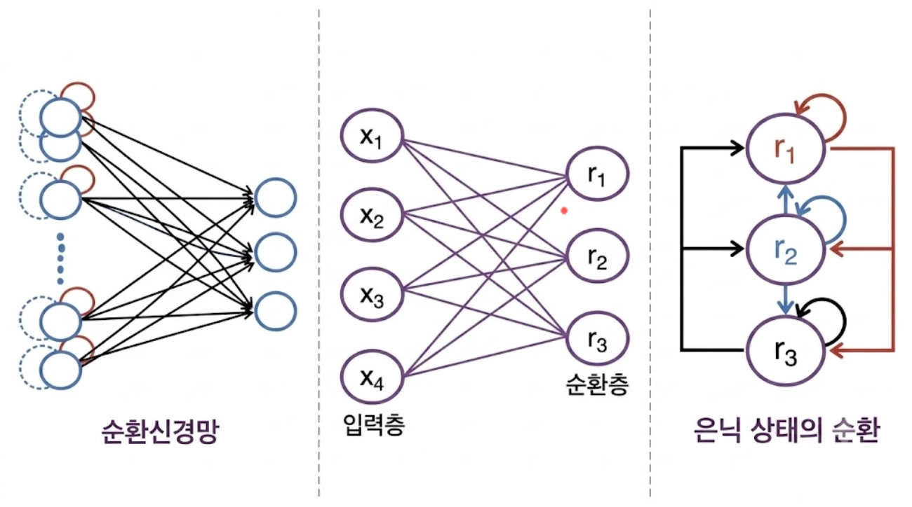
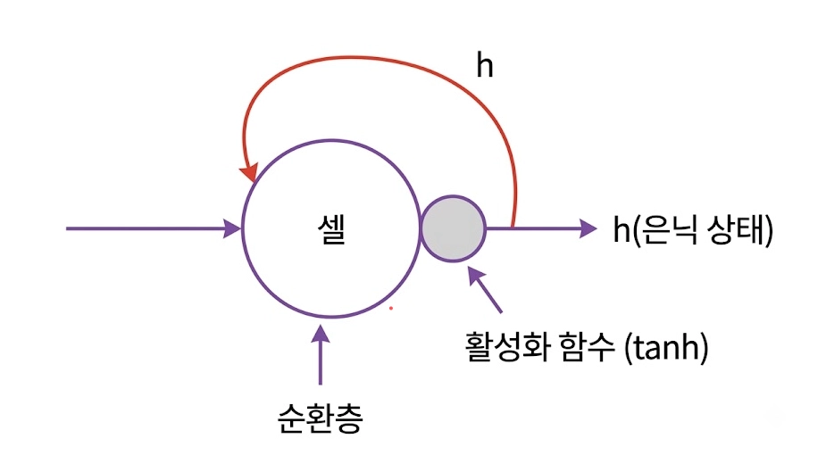
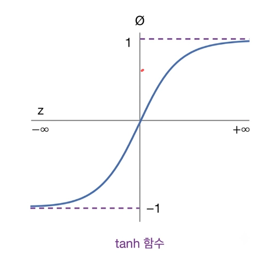
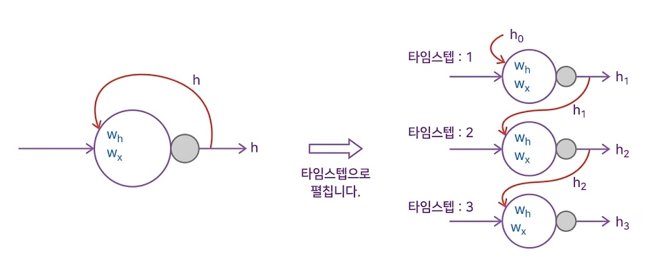
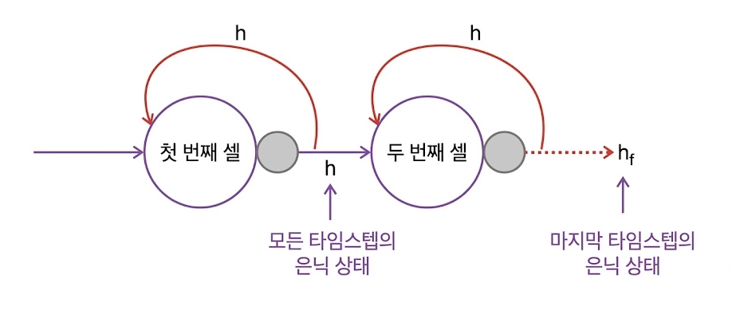
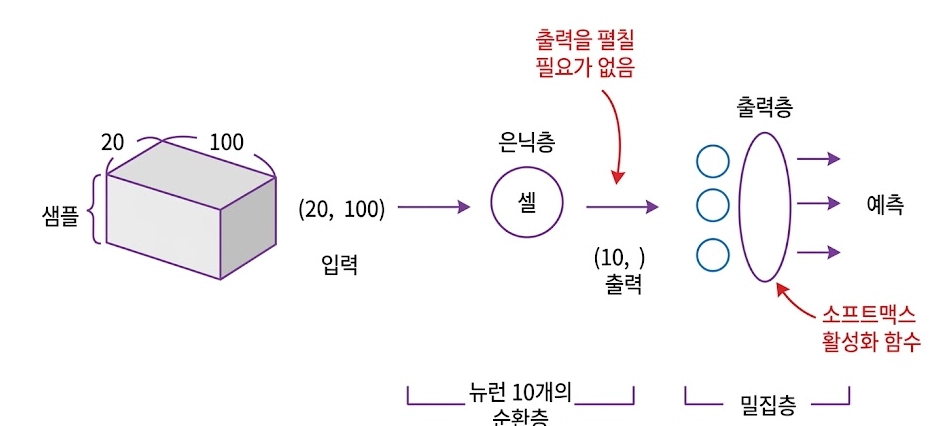
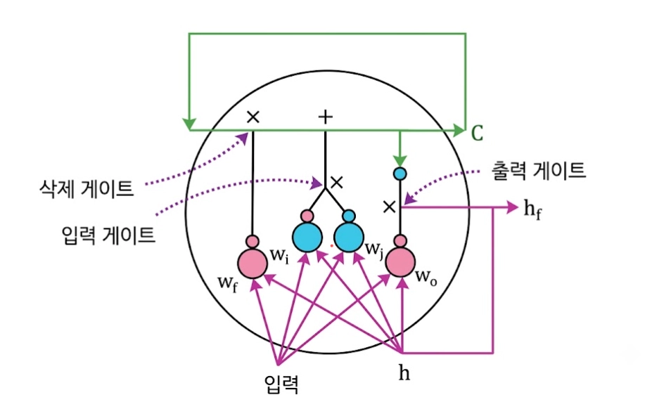

# 오늘의 TIL

> 주제 : 파이토치 심층 신경망과 순환 신경망(RNN) 아키텍처

## 어제의 복습

1. 선형 회귀 ↔ 로지스틱 회귀 : 선형 회귀 출력 결과(로짓 Logits) → 활성화 함수(시그모이드, 소프트맥스) → 확률
2. 이진 분류 ↔ 다중 분류 활성화 함수 : 시그모이드, 소프트맥스
3. 정수형 다중 분류용 손실 함수 : SCCE
4. KFold Shuffle의 이유 : 데이터가 쏠리는 불균형 방지
5. 범주형 데이터 전처리 : 단순 정수(레이블 인코딩) 사용 불가 → 각 범주를 독립된 열로 만들고 해당 열만 1로 표시하는 One-Hot 인코딩 방식 사용

## 오늘 공부한 내용

### 4장 머신러닝

#### 4.1 파이토치 기초 및 심층 신경망

* **과적합(Overfitting)**
  * 모델이 훈련 데이터의 지엽적인 디테일까지 과도하게 암기하여 실전 데이터에서는 제대로 대응하지 못하는 상태입니다.
* **드롭아웃(Dropout) 기법**
  * 일정 비율의 출력을 랜덤하게 0으로 변경합니다.
  * 영향력이 강한 가중치의 출력이 0이 되어, 작은 가중치의 영향력이 상대적으로 높아집니다(특정 뉴런에 대한 의존성 탈피).
* **3. 학습 메커니즘**
  * **순전파(Feed Forward Network)** : 입력 데이터를 바탕으로 예측값을 추론하고 손실을 계산합니다.
  * **역전파(Backpropagation)** : 예측 오류를 분석하여 각 가중치의 오차 기여도(기울기)를 계산합니다.
  * **옵티마이저(Optimizer)** : 계산된 기울기를 바탕으로 오차가 최소화되는 방향으로 가중치를 수정합니다.
* **5. 학습의 양대 함정**
  * **과소적합(Underfitting)** : 학습이 부족하여 기본 패턴조차 익히지 못한 상태.
  * **과적합(Overfitting)** : 훈련 데이터의 노이즈까지 외워버린 상태.

#### 4.2 순환 신경망 아키텍처 구현

##### 1. 자연어 처리의 핵심 개념: 임베딩과 RNN

* 의미가 비슷한 단어끼리 가깝게 모으고, 순서대로 기억하는 기술
* 과거의 0/1 이분법 방식에서 벗어나, 단어에 '성격 점수'를 부여해 문맥 파악

##### 1.1 원핫 인코딩(One-Hot Encoding)의 한계

* **희소 행렬(Sparse Matrix)**
  * 대부분 0, 단 하나의 인덱스만 1인 고차원 행렬
  * 예: 10만 단어 사전에서 '사과' = 99,999개의 0 + 1개의 1
* **차원의 저주(Curse of Dimensionality)**
  * 사전이 커질수록 차원이 기하급수적으로 증가 → 학습 성능·연산 효율 저하
  * 단어 간 유사성을 표현할 수 없다는 근본적 한계

| 구분 | 원핫 인코딩 | 임베딩 |
| --- | --- | --- |
| 데이터 형태 | 고차원 희소 벡터 (대부분 0) | 저차원 밀집 벡터 (실숫값) |
| 의미 표현 | 단어 간 독립성 전제 → 유사도 파악 불가 | 문맥적 의미·유사도 파악 가능 |
| 저장 공간 | 단어 수 늘수록 메모리 낭비 심화 | 상대적으로 압축·효율적 |

##### 1.2 의미를 압축하는 임베딩(Embedding)

* **밀집 벡터(Dense Vector)**
  * 낮은 차원(예: 128차원)에서 실숫값으로 단어의 의미적 특징을 표현
  * 예: 10만 차원 '사과' → [0.8, 0.9, -0.1] 같은 저차원 벡터로 압축
  * 단어 간 의미적 유사성을 벡터 공간의 거리로 표현
* **가중치 최적화를 통한 의미 학습 3단계**
  1. **초기화** : 어휘 수(V) × 임베딩 차원(d) 크기의 가중치 행렬 $W_{emb}$를 무작위 초깃값으로 생성
  2. **룩업(Look-up)** : 입력 단어의 정수 인덱스 $w$가 들어오면, $W_{emb}$의 $w$번째 행을 추출해 밀집 벡터 $v$ 반환
  3. **역전파 갱신** : 학습 과정에서 오차 기울기(Gradient)에 따라 $W_{emb}$ 내부 값이 갱신 → 문맥상 비슷하게 쓰이는 단어들이 벡터 공간에서 기하학적으로 가까워짐

$$
\text{Embedding}(w) = \text{One-Hot}(w) \times W_{emb} = v
$$
* $w$ : 입력 단어의 정수 인덱스
* $W_{emb} \in \mathbb{R}^{V \times d}$ : 학습으로 최적화되는 임베딩 가중치 행렬 (V=사전 크기, d=임베딩 차원)
* $v \in \mathbb{R}^{d}$ : 갱신된 최적의 밀집 벡터

##### 1.3 과거를 기억하는 순환 신경망(RNN)

* **순차 데이터(Sequence Data)의 특성**
  * 등장 순서가 맥락을 결정하는 데이터(시계열, 자연어 등)
  * 일반 순방향 신경망(DNN)은 독립적 연산에 특화되어 선후 관계를 유지 못함
  * RNN은 가중치 공유(Weight Sharing) + 루프 연결로 이를 극복
  * 시간 흐름에 따른 문맥적/순서적 연관성 부여
  * Context Vector 생성
* **노드 구조**
  * 입력층 ↔ 순환층 완전연결(Fully-connected)
  * 순환층의 각 유닛이 결과를 다음 레이어로 출력하는 동시에, 자기 자신에게 재귀적으로 주입(Recurrence)

* **기본 셀 구조와 `tanh` 활성화 함수**
  * 현재 시점의 입력 + 직전 은닉 상태($h$)를 결합해 처리
  * $\tanh$ 함수로 출력을 **-1~1** 사이로 정규화 → 값 발산(Exploding) 방지, 안정적 수렴 유도
  * 스텝이 많을 수록 값이 ↓ → 기울기 소실
  * 오랜 단계의 스텝 기억 상실 → 장기 의존성 문제
  * 모든 타임스텝을 표현 → 병목 현상
* **RNN에서 ReLU를 쓰지 않는 이유**
  * ReLU는 양수 입력에 제약이 없음(0~∞)
  * RNN은 동일한 가중치를 매 시간 단계마다 반복해서 곱함
  * 값이 1보다 조금만 커도 시간 단계를 거치며 복리처럼 기하급수적으로 커짐 → 기울기 폭발(Exploding Gradient)
  * `tanh`는 출력을 -1~1로 강제로 묶어(Bounding) 이 폭발을 방지

#### 타임스텝(Time-step) 전개와 Flatten 불필요성

* **타임스텝 단위 전개**
  * 가중치 재귀 구조를 시간 축으로 수평 전개(Unrolling)하면 선후 관계가 명확해짐
  * 타임스텝 1 : 초기 기억 $h_0$ + 첫 입력 토큰 → $W_x$, $W_h$로 가중합 → $h_1$ 도출
  * 타임스텝 2 : $h_1$이 다음 셀의 재귀 입력으로 전달 → 새 입력과 결합해 $h_2$로 갱신
  * 최종 시점 : 이 과정이 반복되며 은닉 상태가 누적되고, 마지막 타임스텝의 은닉 상태($h_f$)가 시퀀스 전체 맥락을 압축한 컨텍스트 벡터(Context Vector)가 됨

* **Flatten 연산의 불필요성**
  * 가변 길이 시퀀스(예: (20, 100) — 20 타임스텝, 100차원 피처)를 순환층(예: 뉴런 10개)에 넣어도, 마지막 셀을 통과한 최종 은닉 상태는 이미 고정된 1차원 형태 (10,) 벡터로 나옴
  * 별도의 Flatten 계층 없이 이 벡터가 바로 출력층(밀집층)에 매핑되어 Softmax로 이어지므로 파이프라인 효율이 높아짐

* **수학적 연산 식**
  * 매 타임스텝마다 가중치 공유(Weight Sharing) 원칙으로 아래 식이 반복 적용됨

$$
h_t = \tanh(W_h h_{t-1} + W_x x_t + b_h)
$$

  * $x_t \in \mathbb{R}^{d}$ : 현재 타임스텝의 입력 벡터 ($d$ = 임베딩 차원)
  * $h_{t-1} \in \mathbb{R}^{h}$ : 이전 타임스텝의 은닉 상태 벡터 ($h$ = 은닉층 차원)
  * $W_x \in \mathbb{R}^{h \times d}$ : 입력 데이터에 대한 가중치 행렬
  * $W_h \in \mathbb{R}^{h \times h}$ : 이전 은닉 상태에 대한 가중치 행렬 (모든 타임스텝에서 공유)
  * $b_h \in \mathbb{R}^{h}$ : 편향(Bias) 벡터

##### 1.4 장단기 메모리 (LSTM)

- Long Short-Term Memory
- 단기기억(은닉상태)
- 장기기억(셀상태)

장기 의존성 문제(Long-Term Dependency)

- 기본 RNN은 은닉 상태가 여러 시점을 거치면서 과거의 정보가 유실되거나(기울기 소실), 문장이 길어질수록 초반 단어의 영향력이 약화된다.

LSTM

- RNN의 기울기 소실을 줄이려고 셀 상태(Cell State)와 게이트(Gate)를 쓴다.
- 시점이 길어져도 중요한 정보는 남기고 불필요한 정보는 지운다.

| LSTM 게이트 | 하는 일 |
| --- | --- |
| 삭제 게이트 (Forget Gate) | 셀 상태에서 과거 정보를 얼마나 지울지 정한다 |
| 입력 게이트 (Input Gate) | 현재 정보 중 무엇을 셀 상태에 넣을지 정한다 |
| 출력 게이트 (Output Gate) | 갱신된 셀 상태에서 다음 은닉 상태로 무엇을 내보낼지 정한다 |

---

## 찾아본 내용

> ※ 사용자의 빈약한 필기를 보완하기 위해 찾아본 상세 교재/참고 자료 내용입니다. 중복되는 '자연어 처리의 핵심 개념(원핫 인코딩, 임베딩, RNN 개념)' 부분은 가독성을 위해 생략하고 심화 개념과 실습 위주로 정리했습니다. 아래 코드는 교재 원문의 전체 코드와 주석을 그대로 옮긴 것입니다.

### 3. 학습 메커니즘: 역전파와 옵티마이저 상세

* **역전파(Backpropagation)와 옵티마이저(Optimizer)**
  * 순방향 예측이 입력 데이터를 바탕으로 답을 추론하는 과정이라면, 역전파는 예측 오류를 분석하여 각 가중치의 오차 기여도를 계산하는 과정입니다. 이 피드백을 바탕으로 옵티마이저가 가중치를 수정합니다.

#### 3.1 신경망 학습의 4단계 순환 구조

1. **순방향 예측 (Forward Pass)** : 입력 데이터가 신경망의 각 층을 통과하며 최종 예측값을 산출합니다.
2. **손실 계산 (Loss Calculation)** : 실제 정답과 예측값을 비교하여 오차 크기(Loss)를 산출합니다.
3. **역방향 오차 전파 (Backpropagation)** : 출력층에서 발생한 오차를 거꾸로 전파하며 미분의 연쇄 법칙(Chain Rule)을 통해 기울기(Gradient)를 계산합니다.
4. **가중치 조정 (Optimizer)** : 오차가 최소화되는 방향으로 가중치를 업데이트합니다. ($W \leftarrow W - \eta \cdot \frac{\partial L}{\partial W}$)

> 💡 **역전파의 한계와 옵티마이저의 역할**
> 역전파는 오직 '어느 방향으로 얼만큼 가파른지(편미분)' 정보만 컴퓨터에게 알려주는 설계도입니다. 실제 '몇 걸음 걸어갈지(학습률, Learning Rate)'를 결정하고 행동하는 것은 **옵티마이저**입니다.

#### 3.2 옵티마이저의 종류 및 특징

* **SGD (확률적 경사하강법)** : 가파른 내리막 방향으로 일정 보폭만큼 이동. 국소 최적점(Local Minima)에서 정체될 위험이 있습니다.
* **Momentum (모멘텀)** : 이전 이동 방향과 속도(관성)를 유지하려는 성질을 더해 국소 최적점을 빠르게 통과합니다.
* **RMSprop** : 기울기 변화 가중치를 고려해 학습률을 유동적으로 조절합니다.
* **Adam (Adaptive Moment Estimation)** : Momentum(관성)과 RMSprop(보폭 조절)의 장점을 결합하여 가장 널리 사용됩니다.

### 5. 학습의 양대 함정: 과소적합과 과적합 상세

#### 5.1 데이터셋 분할의 목적
* **훈련 데이터 (Train Set)** : 모델이 가중치를 조정하며 직접 학습하는 데이터.
* **검증 데이터 (Validation Set)** : 학습 중 일반화 성능을 주기적으로 확인하는 모의고사 역할.
* **시험 데이터 (Test Set)** : 학습 완료 후 최종 성능을 객관적으로 평가하는 실전 데이터.

#### 5.2 과소적합 (Underfitting)
* 모델 구조가 단순하거나 충분히 학습하지 못해 훈련 데이터의 패턴조차 익히지 못한 상태.
* **해결방법** : 은닉층/뉴런 수 추가(용량 확대), 에포크(학습 시간) 증가.

#### 5.3 과적합 (Overfitting)
* 훈련 데이터의 특이한 노이즈까지 과도하게 암기해 검증/시험 데이터에서 성능이 하락하는 상태.
* **해결방법** :
  * **드롭아웃(Dropout)** : 특정 뉴런에 강력하게 의존하는 '동조화(Co-adaptation)'를 막기 위해 매 배치마다 뉴런을 무작위로 끄고 학습시켜 앙상블 효과를 창출합니다. 추론 시에는 모두 켭니다(`model.eval()`).
  * **조기 종료(Early Stopping)** : 검증 손실이 반등하기 시작할 때 학습을 강제로 종료합니다.

### 6. 파이토치 기반 패션 이미지 다층 모델 실습

#### 6.1 데이터 준비 및 전처리

~~~python
import platform
import torch
from torchvision import datasets
from torchvision.transforms import ToTensor
from torch.utils.data import DataLoader, random_split
import matplotlib.pyplot as plt
from matplotlib import rc

# 가속 연산 디바이스(GPU/MPS) 자동 설정
# CUDA(NVIDIA) -> MPS(Mac 인텔/실리콘) -> CPU 순으로 사용 가능한 자원을 체크합니다.
device = torch.device(
    "cuda" if torch.cuda.is_available() else 
    "mps" if torch.backends.mps.is_available() else 
    "cpu"
)
print(f"현재 연산에 사용 중인 디바이스: {device}")

# matplotlib 한글 깨짐 방지 설정 
if platform.system() == 'Darwin':      # macOS 환경
    rc('font', family='AppleGothic')
elif platform.system() == 'Windows':   # Windows 환경
    rc('font', family='Malgun Gothic')
    
plt.rcParams['axes.unicode_minus'] = False  # 마이너스 기호 깨짐 방지
~~~

~~~python
# 오리지널 데이터셋 다운로드
# Fashion MNIST는 기본적으로 Train(60,000장)과 Test(10,000장)로 나뉘어 제공됩니다.
raw_train_data = datasets.FashionMNIST(
    root="data", train=True, download=True, transform=ToTensor()
)
test_data = datasets.FashionMNIST(
    root="data", train=False, download=True, transform=ToTensor()
)

# random_split을 활용해 60,000장의 훈련용 데이터를 훈련(50,000장)과 검증(10,000장)으로 분할
# seed를 고정하여 실행할 때마다 동일하게 분할되도록 설정합니다.
train_size = 50000
val_size = 10000
train_data, val_data = random_split(
    raw_train_data, [train_size, val_size], 
    generator=torch.Generator().manual_seed(42)
)

print(f"데이터 분할 완료 -> 훈련용: {len(train_data)}장 | 검증용: {len(val_data)}장 | 테스트용: {len(test_data)}장")

# 데이터셋별 DataLoader 생성
train_loader = DataLoader(train_data, batch_size=32, shuffle=True)   # 데이터 섞기 활성화 (과적합 방지)
val_loader = DataLoader(val_data, batch_size=32, shuffle=False)     # 평가는 섞을 필요 없음
test_loader = DataLoader(test_data, batch_size=32, shuffle=False)   # 평가는 섞을 필요 없음
~~~

#### 6.2 모델 설계

~~~python
import torch.nn as nn
import torch.optim as optim

# 1. 다층 퍼셉트론(MLP) 모델 클래스 정의
class AdvancedFashionClassifier(nn.Module):
    def __init__(self):
        super(AdvancedFashionClassifier, self).__init__()
        # 2D 이미지 [28, 28]를 1D 벡터 [784] 형태로 펼쳐주는 계층
        self.flatten = nn.Flatten()
        # 입력층(784) -> 은닉층(128) 선형 변환
        self.linear1 = nn.Linear(28 * 28, 128)
        # 활성화 함수로 은닉층에 비선형성 주입을 위한 ReLU 지정
        self.relu = nn.ReLU()
        # 학습 중 뉴런의 20%를 무작위로 비활성화하는 드롭아웃 설정
        self.dropout = nn.Dropout(p=0.2)
        # 은닉층(128) -> 출력층(10) 선형 변환
        self.linear2 = nn.Linear(128, 10)
        
    def forward(self, x):
        out = self.flatten(x)
        out = self.linear1(out)
        out = self.relu(out)
        out = self.dropout(out)  # 훈련 시에만 적용됨
        out = self.linear2(out)  # 별도의 Softmax 없이 Raw 점수(Logits) 출력
        return out

# 모델 인스턴스 생성 및 연산 디바이스(GPU/MPS/CPU)로 할당
# 할당된 디바이스 메모리로 가중치(Weights)와 편향(Bias) 파라미터가 이동합니다.
model = AdvancedFashionClassifier().to(device)

total_params = sum(p.numel() for p in model.parameters() if p.requires_grad)
print(f"모델의 가속기 이관 완료 | 학습 가능한 총 파라미터 수: {total_params:,}개")

# 손실 함수 및 옵티마이저 정의
# nn.CrossEntropyLoss는 내부적으로 Softmax 연산을 포함합니다.
criterion = nn.CrossEntropyLoss()
optimizer = optim.Adam(model.parameters(), lr=0.005)
~~~

> 💡 제공된 코드에서 Softmax 함수는 명시적으로 작성되어 있지 않습니다. 파이토치(PyTorch)의 구조적 특성상 `nn.CrossEntropyLoss` 내부에서 자동으로 적용됩니다.

#### 6.3 조기 종료 학습 및 검증 루프

~~~python
# 조기 종료(Early Stopping)를 위한 하이퍼파라미터 및 변수 설정
epochs = 20                 # 최대 허용 에포크 수
patience = 3                # 검증 손실이 개선되지 않는 상태를 참아줄 최대 횟수
patience_counter = 0        # 카운터 초기화
best_val_loss = float('inf') # 최적의 검증 손실 기준점을 무한대로 초기화

train_losses = []
val_losses = []

print("\n=== 모델 학습 및 검증을 시작합니다 ===")
for epoch in range(epochs):
    # --- [훈련 모드] ---
    running_loss = 0.0
    model.train()  # 드롭아웃 등 훈련 전용 기능 활성화
    
    for images, labels in train_loader:
        # 미니배치 데이터를 모델이 위치한 동일 가속기 메모리로 이관합니다.
        images = images.to(device)
        labels = labels.to(device)

        optimizer.zero_grad()       # 이전 기울기 초기화
        outputs = model(images)     # 순방향 예측
        loss = criterion(outputs, labels)  # 손실 계산
        loss.backward()             # 오차 역전파 수행
        optimizer.step()            # 가중치 업데이트
        
        running_loss += loss.item()
        
    epoch_loss = running_loss / len(train_loader)
    train_losses.append(epoch_loss)
    
    # --- [검증 모드] ---
    model.eval()  # 드롭아웃 등 평가 시 배제되어야 하는 기능 비활성화
    val_loss = 0.0
    
    with torch.no_grad():  # 검증 시에는 미분 계산을 제한하여 연산 자원 최적화
        for images, labels in val_loader:
            # 평가 단계의 미니배치 데이터도 동일하게 가속기로 이관합니다.
            images = images.to(device)
            labels = labels.to(device)

            outputs = model(images)
            loss = criterion(outputs, labels)
            val_loss += loss.item()
            
    epoch_val_loss = val_loss / len(val_loader)
    val_losses.append(epoch_val_loss)
    
    print(f"Epoch [{epoch+1}/{epochs}] | 훈련 손실: {epoch_loss:.4f} | 검증 손실: {epoch_val_loss:.4f}")
    
    # --- 조기 종료 조건 검증 로직 ---
    if epoch_val_loss < best_val_loss:
        # 검증 손실이 기존 최적값보다 개선된 경우
        best_val_loss = epoch_val_loss
        patience_counter = 0  # 카운터 리셋
        # 최적의 모델 가중치를 파일로 저장
        torch.save(model.state_dict(), "best_fashion_model.pth")
        print(f" => 최적 모델 저장 완료 (최저 검증 손실: {best_val_loss:.4f})")
    else:
        # 검증 손실이 개선되지 않은 경우
        patience_counter += 1
        print(f" => 검증 손실 미개선 (조기 종료 대기 카운트: {patience_counter}/{patience})")
        
        # 설정한 참을성(Patience) 한계를 초과하면 학습을 강제 중단
        if patience_counter >= patience:
            print(f"\n[Early Stopping 활성화] {epoch+1} 에포크에서 학습을 조기 종료합니다.")
            break
~~~

#### 6.4 최종 테스트셋 기반 정확도 측정 및 시각화

~~~python
# 학습 과정 중 가장 성적이 좋았던 가중치 파일(pth) 복원
model.load_state_dict(torch.load("best_fashion_model.pth"))
model.to(device)

# 테스트셋 기반 최종 실전 정확도(Accuracy) 측정
model.eval()  # 추론 및 평가 모드로 고정
correct = 0
total = 0

print("\n=== 최종 테스트셋(실전 성능) 평가 시작 ===")
with torch.no_grad():  # 평가 단계이므로 미분 계산 비활성화
    for images, labels in test_loader:
        # 테스트 데이터셋 역시 연산 전 가속기로 이동시킵니다.
        images = images.to(device)
        labels = labels.to(device)
        
        outputs = model(images)
        # 각 행(인스턴스)별로 10개 카테고리 중 가장 높은 점수를 받은 인덱스 추출
        _, predicted = torch.max(outputs.data, 1)
        
        total += labels.size(0)                       # 전체 데이터 개수 누적
        correct += (predicted == labels).sum().item()  # 정답을 맞춘 개수 누적

test_accuracy = 100 * correct / total
print(f"최종 테스트 데이터셋 정확도(Test Accuracy): {test_accuracy:.2f}%")

# 3. 에포크별 훈련 및 검증 손실 곡선 시각화
plt.figure(figsize=(8, 4))
plt.plot(train_losses, marker='o', color='darkviolet', linewidth=2.5, label='훈련 손실 (Train Loss)')
plt.plot(val_losses, marker='s', color='orange', linewidth=2.5, label='검증 손실 (Val Loss)')
plt.title("에포크별 훈련 및 검증 손실(Loss) 추이 (조기 종료 적용)")
plt.xlabel("학습 횟수 (Epoch)")
plt.ylabel("손실 크기 (Loss)")
plt.legend()
plt.grid(True, linestyle=':')
plt.show()
~~~

### 7. 개념 요약 키워드 및 용어 사전

* **은닉층 (Hidden Layer)** : 입력 데이터의 비선형적 패턴을 고차원적인 특징으로 변환하고 학습하는 공간.
* **조기 종료 (Early Stopping)** : 검증 데이터셋의 손실 지표가 반등하는 시점을 포착하여 과적합 전에 멈추는 기법.
* **model.eval()** : 드롭아웃 등 학습 전용 규제 기능을 비활성화하여 추론 시 일관된 출력을 내도록 하는 메서드.
* **with torch.no_grad()** : 검증 및 추론 단계에서 기울기 연산과 메모리 추적을 차단하여 자원을 절약하는 구문.

### 4장 2강 실습: 네이버 영화 리뷰 감성 분류 (LSTM)

* **LSTM의 핵심 게이트**
  * **삭제 게이트 (Forget Gate)** : 과거 정보 중 삭제할 양 결정
  * **입력 게이트 (Input Gate)** : 새로운 정보 중 셀 상태에 저장할 양 결정
  * **출력 게이트 (Output Gate)** : 업데이트된 셀 상태를 바탕으로 다음 은닉 상태 출력 결정

#### 2.2 데이터 준비 및 분할

~~~python
import pandas as pd
from sklearn.model_selection import train_test_split

# 네이버 영화 리뷰 데이터셋(NSMC) 로드
# 긍정 리뷰 = 1, 부정 리뷰 = 0
df = pd.read_csv('ratings.txt', sep='\t')

# 결측치 전처리
df = df.dropna()

# 데이터 분할 (Train: 64%, Valid: 16%, Test: 20%)
# 과적합을 방지하고 정확한 평가를 위해 학습 데이터와 평가 데이터를 분리합니다.
train_val_df, test_df = train_test_split(df, test_size=0.2, random_state=42)

# 학습용 데이터를 다시 분할하여 검증(Validation) 데이터셋 구축
train_df, val_df = train_test_split(train_val_df, test_size=0.2, random_state=42)

print(f"훈련 데이터셋: {len(train_df)}개")
print(f"검증 데이터셋: {len(val_df)}개")
print(f"테스트 데이터셋: {len(test_df)}개")
~~~

#### 2.3 토큰화 및 파이토치 DataLoader 구축

~~~python
from collections import Counter
import torch
import torch.nn as nn
from torch.utils.data import DataLoader, Dataset

# 훈련 데이터 기반으로 간단한 공백 기준의 단어 사전(Vocabulary) 구축
vocab_size = 20000
all_words = []
for text in train_df['document'].astype(str):
    all_words.extend(text.split())

# 빈도수가 높은 순서대로 단어 정렬 후 고유 인덱스 부여 (0은 패딩, 1은 모르는 단어)
counts = Counter(all_words)
vocab = {word: i+2 for i, (word, _) in enumerate(counts.most_common(vocab_size - 2))}
vocab['<PAD>'] = 0
vocab['<UNK>'] = 1

# 파이토치 커스텀 데이터셋(Dataset) 클래스 정의
class NSMCDataset(Dataset):
    def __init__(self, df, vocab, max_len=32):
        self.labels = df['label'].values
        self.texts = df['document'].astype(str).values
        self.vocab = vocab
        self.max_len = max_len
        
    def __len__(self):
        return len(self.labels)
        
    def __getitem__(self, idx):
        text = self.texts[idx]
        label = self.labels[idx]
        
        # 문장을 단어로 쪼개고 숫자 인덱스로 변환 (사전에 없으면 <UNK>인 1로 매핑)
        tokens = text.split()
        ids = [self.vocab.get(token, 1) for token in tokens[:self.max_len]]
        
        # 문장 표준 규격을 위한 고정 크기 패딩(Padding) 처리
        if len(ids) < self.max_len:
            ids += [0] * (self.max_len - len(ids))
            
        return torch.tensor(ids, dtype=torch.long), torch.tensor(label, dtype=torch.long)

# 데이터셋 인스턴스 생성 및 배치 단위 DataLoader 선언
train_dataset = NSMCDataset(train_df, vocab)
val_dataset = NSMCDataset(val_df, vocab)
test_dataset = NSMCDataset(test_df, vocab)

train_loader = DataLoader(train_dataset, batch_size=64, shuffle=True)
val_loader = DataLoader(val_dataset, batch_size=64, shuffle=False)
test_loader = DataLoader(test_dataset, batch_size=64, shuffle=False)
~~~

#### 2.4 임베딩과 LSTM 모델 설계

~~~python
class SentimentLSTM(nn.Module):
    def __init__(self, vocab_size, embedding_dim, hidden_dim):
        super(SentimentLSTM, self).__init__()
        
        # 임베딩 레이어: 정수 인덱스를 밀집 벡터로 변환 (학습 가능한 파라미터 행렬)
        self.embedding = nn.Embedding(num_embeddings=vocab_size, embedding_dim=embedding_dim)
        
        # LSTM 레이어: 시퀀스 데이터를 순차적으로 처리하여 맥락 벡터 추출
        self.lstm = nn.LSTM(input_size=embedding_dim, hidden_size=hidden_dim, batch_first=True)
        
        # 드롭아웃(Dropout): 과적합 방지를 위해 뉴런 일부를 무작위 비활성화
        self.dropout = nn.Dropout(0.5)
        
        # 분류기: 최종 은닉 상태를 받아 이진 분류 점수 출력
        self.classifier = nn.Linear(hidden_dim, 1)

    def forward(self, x):
        # x: [Batch_Size, Sequence_Length]
        embeds = self.embedding(x)          # [Batch_Size, Sequence_Length, Embedding_Dim]
        lstm_out, _ = self.lstm(embeds)     # lstm_out: [Batch_Size, Sequence_Length, Hidden_Dim]
        
        # 시퀀스의 마지막 시점(Last Time Step)의 은닉 상태 추출 (Flatten 불필요)
        last_memory = lstm_out[:, -1, :]    # [Batch_Size, Hidden_Dim]
        
        # 드롭아웃 및 선형 분류기 통과
        last_memory = self.dropout(last_memory)
        logits = self.classifier(last_memory) # 최종 로짓 값 출력 (제한이 없는 실숫값 범위)
        return logits
~~~

> 💡 **왜 모델 내부에 Sigmoid를 쓰지 않나요?**
> `nn.BCEWithLogitsLoss` 손실 함수를 사용하면 가공되지 않은 Logit 값을 그대로 받아 내부적으로 안전하게 연산하므로, 모델 안에서 Sigmoid를 직접 통과시키는 것보다 수치적 안정성이 높고 속도가 빠릅니다.

#### 2.5 조기 종료(Early Stopping) 및 모델 평가

~~~python
import matplotlib.pyplot as plt
from matplotlib import rc
import platform

# 가속 연산 디바이스(GPU/MPS) 자동 설정
# CUDA(NVIDIA) -> MPS(Mac 인텔/실리콘) -> CPU 순으로 사용 가능한 자원을 체크합니다.
device = torch.device(
    "cuda" if torch.cuda.is_available() else 
    "mps" if torch.backends.mps.is_available() else 
    "cpu"
)
print(f"현재 연산에 사용 중인 디바이스: {device}")

# matplotlib 한글 깨짐 방지 설정 
if platform.system() == 'Darwin':      # macOS 환경
    rc('font', family='AppleGothic')
elif platform.system() == 'Windows':   # Windows 환경
    rc('font', family='Malgun Gothic')
    
plt.rcParams['axes.unicode_minus'] = False  # 마이너스 기호 깨짐 방지

# 임베딩 파라미터 가중치를 보존할 모델 인스턴스화 및 지정 장치 탑재
vocab_size = 20000  # 사전 구축 크기 가정
embedding_dim = 128
hidden_dim = 256
model = SentimentLSTM(vocab_size, embedding_dim, hidden_dim).to(device)

# 하이퍼파라미터 및 학습 제어 변수 설정
epochs = 20
patience = 3
patience_counter = 0
best_val_loss = float('inf')

train_losses = []
val_losses = []

# 손실 함수 정의 시 BCEWithLogitsLoss를 채택하여 내부에 Sigmoid 연산을 위임합니다.
criterion = nn.BCEWithLogitsLoss()
optimizer = torch.optim.Adam(model.parameters(), lr=0.001)

print("\n=== 모델 학습 및 검증 시작 ===")
for epoch in range(epochs):
    # --- [훈련 모드] ---
    model.train()
    running_train_loss = 0.0
    
    for sequences, labels in train_loader:

        sequences, labels = sequences.to(device), labels.to(device)

        optimizer.zero_grad()
        outputs = model(sequences)
        
        # 손실 계산 (BCEWithLogitsLoss의 입력 규격에 맞춰 레이블을 차원 변환)
        loss = criterion(outputs, labels.float().unsqueeze(1))
        loss.backward()
        optimizer.step()
        
        running_train_loss += loss.item()
        
    epoch_train_loss = running_train_loss / len(train_loader)
    train_losses.append(epoch_train_loss)
    
    # --- [검증 모드] ---
    model.eval()
    running_val_loss = 0.0
    
    with torch.no_grad(): # 검증 단계에서는 기울기 연산을 차단하여 자원 절약
        for sequences, labels in val_loader:
            sequences, labels = sequences.to(device), labels.to(device)
            outputs = model(sequences)
            loss = criterion(outputs, labels.float().unsqueeze(1))
            running_val_loss += loss.item()
            
    epoch_val_loss = running_val_loss / len(val_loader)
    val_losses.append(epoch_val_loss)
    
    print(f"Epoch [{epoch+1}/{epochs}] | Train Loss: {epoch_train_loss:.4f} | Val Loss: {epoch_val_loss:.4f}")
    
    # --- [조기 종료 검증] ---
    if epoch_val_loss < best_val_loss:
        best_val_loss = epoch_val_loss
        patience_counter = 0
        torch.save(model.state_dict(), "best_movie_model.pth")
        print(f" => 최적 모델 가중치 저장 완료")
    else:
        patience_counter += 1
        print(f" => 검증 손실 미개선 (Counter: {patience_counter}/{patience})")
        
        if patience_counter >= patience:
            print(f"\n[Early Stopping] {epoch+1} Epoch에서 학습을 선제 종료합니다.")
            break

# --- [최종 테스트셋 평가] ---
# 가장 일반화 성능이 좋았던(검증 손실이 낮았던) 최적 가중치 스냅샷 복원
model.load_state_dict(torch.load("best_movie_model.pth"))
model.eval()

correct = 0
total = 0
threshold = 0.6  # 0.6이상의 값일때 양성으로 판단

print("\n=== 최종 테스트 데이터셋 평가 시작 ===")
with torch.no_grad():
    for sequences, labels in test_loader:
        sequences, labels = sequences.to(device), labels.to(device)
        outputs = model(sequences)
        
        # 모델의 출력 로짓(Logit)을 시그모이드를 통해 0~1 사이의 실제 확률값으로 변환
        probabilities = torch.sigmoid(outputs)
        
        # 신뢰도 임계값(0.6) 이상일 때만 긍정(1)으로 최종 판정
        predictions = (probabilities >= threshold).int()
        
        # 정답 레이블과 비교하여 맞춘 개수 동적 누적 산출
        correct += (predictions == labels.unsqueeze(1)).sum().item()
        total += labels.size(0)

test_accuracy = (correct / total) * 100
print(f"최종 테스트 데이터셋 정확도(Test Accuracy): {test_accuracy:.2f}%\n")

# 에포크별 학습 및 검증 손실 곡선 시각화
plt.figure(figsize=(8, 4))
plt.plot(train_losses, marker='o', color='darkviolet', linewidth=2.5, label='Train Loss')
plt.plot(val_losses, marker='s', color='orange', linewidth=2.5, label='Val Loss')
plt.title("Training and Validation Loss Curve", fontsize=14)
plt.xlabel("Epoch", fontsize=12)
plt.ylabel("Loss", fontsize=12)
plt.axvline(x=len(train_losses)-patience-1, color='red', linestyle='--', label='Best Model')
plt.legend()
plt.grid(True, linestyle=':')
plt.show()
~~~

## 편집 로그

### 수정한 내용
* 맞춤법 수정
* Markdown 구조 개선
* 중복 제거 (교재 내용 중 필기에 이미 작성된 RNN 개념부 중복 제거)
* 주제·태그 정리
* Front Matter 작성
* 사용자의 지시에 따라 부실한 필기 항목(3. 메커니즘, 5. 양대 함정 등)을 하단 교재 텍스트를 바탕으로 요약하여 보충
* 사용자 요청에 따라 교재 보충 섹션의 축약 코드를 원문 전체 코드(주석 포함)로 교체·확장

### 수정하지 않은 내용
* 사용자 필기에 작성된 개념 비교 및 수식 원문 구조
* 첨부된 교재 코드의 변수명, 주석, 로직 (원문 그대로 유지)

### 추가 정보 출처
* 교재 (사용자가 덧붙인 하단 텍스트 자료를 교재로 간주)

# 오늘의 TIL

## 어제의 복습
1. 선형 회귀 <> 로지스틱 회귀 : 선형 회귀 출력 결과 = 로짓 Logits  -> 활성화 함수(시그모이드, 소프트맥스) -> 확률
2. 이진 분류 <> 다중 분류 활성화 함수 : 시그모이드, 소프트맥스
3. 정수형 다중 분류용 손실 함수 : SCCE
4. KFold Shuffle의 이유 : 데이터가 쏠리는 불균형 방지
5. 범주형 데이터 단순 정수(레이블 인코딩) X -> 각 범주 독립된 열 해당 열만 1로 표시 전처리 방식 : One-Hot 인코딩
 

## 오늘의 학습
### 4장 머신러닝
#### 4.1 파이토치 기초 및 심층 신경망

과적학
 드롭아웃 기법
 (일정 비율의 출력을 랜덤하게 0으로 변경)
-> 영향력이 강한 가중치의 출력이 0
-> 작은 가중치 ↑

3. 학습 메커니즘
순전파 Feed Forward Network

옵티마이저

5. 

#### 4.2 순환 신경망 아키텍처 구현
##### 1. 자연어 처리의 핵심 개념: 임베딩과 RNN 

  * 의미가 비슷한 단어끼리 가깝게 모으고, 순서대로 기억하는 기술
  * 과거의 0/1 이분법 방식에서 벗어나, 단어에 '성격 점수'를 부여해 문맥 파악

##### 1.1 원핫 인코딩(One-Hot Encoding)의 한계 

  * 희소 행렬(Sparse Matrix)
    - 대부분 0, 단 하나의 인덱스만 1인 고차원 행렬
    - 예: 10만 단어 사전에서 '사과' = 99,999개의 0 + 1개의 1
  * 차원의 저주(Curse of Dimensionality)
    - 사전이 커질수록 차원이 기하급수적으로 증가 → 학습 성능·연산 효율 저하
    - 단어 간 유사성을 표현할 수 없다는 근본적 한계

  | 구분 | 원핫 인코딩 | 임베딩 |
  |---|---|---|
  | 데이터 형태 | 고차원 희소 벡터 (대부분 0) | 저차원 밀집 벡터 (실숫값) |
  | 의미 표현 | 단어 간 독립성 전제 → 유사도 파악 불가 | 문맥적 의미·유사도 파악 가능 |
  | 저장 공간 | 단어 수 늘수록 메모리 낭비 심화 | 상대적으로 압축·효율적 |

##### 1.2 의미를 압축하는 임베딩(Embedding)

  * 밀집 벡터(Dense Vector)
    - 낮은 차원(예: 128차원)에서 실숫값으로 단어의 의미적 특징을 표현
    - 예: 10만 차원 '사과' → [0.8, 0.9, -0.1] 같은 저차원 벡터로 압축
    - 단어 간 의미적 유사성을 벡터 공간의 거리로 표현

  * 가중치 최적화를 통한 의미 학습 3단계
    1. **초기화** : 어휘 수(V) × 임베딩 차원(d) 크기의 가중치 행렬 $W_{emb}$를 무작위 초깃값으로 생성
    2. **룩업(Look-up)** : 입력 단어의 정수 인덱스 $w$가 들어오면, $W_{emb}$의 $w$번째 행을 추출해 밀집 벡터 $v$ 반환
    3. **역전파 갱신** : 학습 과정에서 오차 기울기(Gradient)에 따라 $W_{emb}$ 내부 값이 갱신 → 문맥상 비슷하게 쓰이는 단어들이 벡터 공간에서 기하학적으로 가까워짐

$$
\text{Embedding}(w) = \text{One-Hot}(w) \times W_{emb} = v
$$

    - $w$ : 입력 단어의 정수 인덱스
    - $W_{emb} \in \mathbb{R}^{V \times d}$ : 학습으로 최적화되는 임베딩 가중치 행렬 (V=사전 크기, d=임베딩 차원)
    - $v \in \mathbb{R}^{d}$ : 갱신된 최적의 밀집 벡터

##### 1.3 과거를 기억하는 순환 신경망(RNN)

  * 순차 데이터(Sequence Data)의 특성
    - 등장 순서가 맥락을 결정하는 데이터(시계열, 자연어 등)
    - 일반 순방향 신경망(DNN)은 독립적 연산에 특화되어 선후 관계를 유지 못함
    - RNN은 가중치 공유(Weight Sharing) + 루프 연결로 이를 극복
    - 시간 흐름에 따른 문맥적/순서적 연관성 부여
    - Context Vector

  * 노드 구조
    - 입력층 ↔ 순환층 완전연결(Fully-connected)
    - 순환층의 각 유닛이 결과를 다음 레이어로 출력하는 동시에, 자기 자신에게 재귀적으로 주입(Recurrence)

  * 기본 셀 구조와 `tanh` 활성화 함수
    - 현재 시점의 입력 + 직전 은닉 상태($h$)를 결합해 처리
    - $\tanh$ 함수로 출력을 **-1~1** 사이로 정규화 → 값 발산(Exploding) 방지, 안정적 수렴 유도
    - 스텝이 많을 수록 값이 ↓ → 기울기 소실
    - 오랜 단계의 스텝 기억 상실 → 장기 의존성 문제
    - 모든 타임스텝을 표현 → 병목 현상

  * RNN에서 ReLU를 쓰지 않는 이유
    - ReLU는 양수 입력에 제약이 없음(0~∞)
    - RNN은 동일한 가중치를 매 시간 단계마다 반복해서 곱함
    - 값이 1보다 조금만 커도 시간 단계를 거치며 복리처럼 기하급수적으로 커짐 → 기울기 폭발(Exploding Gradient)
    - tanh는 출력을 -1~1로 강제로 묶어(Bounding) 이 폭발을 방지

##### 1.4 장단기 메모리 (LSTM)

- 단기기억: 은닉 상태 / 장기기억: 셀 상태
- 기본 RNN: 시점이 길면 과거가 사라짐 (기울기 소실, 장기 의존성)
- LSTM: 셀 상태 + 게이트로 남길 것/지울 것을 정함
  - Forget: 과거를 얼마나 지울지
  - Input: 지금 무엇을 셀에 넣을지
  - Output: 셀에서 다음 은닉으로 무엇을 내보낼지

---

## 찾아본 내용**